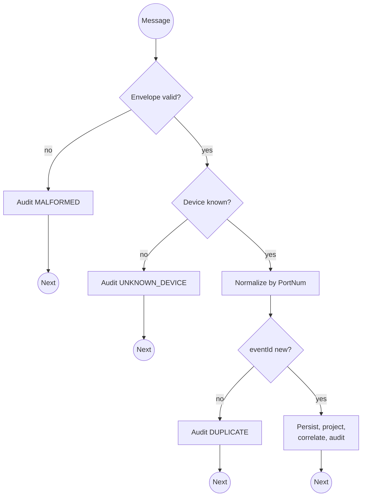

# MQTT ingress contract: `treklink/2/json/+/+`

> Module `gateway-sync`. This is the one inbound interface of the platform that is not HTTP, so it has no D-002 envelope; it is documented here in the endpoint format so the frontend, the firmware owner and the test harness read one contract. Stage A per D-005 and D-018; the payload is produced by stock Meshtastic, unchanged by Stage B (D-019 §3).

[TOC]

---
## Overview

The backend's `MqttJsonIngressAdapter` subscribes to the JSON topic that a TrekLink node publishes when its MQTT module runs with `json_enabled = true`, `encryption_enabled = false` and `root = "treklink"` (D-007). Each message is one mesh packet. The adapter validates the envelope, maps `type` to a PortNum, and hands a `RawMeshPacket` to the normalizer.

## API Specification

| API        | URL             |
| ---------- | --------------- |
| SUBSCRIBE (MQTT, QoS 1) | `treklink/2/json/<channelId>/<nodeId>`, subscribed as `treklink/2/json/+/+` |
| Permission | Broker ACL: publish restricted to fleet nodes and bridges; the backend holds a subscribe-only credential |
| Source | `src/mqtt/MQTT.cpp:423–430`, `:798` (topic); `src/serialization/MeshPacketSerializer.cpp:410–424` (envelope) |
| Traces | UC-13, FR-EVT-01, BR-06, REQ-EVT-01, REQ-ERR-03, D-006, D-007 |

## Request sample

A position packet as the stock serializer emits it. Field names are the serializer's, not TrekLink's. (unverified) The `payload` member names (`latitude_i`, `longitude_i`, `altitude`, `time`) and the mapping of `timestamp` to `rx_time` are taken from the serializer's field list in `04-firmware-ground-truth.md` §4, not from a captured message; task 0.4's golden fixtures replace this sample and settle them.

```json
{
  "id": 1834576211,
  "timestamp": 1760072560,
  "to": 4294967295,
  "from": 2763113171,
  "channel": 0,
  "type": "position",
  "sender": "!a4b1c2d3",
  "payload": { "latitude_i": 115601000, "longitude_i": 1085402000, "altitude": 1320, "time": 1760072559 },
  "rssi": -97,
  "snr": 6.25,
  "hops_away": 1
}
```

| Field | Description | Data Type | Required | Examples |
| --- | --- | --- | --- | --- |
| id | `MeshPacket.id`, rolling 10-bit counter plus 22 random bits; half of the `eventId` (D-006) | uint32 | yes | `1834576211` |
| from | Originating node number; the other half of `eventId`; resolved to a `Device` | uint32 | yes | `2763113171` |
| timestamp | Device `rx_time`; `0` means no valid RTC and is stored as null (REQ-ERR-06) | uint32 seconds | yes | `1760072560` |
| type | `text`, `position` or `telemetry` for TrekLink traffic; anything else is ignored with no error | string | yes | `position` |
| sender | Node or bridge that published; the `Gateway` key (REQ-EVT-14) | string | yes | `!a4b1c2d3` |
| payload | Per-type body; `text` carries `{ "text": "SOS - [11.123456], [107.654321]" }` | object | yes | n/a |
| rssi, snr, hops_away | Link quality; present only when non-zero | number | no | `-97` |

`eventId = sha256(from + ":" + id)` in lower-case hex (REQ-UBI-05).

## Response sample

MQTT has no response body. The observable outcomes are one `SyncAuditLog` row per message and, for accepted events, one `GatewayEvent` row:

```json
{
  "eventId": "5d41402abc4b2a76b9719d911017c592...",
  "outcome": "ACCEPTED",
  "kind": "POSITION",
  "priority": "P2"
}
```

## Validation

| Condition | Outcome written to `SyncAuditLog` | Effect |
| --- | --- | --- |
| JSON unparsable or required field missing | `MALFORMED_ENVELOPE`, raw message stored | nothing else; consumption continues (E02-4) |
| `from` matches no `Device` | `UNKNOWN_DEVICE` | quarantined, no `GatewayEvent` (REQ-STA-04) |
| `eventId` already stored | `DUPLICATE_REJECTED` | no Incident, no emit (E02-2) |
| Strategy throws | `NORMALIZATION_FAILED` with error | isolated to this packet |
| Coordinates outside WGS-84 | `INVALID_POSITION` | event kept, position null |
| Speed from last position above threshold | `IMPLAUSIBLE_POSITION` | event kept, not projected, not plotted (E04-4) |
| `timestamp` far from receipt | `CLOCK_SKEW` flag | event kept (E02-6) |
| `PRIVATE_APP` queue report `[B]` | `QUEUE_REPORT` | device buffering state updated, no `GatewayEvent` |
| Otherwise | `ACCEPTED` | `GatewayEvent`, projection, correlation |

## Activity Diagram



## Sequence Diagram

See `specs/gateway-sync/design.md` Figure 4.
