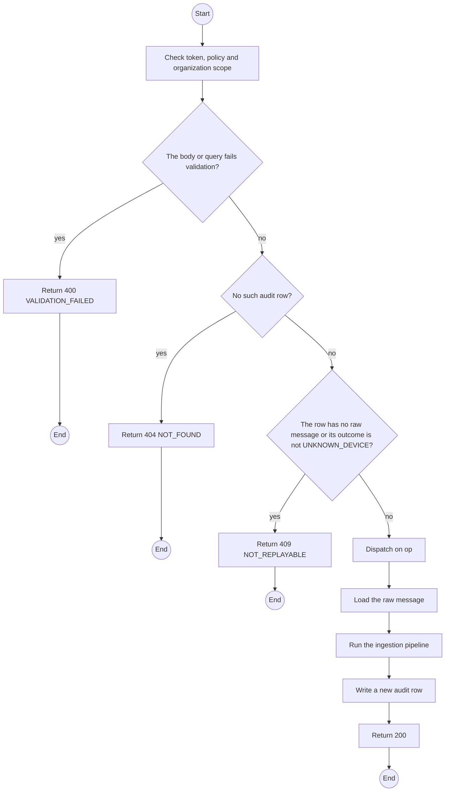
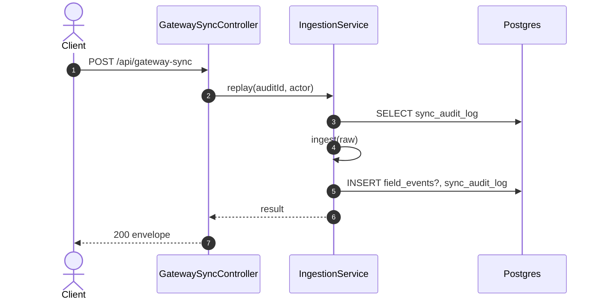

# POST /api/gateway-sync op replayAudit: Replay a quarantined message

> Module `gateway-sync`. Generated from `scripts/specs/endpoints/gateway_sync.py` by `scripts/specs/build_api_design.py`; edit the catalog, not this file. Format: `02-templates/04-api-endpoint-template.md` with Mermaid (D-017). Envelope: D-002.

[TOC]

---
## Overview

Re-runs ingestion on the stored raw message of an `UNKNOWN_DEVICE` audit row, after Staff registered the device. Idempotent: an `eventId` already stored ends as `DUPLICATE_REJECTED` (BR-11).

## API Specification

| API | URL |
| --- | --- |
| POST | /api/gateway-sync |
| Permission | TrekLink Admin |
| Operation | `op: "replayAudit"` (D-027) |
| Traces | UC-26, FR-EVT-01, BR-11 |

## Request sample

```json
{
  "op": "replayAudit",
  "auditId": "sa-7"
}
```

| Field | Description | Data Type | Required | Examples |
| --- | --- | --- | --- | --- |
| op | Literal `replayAudit` | string | yes | `replayAudit` |
| auditId | Sync audit row with a stored raw message | uuid | yes | `sa-7` |

## Response sample

```json
{
  "result": {
    "auditId": "sa-7",
    "newAuditId": "sa-9123",
    "outcome": "ACCEPTED",
    "eventId": "9a0b..."
  },
  "isSuccess": true,
  "statusCode": 200,
  "message": "OK"
}
```

## Validation

<table>
    <th>Status code</th>
    <th>Description</th>
    <th>Examples</th>
    <tbody>
        <tr>
            <td>400</td>
            <td>The body or query fails validation (<code>VALIDATION_FAILED</code>)</td>
<td>

```json
{
  "result": {
    "errorCode": "VALIDATION_FAILED"
  },
  "isSuccess": false,
  "statusCode": 400,
  "message": "{field} is required."
}
```
</td>
        </tr>
        <tr>
            <td>401</td>
            <td>Missing, malformed or expired access token or API key (<code>UNAUTHENTICATED</code>)</td>
<td>

```json
{
  "result": {
    "errorCode": "UNAUTHENTICATED"
  },
  "isSuccess": false,
  "statusCode": 401,
  "message": "Authentication required."
}
```
</td>
        </tr>
        <tr>
            <td>403</td>
            <td>The caller's role, policy or organization does not allow this action (<code>FORBIDDEN</code>)</td>
<td>

```json
{
  "result": {
    "errorCode": "FORBIDDEN"
  },
  "isSuccess": false,
  "statusCode": 403,
  "message": "You do not have access to this."
}
```
</td>
        </tr>
        <tr>
            <td>404</td>
            <td>No such audit row (<code>NOT_FOUND</code>)</td>
<td>

```json
{
  "result": {
    "errorCode": "NOT_FOUND"
  },
  "isSuccess": false,
  "statusCode": 404,
  "message": "Audit row not found."
}
```
</td>
        </tr>
        <tr>
            <td>409</td>
            <td>The row has no raw message or its outcome is not UNKNOWN_DEVICE (<code>NOT_REPLAYABLE</code>)</td>
<td>

```json
{
  "result": {
    "errorCode": "NOT_REPLAYABLE"
  },
  "isSuccess": false,
  "statusCode": 409,
  "message": "This cannot be done while it is ACCEPTED."
}
```
</td>
        </tr>
    </tbody>
</table>

## Activity Diagram



## Sequence Diagram


