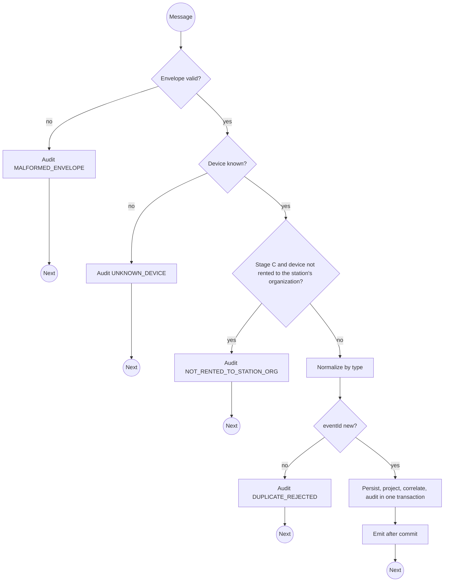

# MQTT ingress contract: Stage A, B and C topics

> Module `gateway-sync`. Hand-written: the one inbound interface of the platform that is not HTTP, so it
> has no D-002 envelope. Firmware facts are cited to `treklink-docs/_docs/00-project-context/04-firmware-ground-truth.md`
> (FGT); where FGT and this file disagree, FGT wins and this file is stale.

[TOC]

---
## Overview

Field events reach the backend over MQTT, QoS 1, TLS, on two topic families that share one payload
format, the stock Meshtastic JSON serializer (FGT §4):

| Stage | Publisher | Topic | Credential |
|---|---|---|---|
| A, B | A TrekLink node with Wi-Fi uplink, MQTT module on, `json_enabled = true`, `root = "treklink"` | `treklink/2/json/<channelId>/<nodeId>` | Fleet node credential, provisioned by TrekLink |
| C | The Field Station on the organization's laptop, republishing what its USB node hears | `treklink/fs/<mqttUsername>/2/json/<channelId>/<nodeId>` | The organization's Field Station credential (D-037, FR-EVT-14) |

The Field Station topic carries the station's username, because an MQTT subscriber never sees who
published. The broker ACL (`api-design/02`) allows a Field Station to publish only under its own
`treklink/fs/<username>/#`, so the username in the topic is trustworthy. The backend subscribes to
`treklink/2/json/+/+` and `treklink/fs/+/2/json/+/+` with a subscribe-only credential.

The Field Station republishes each queued event verbatim, keeping `from` and `id`, so `eventId` is
identical whichever path delivers it and a packet heard by both a node uplink and a station is stored
once (BR-11).

## Message

A position packet as the stock serializer emits it (FGT §4). Member names inside `payload` are the
serializer's; golden fixtures captured from real devices replace this sample (gateway-sync tasks 1.2).

```json
{
  "id": 1834576211,
  "timestamp": 1760072560,
  "to": 4294967295,
  "from": 2763113171,
  "channel": 0,
  "type": "position",
  "sender": "!a4b1c2d3",
  "payload": { "latitude_i": 115601000, "longitude_i": 1085402000, "altitude": 1320, "time": 1760072559 },
  "rssi": -97,
  "snr": 6.25,
  "hops_away": 1
}
```

| Field | Description | Data Type | Required | Examples |
| --- | --- | --- | --- | --- |
| id | `MeshPacket.id`; half of `eventId` (D-006) | uint32 | yes | `1834576211` |
| from | Originating node number; the other half of `eventId`; resolved to a `Device` by `nodeNum` | uint32 | yes | `2763113171` |
| timestamp | Device `rx_time`; `0` means no valid RTC and is stored as null (FR-EVT-08) | uint32 seconds | yes | `1760072560` |
| type | `text`, `position`, `telemetry`; `treklink_queue_health` for the Stage B report ([queue-health-payload.md](queue-health-payload.md)); anything else, including an empty `type`, is ignored without error | string | yes | `position` |
| sender | The node that published (Stage A, B) or the station's node (Stage C) | string | yes | `!a4b1c2d3` |
| payload | Per-type body. `text` carries the SOS strings of FGT §2 | object | yes | n/a |
| rssi, snr, hops_away | Link quality; present only when non-zero | number | no | `-97` |

`eventId = sha256(from + ":" + id)`, lower-case hex (FR-EVT-01, D-006).

**Classification** (FR-EVT-02, FR-EVT-09): a `text` body starting `SOS - FALL DETECTED` is `FALL_SOS`
and is tested before `SOS - `, which is `SOS` (FGT §2, line 49); both are `P0_SOS`. `SOS_CANCEL` is
reserved: today the firmware transmits **nothing** on cancel (FGT §2, `TrekLinkSOSHelper.cpp:49-53`),
so FR-INC-09 has no input until the firmware sends a cancel text (OPEN, D-038 pending). `position` is `P2_GPS`, raised to `P1_LOCATION` when it belongs to an open
episode; `telemetry` is `P3_TELEMETRY`; other text is `CHAT` at `P3`.

## Outcomes

MQTT has no response. Each message yields one `SyncAuditLog` row and, when accepted, one `FieldEvent`.

| Condition | Outcome | Effect |
| --- | --- | --- |
| JSON unparsable or a required field missing | `MALFORMED_ENVELOPE`, raw message stored | nothing else; consumption continues (FR-EVT-05, E02-4) |
| `from` matches no device | `UNKNOWN_DEVICE`, raw message stored | quarantined; replayable after registration (`op replayAudit`) |
| Stage C, and the device is not on a running contract of the station's organization | `NOT_RENTED_TO_STATION_ORG` | dropped (FR-EVT-14) |
| `eventId` already stored | `DUPLICATE_REJECTED` | no incident, no emit (FR-EVT-01, E02-2) |
| The type strategy throws | `NORMALIZATION_FAILED` with the error | isolated to this packet |
| Coordinates outside WGS-84 or outside `monitoring.positionBounds` | `INVALID_POSITION` | event kept, position null (FR-MON-04) |
| Speed from the last position above `monitoring.maxPlausibleSpeedKmh` | `IMPLAUSIBLE_POSITION` | event kept with `plotted = false`, not projected (FR-MON-04, E04-6) |
| `type: treklink_queue_health` | `QUEUE_REPORT` | `DeviceQueueReport` stored; no `FieldEvent` |
| Otherwise | `ACCEPTED` | `FieldEvent` with the renting organization, device projection, incident correlation, stream event |

The `FieldEvent` insert, the device projection and the incident correlation run in one transaction
keyed by the unique `eventId` (FR-EVT-01); the stream and alert emits happen after commit.

## Activity Diagram



## Sequence Diagram

See `specs/gateway-sync/design.md` Figure 3.
