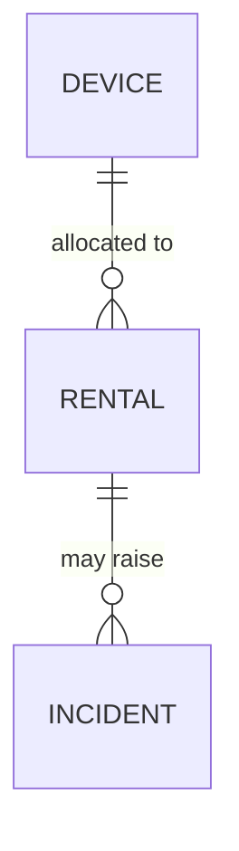
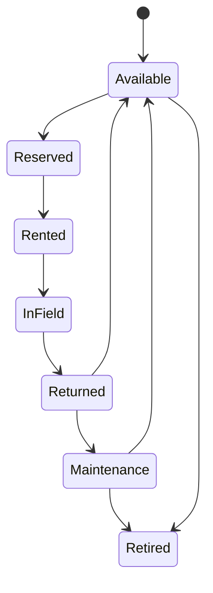
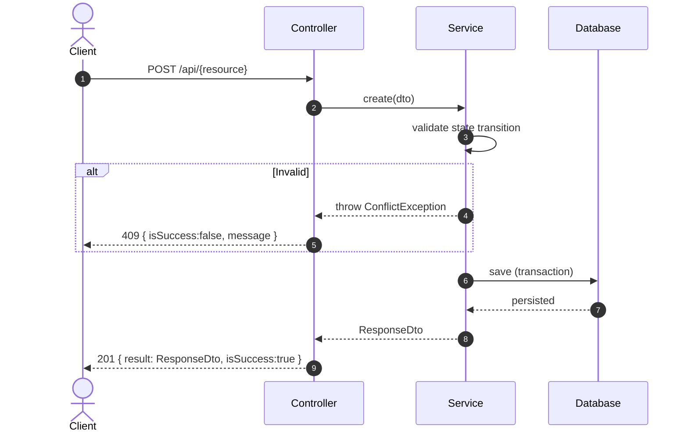

# Technical Design: gateway-sync

> Fulfills `requirements.md` in the same `specs/{module}/` folder. Do not start `tasks.md` or code until this is reviewed.

## 1. Domain Model & Data Schema

### Entity: [EntityName]
- `id` (UUID, PK)
- `status` (enum: …) — if this entity has a lifecycle, render it below as a state diagram
- Audit fields: `createdAt`, `updatedAt` (see `01-conventions/04-architecture-conventions.md` §2)

### State machine (if applicable — e.g. Device 7-state, Incident 5-state)

---

## 2. Service / Business Logic Design

### Mutating operations
- `create{Thing}(dto)` → returns `{Thing}ResponseDto`
- `update{Thing}Status(id, newStatus)` → validates against the transition table, throws `ConflictException` on an illegal transition

### Read operations
- `find{Thing}sPaged(query)` → returns `PagedResultDto<{Thing}ResponseDto>`

### Cross-module dependencies
- Depends on: `{OtherModule}Service.{method}` (imported via DI, per `01-conventions/04-architecture-conventions.md` §1.1 — never a direct repository import)

---

## 3. Sequence Flow

---

## 4. API Endpoints in this module
List each endpoint and link its file under `api-design/`, using `02-templates/04-api-endpoint-template.md`:
- `POST /api/{resource}` → `api-design/01-post-{resource}-create.md`
- `GET /api/{resource}` → `api-design/02-get-{resource}-list.md`

---

## 5. Frontend impact (if applicable)
- New screens/widgets: […]
- New Zod schema mirroring the DTO above: […]
