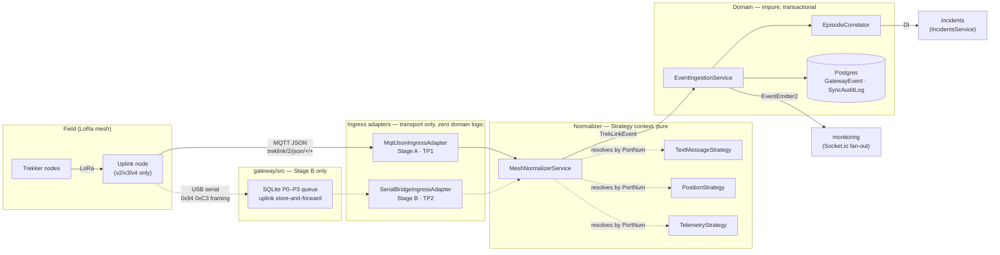
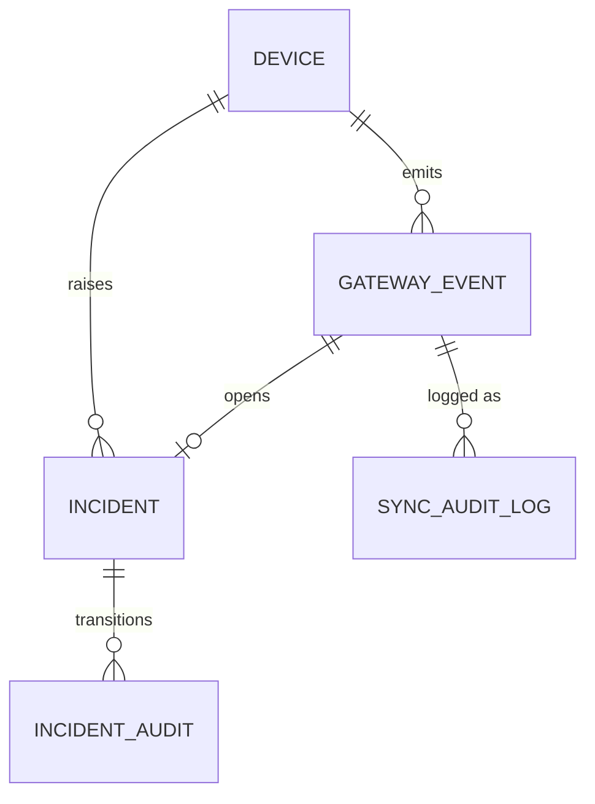
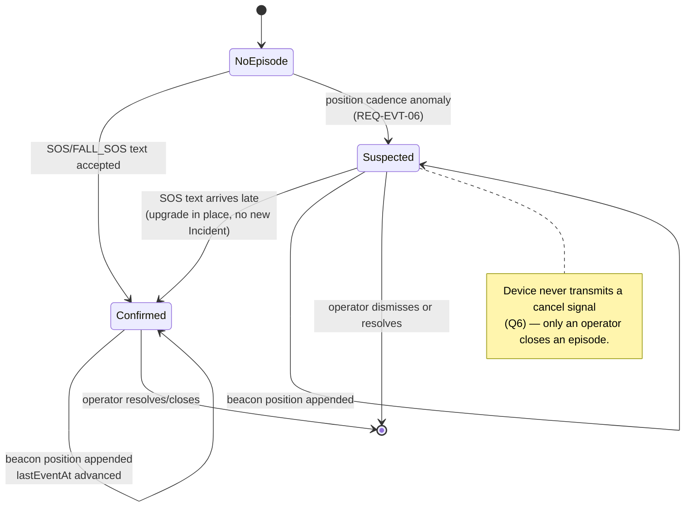
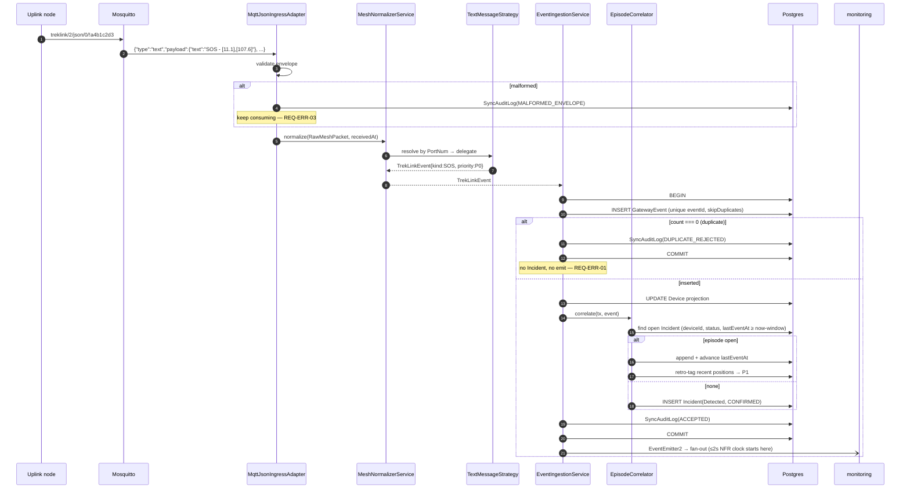

# Technical Design: gateway-sync

> Fulfills `requirements.md` in the same `specs/{module}/` folder. Do not start `tasks.md` or code until this is reviewed.
>
> **Authority**: D-005 (staged topology), D-006 (split `eventId`), D-007 (canonical envelope + Strategy normalizer), D-008 (firmware is editable). Firmware facts cited as `file:line` are inspection results — full reference in [`04-firmware-ground-truth.md`](../../../treklink-docs/_docs/00-project-context/04-firmware-ground-truth.md).
>
> This design targets firmware **as it stands today** and does not depend on any firmware change landing. Where a firmware fix would supersede a mitigation here, it is marked ⟡.

---

## 0. Architecture Overview

The module is a pipeline with two deliberate seams. Everything upstream of the normalizer is transport; everything downstream is domain.



**Why the seams sit here.** Stage A and Stage B do not share a wire format. The node's MQTT module publishes to a hardcoded topic shape — `<root>/2/e/<channelId>/<nodeId>` (ServiceEnvelope protobuf) or `<root>/2/json/<channelId>/<nodeId>` (JSON) per `MQTT.cpp:423–430`, `:798`. `<root>` is configurable; the rest is not. `gateway/src/mqtt/mqtt-client.ts:53` publishes something else entirely. Parsing either format directly in the domain layer makes Stage B a rewrite. Both stages instead converge on `TrekLinkEvent` before any domain code runs.

---

## 1. Domain Model & Data Schema

### 1.1 Canonical envelope — `TrekLinkEvent`

The one type the domain layer accepts. Lives in `backend/src/modules/gateway-sync/contracts/` and is re-exported for `gateway/` to share (the shared-types benefit D-004 cites for the monorepo).

```typescript
export type IngressPath = 'MQTT_NODE' | 'SERIAL_BRIDGE';

export enum EventKind {
  SOS = 'SOS',
  FALL_SOS = 'FALL_SOS',
  POSITION = 'POSITION',
  TELEMETRY = 'TELEMETRY',
  CHAT = 'CHAT',
}

export interface TrekLinkEvent {
  readonly eventId: string;        // sha256(nodeNum:packetId) hex — D-006
  readonly nodeNum: number;        // MeshPacket.from
  readonly packetId: number;       // MeshPacket.id
  readonly gatewayId: string;      // JSON `sender` — which node/bridge delivered it
  readonly ingress: IngressPath;
  readonly kind: EventKind;
  readonly priority: PriorityTier; // provisional; EpisodeCorrelator may promote P2→P1
  readonly observedAt: Date | null; // device rx_time; null when RTC invalid (REQ-ERR-06)
  readonly receivedAt: Date;        // backend wall clock — the trusted ordering field
  readonly position?: { lat: number; lon: number; alt?: number } | null;
  readonly metrics?: { batteryPct?: number; voltage?: number };
  readonly text?: string;
  readonly linkQuality?: { rssi?: number; snr?: number; hopsAway?: number };
  readonly rawPayload: unknown;    // persisted verbatim — REQ-UBI-04
}
```

`observedAt` and `receivedAt` are separate because `rx_time` comes from the device RTC and `getValidTime()` yields `0` when no valid time is held. Substituting `receivedAt` would fabricate data; all ordering therefore uses `receivedAt` (REQ-UBI-02).

### 1.2 Prisma schema changes



**`GatewayEvent`** — append-only ledger of accepted events, and the telemetry history itself (no separate time-series table; "last N readings" and map trails query this directly).

| Change | Detail |
|---|---|
| `eventId` | Stays `@unique`. Now `sha256(nodeNum:packetId)` per D-006. |
| `kind` | **New** — `EventKind` enum. |
| `observedAt` | **New**, nullable. |
| `receivedAt` | **New**, non-null, default `now()`. |
| `gatewayId`, `ingress` | **New** — which path delivered it. Makes Stage A+B dual-path dedup auditable. |
| `latitude`/`longitude`/`altitude` | **New**, nullable — promoted out of `payload` for map queries. |
| `rssi`/`snr`/`hopsAway` | **New**, nullable — RQ1 RF-coverage analysis (REQ-OPT-02). |
| `incidentId` | **New**, nullable FK — set when this event opened or joined an episode. |
| `@@index` | `([deviceId, receivedAt])` for trails; `([deviceId, kind, receivedAt])` for cadence detection. |

**`Incident`** — the D-006 split. Current `eventId @unique` serves as *both* the packet key and the episode key; that conflation is what mints one Incident per beacon tick.

| Change | Detail |
|---|---|
| `eventId @unique` | **Removed.** Replaced by `openedByEventId` FK → `GatewayEvent`. |
| `lastEventAt` | **New**, non-null — advanced on every correlated append. |
| `detectionConfidence` | **New** — `CONFIRMED` (text frame seen) \| `SUSPECTED` (cadence-inferred, REQ-EVT-06). |
| `@@index` | `([deviceId, status, lastEventAt])` — the episode-correlation lookup (§2.4). |

**`SyncAuditLog`** — **new table.** Every ingestion *attempt*, accepted or not. This is the evidence base for the RQ1 delivery/loss/duplicate figures; `GatewayEvent` alone cannot show what was rejected.

```prisma
model SyncAuditLog {
  id          String        @id @default(uuid())
  eventId     String?       // null when the envelope was too malformed to derive one
  nodeNum     Int?
  deviceId    String?
  ingress     IngressPath
  outcome     SyncOutcome
  detail      String?
  rawMessage  Json?
  createdAt   DateTime      @default(now())

  @@index([outcome, createdAt])
  @@index([eventId])
  @@map("sync_audit_log")
}

enum SyncOutcome {
  ACCEPTED
  DUPLICATE_REJECTED
  MALFORMED_ENVELOPE
  NORMALIZATION_FAILED
  UNKNOWN_DEVICE
  INVALID_POSITION
  CLOCK_SKEW
}
```

`Device` keeps its latest-only projection columns (`lastSeenAt`, `batteryPct`, plus new `lastLatitude`/`lastLongitude`) for current-state reads. History always comes from `GatewayEvent`.

### 1.3 SOS episode lifecycle

The `Incident` 5-state FSM belongs to `incidents`. What `gateway-sync` owns is the episode-membership question feeding it:



---

## 2. Service / Business Logic Design

### 2.1 Ingress adapters — `MeshIngressAdapter`

Transport only. An adapter that contains a PortNum check is a bug.

```typescript
export interface RawMeshPacket {
  readonly from: number;
  readonly id: number;
  readonly channel: number;
  readonly portnum: PortNum;
  readonly payload: unknown;
  readonly rxTime: number | null;   // 0 → null
  readonly gatewayId: string;
  readonly ingress: IngressPath;
  readonly linkQuality?: { rssi?: number; snr?: number; hopsAway?: number };
  readonly raw: unknown;
}

export interface MeshIngressAdapter {
  readonly path: IngressPath;
  start(): Promise<void>;
  stop(): Promise<void>;
}
```

`MqttJsonIngressAdapter` `[A]` subscribes `treklink/2/json/+/+`, validates the envelope with `class-validator`, maps the JSON `type` discriminator (`"text"` / `"position"` / `"telemetry"`, from `MeshPacketSerializer.cpp:28,208,56`) to a PortNum, and calls the normalizer. Envelope fields available — `id`, `timestamp`, `to`, `from`, `channel`, `type`, `sender`, `payload`, `rssi`, `snr`, `hops_away` (`MeshPacketSerializer.cpp:410–424`).

`SerialBridgeIngressAdapter` `[B]` consumes the bridge's canonical publish, which `gateway/src` produces from `0x94 0xC3` + big-endian u16 frames.

Registered as a NestJS multi-provider so enabling Stage B is a module-registration change, nothing more:

```typescript
{ provide: MESH_INGRESS_ADAPTERS, useClass: MqttJsonIngressAdapter, multi: true }
```

### 2.2 Strategy pattern — normalization

**Context.** `MeshNormalizerService` holds no PortNum knowledge. It resolves and delegates.

```typescript
export interface PacketNormalizationStrategy {
  readonly portnum: PortNum;
  /** Pure. No I/O, no clock, no Prisma. Returns null to ignore the packet. */
  normalize(packet: RawMeshPacket, receivedAt: Date): TrekLinkEvent | null;
}

@Injectable()
export class MeshNormalizerService {
  private readonly registry: ReadonlyMap<PortNum, PacketNormalizationStrategy>;

  constructor(@Inject(PACKET_STRATEGIES) strategies: PacketNormalizationStrategy[]) {
    this.registry = new Map(strategies.map((s) => [s.portnum, s]));
  }

  normalize(packet: RawMeshPacket, receivedAt: Date): TrekLinkEvent | null {
    return this.registry.get(packet.portnum)?.normalize(packet, receivedAt) ?? null;
  }
}
```

**Why Strategy and not a switch.** Open/Closed: a new PortNum is a new class plus one provider line, with no edit to the context (AC-09). Each strategy is independently unit-testable with a hand-built `RawMeshPacket` — no broker, no device, no DB (AC-10), which is what makes the charter's dedup/ordering NFR suite cheap rather than integration-only. Purity is enforced by construction: `receivedAt` is passed in rather than read from the clock, so tests are deterministic.

**Concrete strategies.**

| Strategy | PortNum | Produces | Notes |
|---|---|---|---|
| `TextMessageStrategy` | `TEXT_MESSAGE_APP` (1) | `SOS` / `FALL_SOS` / `CHAT` | Prefix match + coordinate parse (§2.3) |
| `PositionStrategy` | `POSITION_APP` (3) | `POSITION` @ provisional `P2` | Promotion to `P1` is the correlator's job (§2.4) |
| `TelemetryStrategy` | `TELEMETRY_APP` (67) | `TELEMETRY` @ `P3` | Extracts `batteryPct` |

Priority is assigned *by the strategy*, because only the strategy knows whether a text body is an SOS or chat.

### 2.3 SOS text parsing — `TextMessageStrategy`

The firmware emits SOS as an ASCII prefix, not a PortNum. Format string is `"%s - [%.6f], [%.6f]"` (`TrekLinkSOSHelper.cpp:146`) with a no-GPS fallback `"%s - [No GPS]"` (`:148`). Order matters — the fall prefix must be tested first, since `"SOS - FALL DETECTED - …"` also satisfies `"SOS - "`.

| Input | Kind | Priority | Position |
|---|---|---|---|
| `SOS - FALL DETECTED - [11.123456], [107.654321]` | `FALL_SOS` | `P0` | parsed |
| `SOS - FALL DETECTED - [No GPS]` | `FALL_SOS` | `P0` | null |
| `SOS - [11.123456], [107.654321]` | `SOS` | `P0` | parsed |
| `SOS - [No GPS]` | `SOS` | `P0` | null |
| anything else | `CHAT` | `P3` | null |

A parse failure on the coordinate portion never downgrades the kind (REQ-ERR-05): an SOS without coordinates is still an SOS. Note the buffer is 100 bytes (`char message[100]`) and truncated with `snprintf`, so a malformed tail is possible and must not throw.

> ⟡ **Fragility, acknowledged.** This parser is coupled to a `printf` format string. It is the only discriminator the firmware currently offers — `TREKLINK_MSG_SOS 0x01` is declared in three headers and referenced nowhere. A format change silently breaks ingestion, so §5 pins a regression test to the cited line.
>
> **Firmware supersession (D-008)**: a real custom SOS PortNum in the `PRIVATE_APP` (256) range would retire this parser entirely and is the cleanest available fix. Until it lands, this table is the contract — and the regression test should be kept afterward regardless, since it costs nothing and catches drift.

### 2.4 Episode correlation — `EpisodeCorrelator`

Two problems this solves, both consequences of firmware behavior.

**(a) One SOS episode must yield one Incident.** `tickBeacon` retransmits position every 5s for 60s, then every 30s, indefinitely (`TrekLinkSOSHelper.cpp:181`). Per-packet keys would mint an Incident per tick.

Lookup, not hash — `findFirst({ deviceId, status: { notIn: [RESOLVED, CLOSED] }, lastEventAt: { gte: now - episodeWindow } })`. Found → append, advance `lastEventAt`. Not found → create one Incident.

> A hash-bucket key (`hash(nodeNum : timeBucket)`) was considered and rejected in D-006: an episode straddling a bucket boundary splits into two Incidents — precisely the failure the key exists to prevent. The lookup has no boundary artifact.

**(b) The SOS position packet is indistinguishable from a routine one on the JSON path.** `triggerSOS()` sends position *then* text (`TrekLinkSOSHelper.cpp:41–48`), both at `priority = MAX` (`:119`, `:158`) — but the JSON envelope omits `MeshPacket.priority` entirely (D-007). So `PositionStrategy` cannot tell them apart.

Resolved with a two-way window (REQ-EVT-08): a position arriving *while* an episode is open is `P1`; and when an SOS text opens an episode, positions from that device within the preceding grace window are **retro-tagged** `P1`. The retro-tag is needed because the position is emitted first and mesh reordering can widen that gap arbitrarily.

**(c) Cadence inference** (REQ-EVT-06). ⟡ The SOS text is sent **once**, `want_ack = false` (`:157–160`); every beacon after it is position-only. Lose that one frame to RF and the episode is invisible. But the beacon cadence itself is evidence — 5s/30s is far denser than any routine position interval. N positions inside window W with no open Incident raises a `SUSPECTED` episode. A later-arriving SOS text upgrades it to `CONFIRMED` **in place**, never creating a second Incident.

> **Firmware supersession (D-008)**: retransmitting the SOS discriminator with each beacon — or setting `want_ack` on the text frame — would remove the single point of failure at source and demote this detector from primary safeguard to defence-in-depth. **Keep it either way.** A heuristic that occasionally raises a low-confidence episode is a far better failure mode than a real SOS arriving as routine telemetry, and no firmware fix makes RF loss impossible.

> Thresholds N, W, episode window, and grace window are **Q3–Q5 in `requirements.md` §5** and are not yet calibrated. They ship as configuration, not constants.

### 2.5 Transactional ingestion — `EventIngestionService`

Per `04-architecture-conventions.md` §3, the idempotency check and the Incident side-effect are **one** transaction. A read-then-write pair races under the charter's 20-simultaneous-submission target.

```typescript
await this.prisma.$transaction(async (tx) => {
  const inserted = await tx.gatewayEvent.createMany({ data: [row], skipDuplicates: true });
  if (inserted.count === 0) {
    await tx.syncAuditLog.create({ data: { ...ctx, outcome: 'DUPLICATE_REJECTED' } });
    return;                                  // no Incident, no domain event — REQ-ERR-01
  }
  await tx.device.update({ where: { id }, data: projection });
  if (isSosKind(event)) await this.correlator.correlate(tx, event);
  await tx.syncAuditLog.create({ data: { ...ctx, outcome: 'ACCEPTED' } });
});
```

Atomicity rests on the unique index on `eventId` doing the arbitration — `skipDuplicates` resolves the race in the database, not in application code (REQ-ERR-02).

### 2.6 Cross-module dependencies

Per `04-architecture-conventions.md` §1.1 — exported services via DI, never a foreign repository import.

- **`DevicesService.findByNodeNum(nodeNum)`** — resolution; miss → `UNKNOWN_DEVICE` quarantine (REQ-STA-04).
- **`IncidentsService.openEpisode()` / `.appendEvent()`** — `gateway-sync` never writes the Incident FSM itself.
- **`monitoring`** — decoupled by `EventEmitter2`, not a direct call. `gateway-sync` holds no Socket.io reference (REQ-EVT-07), which also avoids the circular import `04-architecture-conventions.md` §1.1 forbids.

---

## 3. Sequence Flow



---

## 4. API Endpoints in this module

Ingestion is MQTT-driven, not REST — there is no public "submit event" endpoint.

**One endpoint per module, dispatched by operation** (team decision, Session 7). The module exposes a single route whose request body carries a discriminated `op`, resolved through an operation-strategy registry — the same Strategy shape §2.2 already uses for normalization, applied to the API surface.

```
POST /api/gateway-sync     { "op": "...", ...params }   → D-002 envelope
```

| `op` | Params | Purpose | Authority | Spec file |
|---|---|---|---|---|
| `health` | — | Broker connectivity, last-packet age per gateway, adapter status, **per-device queue depth from REQ-EVT-12**. Serves REQ-ERR-10's silence alarm and REQ-EVT-13's buffering state. | Staff, Admin | `api-design/01-op-health.md` |
| `listEvents` | device, kind, priority, from, to, page | Paged `GatewayEvent` query. Backs map trails and "last N readings". | Staff, Admin | `api-design/02-op-list-events.md` |
| `listAudit` | outcome, from, to, page | Paged `SyncAuditLog`. **The RQ1 evidence surface** — delivery, loss and duplicate rates are computed from here. | **Admin only** | `api-design/03-op-list-audit.md` |
| `replay` | eventId | Re-run normalization from stored `rawPayload` after a parser fix (REQ-UBI-04). | **Admin only** | `api-design/04-op-replay.md` |

```ts
interface GatewaySyncOperation<TParams, TResult> {
  readonly op: string;
  readonly policy: PolicyHandler;          // resolved per-op, NOT per-route
  handle(params: TParams, actor: Actor): Promise<TResult>;
}
```

> ⚠️ **The authorization caveat, stated because it is the one real cost of this shape.** Collapsing four routes into one collapses four route-level guard declarations into one. `JwtAuthGuard` still covers the route, but `PoliciesGuard` **cannot** — the required policy now depends on the request *body*, which a route-level guard is the wrong place to read. So the policy check moves inside dispatch: the registry resolves the operation, reads its declared `policy`, and evaluates it **before** `handle()` runs. Two consequences that are not optional:
> 1. **An operation registered without a `policy` must fail closed** — reject at registration time, not at request time. A missing policy silently defaulting to "allow" would expose `listAudit` and `replay` to any authenticated user, which is the entire Admin boundary in this module.
> 2. **Every operation needs its own authorization test.** Route-level guards are visible in one file and easy to audit; per-op policies are not. The test suite is what replaces that visibility.
>
> Also traded away: HTTP caching and conditional requests on the three read operations, since they are now `POST`. Acceptable here — these are live operational reads that should not be cached anyway — but it is a real loss and should not be rediscovered later as a surprise.

---

## 5. Testing Strategy

Purity (REQ-UBI-07) is what makes the top tier cheap — no broker, no device, no DB.

| Tier | Target | Covers |
|---|---|---|
| Unit — strategies | Every row of the §2.3 table, plus truncated and empty bodies | AC-05, AC-09, AC-10 |
| Unit — correlator | Episode open/append/upgrade; boundary case that killed the hash approach | AC-04, AC-06 |
| Integration — ingestion | 10× replay; 20 concurrent distinct; 20 concurrent identical | AC-01, AC-02, AC-03 |
| Integration — adapter | Malformed envelope, unknown `nodeNum`, `rx_time = 0`, out-of-range coordinates | AC-07, AC-08 |
| **Contract — firmware regression** | Golden fixtures captured from a real device, asserted against the `TrekLinkSOSHelper.cpp:146` format string | §2.3 fragility |
| E2E `[B]` | 30-minute uplink severance on a **device**, mixed-priority events, SOS survives eviction | firmware `onboard-queue` AC-01, AC-02 |
| E2E `[C]` | 30-minute uplink severance at the **bridge**, 200 mixed-priority events | AC-11 |

The contract tier is the one not to skip. It is the only thing that turns a silent firmware format drift into a failing build rather than an SOS that parses as chat.

---

## 6. Frontend impact

- **Widgets**: `LiveMapWidget` gains an SOS-episode layer distinguishing `CONFIRMED` from `SUSPECTED` markers — a cadence-inferred episode must be visually distinct, since it carries lower confidence and no operator should treat it as equivalent.
- **New**: `GatewayHealthWidget` (broker state, last-packet age per gateway) and `SyncAuditTable` (Admin; the RQ1 evidence view).
- **Zod schemas** mirroring `GatewayEventResponseDto` and `SyncAuditLogResponseDto` in `shared/api/`.
- Socket payloads arrive via `shared/socket/socketClient.ts`, rooms scoped per trip.
