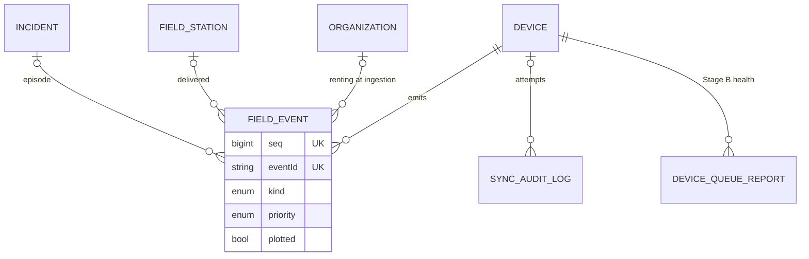
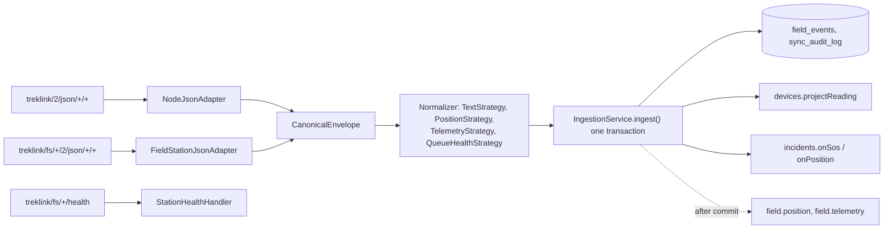
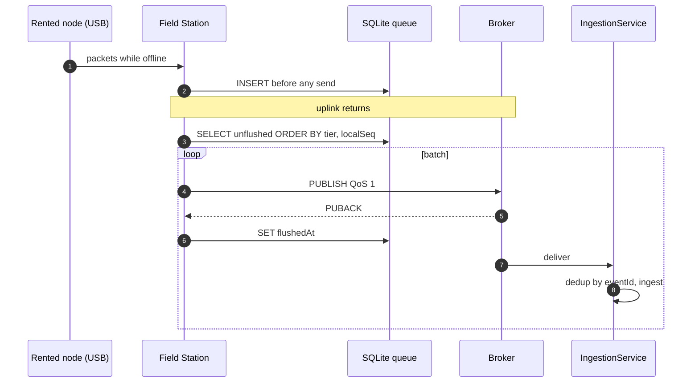

# Technical Design: gateway-sync

> Fulfills `requirements.md` in this folder. Schema: the `// @module gateway-sync` block of
> `backend/prisma/schema.prisma` is authoritative. Contracts: [mqtt-ingress-contract.md](api-design/mqtt-ingress-contract.md),
> [queue-health-payload.md](api-design/queue-health-payload.md), [field-station-local-page.md](api-design/field-station-local-page.md).

---

## 1. Data model

```mermaid
erDiagram
    DEVICE ||--o{ FIELD_EVENT : "emits"
    ORGANIZATION |o--o{ FIELD_EVENT : "renting at ingestion"
    FIELD_STATION |o--o{ FIELD_EVENT : "delivered"
    INCIDENT |o--o{ FIELD_EVENT : "episode"
    DEVICE |o--o{ SYNC_AUDIT_LOG : "attempts"
    DEVICE ||--o{ DEVICE_QUEUE_REPORT : "Stage B health"
    FIELD_EVENT {
        bigint seq UK
        string eventId UK
        enum kind
        enum priority
        bool plotted
    }
```

***Figure 1***: gateway-sync slice. `FieldEvent.seq` is the ingestion order used by history queries.

---

## 2. Pipeline

```mermaid
flowchart LR
    T1["treklink/2/json/+/+"] --> A1["NodeJsonAdapter"]
    T2["treklink/fs/+/2/json/+/+"] --> A2["FieldStationJsonAdapter"]
    T3["treklink/fs/+/health"] --> H["StationHealthHandler"]
    A1 --> E["CanonicalEnvelope"]
    A2 --> E
    E --> N["Normalizer: TextStrategy, PositionStrategy,<br/>TelemetryStrategy, QueueHealthStrategy"]
    N --> I["IngestionService.ingest() one transaction"]
    I --> DB[("field_events, sync_audit_log")]
    I --> D["devices.projectReading"]
    I --> C["incidents.onSos / onPosition"]
    I -.->|"after commit"| M["field.position, field.telemetry"]
```

***Figure 2***: Ingestion pipeline (D-007). Adapters only translate topics and envelopes; strategies only
decode payloads; `IngestionService` alone writes.

`IngestionService.ingest(envelope)`:

1. Compute `eventId`; resolve the device by `nodeNum` (`UNKNOWN_DEVICE` otherwise).
2. Stage C: resolve the station from the topic; revoked, or device not on a running contract of its
   organization, ends the attempt with its audit outcome.
3. `BEGIN`; `INSERT field_events ... ON CONFLICT (eventId) DO NOTHING RETURNING id`. No row means
   `DUPLICATE_REJECTED`: audit and `COMMIT`.
4. Position rules (bounds, speed); `devices.projectReading`; `incidents.onSos` or `onPosition` with the
   same `tx`; set `incidentId` on the event when it joined an episode (the one allowed update).
5. Audit `ACCEPTED`; `COMMIT`; emit.

The MQTT client uses QoS 1 and a persistent session, and acknowledges a message only after `ingest()`
returns, so a backend crash mid-transaction gets the message redelivered and dedup absorbs it.

---

## 3. Field Station (Stage C) executable

A Node.js program in `treklink-web/gateway/`, packaged as one executable per OS (task 5.1):

| Part | Design |
|---|---|
| Serial reader | Meshtastic serial protocol over the USB COM port of one rented node; decodes `FromRadio` packets into the stock JSON shape |
| Queue | SQLite in WAL mode, table `queue(localSeq INTEGER PRIMARY KEY, tier INT, eventJson TEXT, attempts INT, flushedAt)`; insert before anything else |
| Flush | One in-flight batch: `SELECT ... WHERE flushedAt IS NULL ORDER BY tier, localSeq LIMIT 50`; publish each with QoS 1; set `flushedAt` on its PUBACK |
| Bound | `QUEUE_MAX_ROWS`; on overflow delete the oldest P3, then P2; never P0 or P1 |
| Health | every 60 s while connected, publish depth per tier and the oldest `attempts` to `treklink/fs/<username>/health` |
| Local page | `127.0.0.1:4321`, the routes of `field-station-local-page.md` |

---

## 4. Broker hooks

mosquitto 2 with the go-auth plugin, HTTP backend, JSON params, **status** response mode
(https://github.com/iegomez/mosquitto-go-auth, read 2026-10-04): any 2xx allows. The hooks answer through
the normal envelope with 200, 401 or 403, which status mode reads correctly. The plugin's auth cache is set to at
most 60 s (option name confirmed in task 3.1; `auth_opt_cache_seconds` is assumed, unverified), which bounds how long a revoked station keeps a
fresh connection; the backend additionally drops every message from a revoked username at once (§2 step 2).

| Credential kind | Username | Publish | Subscribe |
|---|---|---|---|
| Backend subscriber | `MQTT_USERNAME` | none | `treklink/#` |
| Fleet node (Stage A, B) | `node-<nodeId>` | `treklink/2/json/+/<nodeId>`, `treklink/2/e/+/<nodeId>` | none |
| Field Station | `fs-<org>-<n>` | `treklink/fs/<username>/#` | none |

---

## 5. Services and ports

| Export | Used by |
|---|---|
| `GatewaySyncService.eventsOfIncident(id)`, `events(deviceId, periods, kinds)`, `stats(window)` | incidents, monitoring |
| provider of `MQTT_HEALTH_PROBE` | platform |

Listens to `fieldStation.revoked`. Emits `field.position`, `field.telemetry`, `fieldStation.synced`.

---

## 6. Error catalogue

| Code | HTTP |
|---|---|
| `BROKER_SECRET` | 401 |
| `CREDENTIAL_REJECTED` | 403 |
| `TOPIC_DENIED` | 403 |
| `NOT_REPLAYABLE` | 409 |

Ingestion outcomes are audit values (`SyncOutcome`), not HTTP codes.

---

## 7. Sequence: offline flush

```mermaid
sequenceDiagram
    autonumber
    participant N as Rented node (USB)
    participant F as Field Station
    participant Q as SQLite queue
    participant B as Broker
    participant G as IngestionService
    N->>F: packets while offline
    F->>Q: INSERT before any send
    Note over F,B: uplink returns
    F->>Q: SELECT unflushed ORDER BY tier, localSeq
    loop batch
        F->>B: PUBLISH QoS 1
        B-->>F: PUBACK
        F->>Q: SET flushedAt
        B->>G: deliver
        G->>G: dedup by eventId, ingest
    end
```

***Figure 3***: Stage C flush; P0 first (BR-12).

---

## 8. Testing strategy

Golden fixtures captured from v2, v3 and v4 devices per payload type; dedup under concurrent duplicate
delivery; the replay harness for TC-11; an outage harness that blocks the uplink for 30 s to 30 min and
counts delivery and ordering (RQ1); Field Station crash mid-flush; broker hook table tests.
