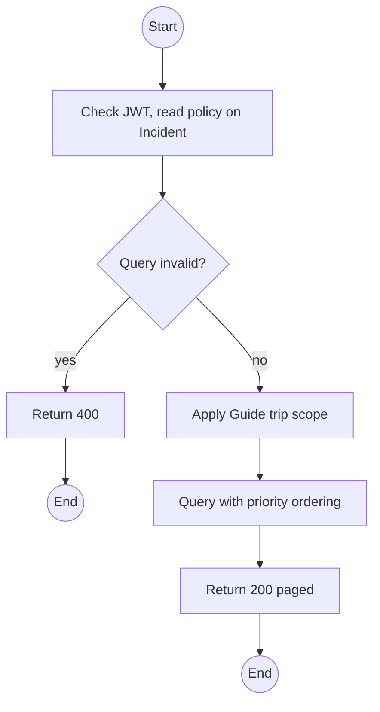
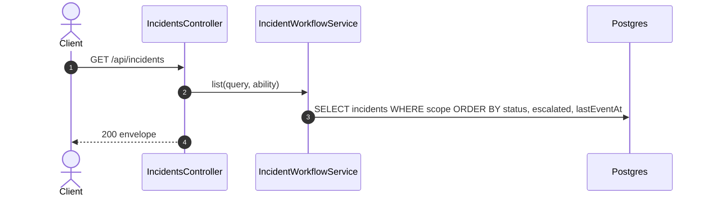

# GET /api/incidents: Incident queue

> Module `incidents`. Format: `02-templates/04-api-endpoint-template.md`, with Mermaid in place of PlantUML (D-017). Envelope: D-002.

[TOC]

---
## Overview

Paged incident list for the queue panel beside the live map. Default order puts `DETECTED` first, escalated first within it, then by `lastEventAt`. Clients call it on WebSocket reconnect to reconcile anything missed (E03-7). Guides see incidents of their assigned trips only; unassigned incidents are visible to Operators and Admin.

## API Specification

| API        | URL             |
| ---------- | --------------- |
| GET | /api/incidents |
| Permission | Operator, Admin; Guide (own trips) |
| Traces | UC-14, UC-15, US-066, REQ-UBI-04, E03-7, BR-13 |

### Query parameters

| Field | Description | Data Type | Required | Examples |
| --- | --- | --- | --- | --- |
| status | Incident statuses; default all but CLOSED | enum[] | no | `DETECTED,ACKNOWLEDGED` |
| confidence | CONFIRMED or SUSPECTED | enum | no | `SUSPECTED` |
| tripId | Trip filter | uuid | no | `a1c3...` |
| deviceId | Device filter (device history view) | uuid | no | `0d3f...` |
| unassigned | Only unassigned | bool | no | `true` |
| updatedSince | For reconnect reconciliation | datetime | no | `2026-10-11T03:10:00Z` |
| pageNumber | 1-based | int | no | `1` |
| pageSize | Default 50 | int | no | `50` |

## Request sample

No request body. Query string example:

```
GET /api/incidents?status=DETECTED,ACKNOWLEDGED,IN_PROGRESS
```

## Response sample

```json
{
  "result": {
    "items": [
      {
        "id": "3e4f5a6b-7c8d-4e9f-a0b1-c2d3e4f5a6b7",
        "code": "INC-2026-000045",
        "device": {
          "id": "0d3f...",
          "assetTag": "TL-0042"
        },
        "trip": {
          "id": "a1c3...",
          "code": "TRP-2026-1010-TNPD"
        },
        "unassigned": false,
        "source": "DEVICE_FALL",
        "confidence": "CONFIRMED",
        "status": "DETECTED",
        "firstEventAt": "2026-10-11T03:14:05Z",
        "lastEventAt": "2026-10-11T03:19:35Z",
        "eventCount": 23,
        "lastPosition": {
          "lat": 11.5601,
          "lon": 108.5402
        },
        "escalatedAt": null,
        "reopenCount": 0,
        "version": 0
      },
      {
        "id": "i-2...",
        "code": "INC-2026-000046",
        "device": {
          "id": "0d3f...",
          "assetTag": "TL-0042"
        },
        "trip": {
          "id": "a1c3...",
          "code": "TRP-2026-1010-TNPD"
        },
        "unassigned": false,
        "source": "CADENCE_INFERRED",
        "confidence": "SUSPECTED",
        "status": "DETECTED",
        "firstEventAt": "2026-10-11T03:14:05Z",
        "lastEventAt": "2026-10-11T03:19:35Z",
        "eventCount": 7,
        "lastPosition": {
          "lat": 11.5601,
          "lon": 108.5402
        },
        "escalatedAt": null,
        "reopenCount": 0,
        "version": 0
      }
    ],
    "pageNumber": 1,
    "pageSize": 50,
    "totalCount": 2,
    "totalPages": 1
  },
  "isSuccess": true,
  "statusCode": 200,
  "message": "Incidents retrieved"
}
```

## Validation

<table>
    <th>Status code</th>
    <th>Description</th>
    <th>Examples</th>
    <tbody>
        <tr>
            <td>400</td>
            <td>Bad filter (<code>VALIDATION_FAILED</code>)</td>
<td>

```json
{
  "result": {
    "errorCode": "VALIDATION_FAILED"
  },
  "isSuccess": false,
  "statusCode": 400,
  "message": "status must be a valid incident status."
}
```
</td>
        </tr>
        <tr>
            <td>401</td>
            <td>Missing, malformed or expired access token (<code>UNAUTHENTICATED</code>)</td>
<td>

```json
{
  "result": {
    "errorCode": "UNAUTHENTICATED"
  },
  "isSuccess": false,
  "statusCode": 401,
  "message": "Authentication required."
}
```
</td>
        </tr>
        <tr>
            <td>403</td>
            <td>Authenticated, but the caller's role or policy does not allow this action (<code>FORBIDDEN</code>)</td>
<td>

```json
{
  "result": {
    "errorCode": "FORBIDDEN"
  },
  "isSuccess": false,
  "statusCode": 403,
  "message": "You do not have permission to perform this action."
}
```
</td>
        </tr>
    </tbody>
</table>

## Activity Diagram



## Sequence Diagram


