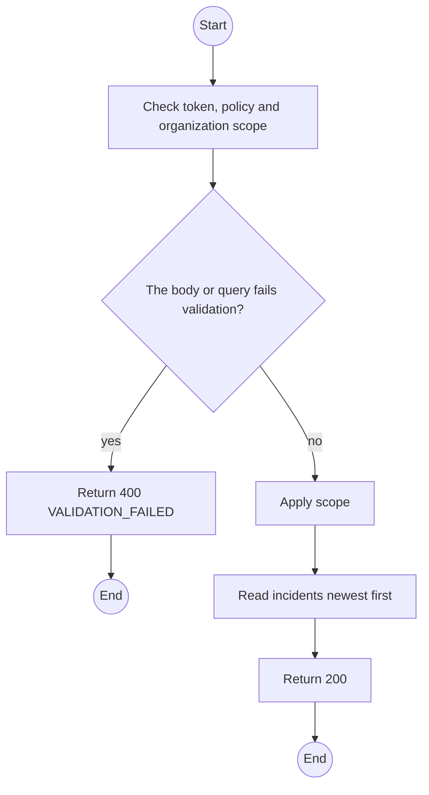
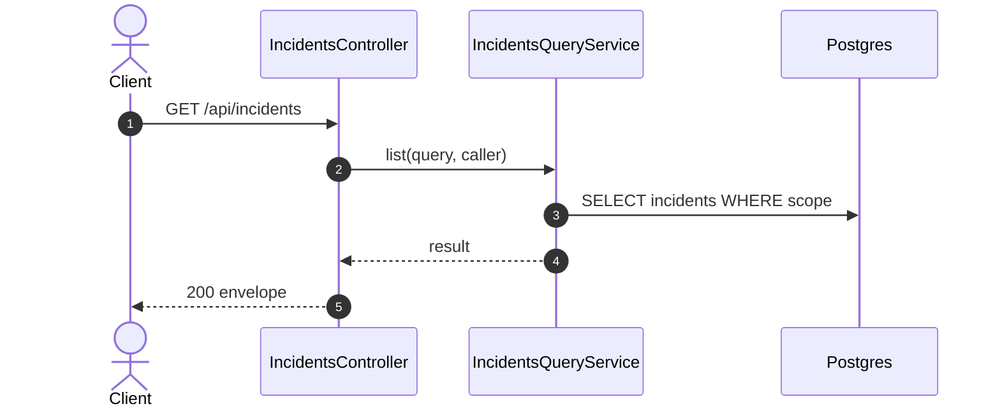

# GET /api/incidents: List incidents

> Module `incidents`. Generated from `scripts/specs/endpoints/incidents.py` by `scripts/specs/build_api_design.py`; edit the catalog, not this file. Format: `02-templates/04-api-endpoint-template.md` with Mermaid (D-017). Envelope: D-002.

[TOC]

---
## Overview

Lists incidents with state filters. Organization members see their organization's incidents; TrekLink staff see every incident, and `state=UNROUTED,ESCALATED` is their queue.

## API Specification

| API | URL |
| --- | --- |
| GET | /api/incidents |
| Permission | Org Manager, Org Operator: own; TrekLink Staff, TrekLink Admin |
| Traces | UC-29, UC-32, FR-AUTH-11 |

### Query parameters

| Field | Description | Data Type | Required | Examples |
| --- | --- | --- | --- | --- |
| state | IncidentState, repeatable | enum | no | `NOTIFY_PRIMARY` |
| open | Every state except CLOSED | bool | no | `true` |
| deviceId | Device | uuid | no | `0d3f6a2b-7e11-4c55-8f0a-2b1c9e7d4a10` |
| from | createdAt lower bound | datetime | no | `...` |
| pageNumber | 1-based page | int | no | `1` |
| pageSize | Items per page, at most MAX_PAGE_SIZE | int | no | `20` |

## Request sample

No body.

## Response sample

```json
{
  "result": {
    "items": [
      {
        "id": "7a6b5c4d-3e2f-4a1b-8c9d-0e1f2a3b4c5d",
        "code": "INC-2026-000045",
        "device": {
          "id": "0d3f6a2b-7e11-4c55-8f0a-2b1c9e7d4a10",
          "assetTag": "TL-0042",
          "holder": {
            "name": "Le Thi E",
            "phone": "0912345678"
          }
        },
        "organizationId": "5b1d2c0e-7f3a-4e21-9c8d-1a2b3c4d5e6f",
        "contractId": "c0ffee00-1234-4abc-9def-001122334455",
        "state": "NOTIFY_PRIMARY",
        "stateChangedAt": "2026-10-20T03:15:00.000Z",
        "source": "DEVICE_FALL",
        "confidence": "CONFIRMED",
        "firstEventAt": "2026-10-20T03:14:52Z",
        "lastEventAt": "2026-10-20T03:15:00.000Z",
        "eventCount": 4,
        "lastPosition": {
          "lat": 11.5601,
          "lon": 108.5402
        },
        "stale": false,
        "owner": null,
        "tierDeadlineAt": "2026-10-20T03:17:00Z",
        "statusDueAt": null,
        "reopenCount": 0,
        "version": 1
      }
    ],
    "pageNumber": 1,
    "pageSize": 20,
    "totalCount": 2,
    "totalPages": 1
  },
  "isSuccess": true,
  "statusCode": 200,
  "message": "OK"
}
```

## Validation

<table>
    <th>Status code</th>
    <th>Description</th>
    <th>Examples</th>
    <tbody>
        <tr>
            <td>400</td>
            <td>The body or query fails validation (<code>VALIDATION_FAILED</code>)</td>
<td>

```json
{
  "result": {
    "errorCode": "VALIDATION_FAILED"
  },
  "isSuccess": false,
  "statusCode": 400,
  "message": "{field} is required."
}
```
</td>
        </tr>
        <tr>
            <td>401</td>
            <td>Missing, malformed or expired access token or API key (<code>UNAUTHENTICATED</code>)</td>
<td>

```json
{
  "result": {
    "errorCode": "UNAUTHENTICATED"
  },
  "isSuccess": false,
  "statusCode": 401,
  "message": "Authentication required."
}
```
</td>
        </tr>
        <tr>
            <td>403</td>
            <td>The caller's role, policy or organization does not allow this action (<code>FORBIDDEN</code>)</td>
<td>

```json
{
  "result": {
    "errorCode": "FORBIDDEN"
  },
  "isSuccess": false,
  "statusCode": 403,
  "message": "You do not have access to this."
}
```
</td>
        </tr>
    </tbody>
</table>

## Activity Diagram



## Sequence Diagram


