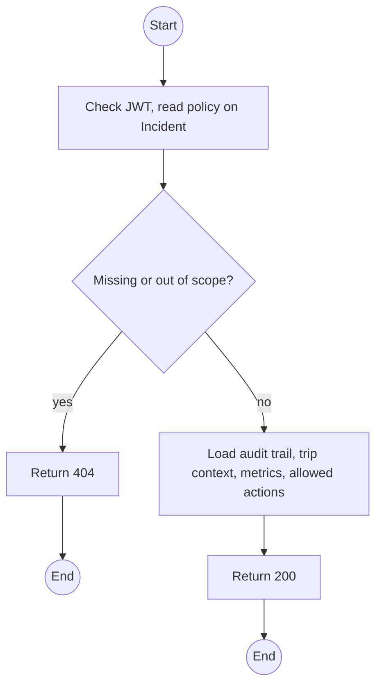
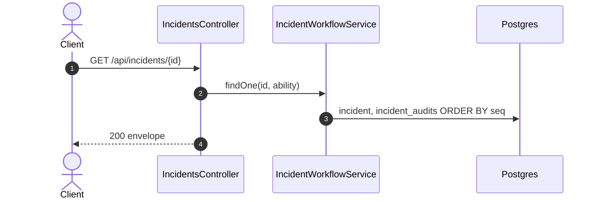

# GET /api/incidents/:id: Incident detail with audit trail

> Module `incidents`. Format: `02-templates/04-api-endpoint-template.md`, with Mermaid in place of PlantUML (D-017). Envelope: D-002.

[TOC]

---
## Overview

One Incident with its complete audit trail in sequence order, the trip, rental and custodian Guide, MTTA and MTTR once available, and the actions the caller may take now. The packet timeline is fetched separately from `gateway-sync` (`listEvents` with `incidentId`).

## API Specification

| API        | URL             |
| ---------- | --------------- |
| GET | /api/incidents/:id |
| Permission | Operator, Admin; Guide (own trips) |
| Traces | UC-16, UC-20, BR-10, BR-11, US-059 |

### Path parameters

| Field | Description | Data Type | Examples |
| --- | --- | --- | --- |
| id | Incident id or code | string | `INC-2026-000045` |

## Request sample

No request body.

## Response sample

```json
{
  "result": {
    "id": "3e4f5a6b-7c8d-4e9f-a0b1-c2d3e4f5a6b7",
    "code": "INC-2026-000045",
    "device": {
      "id": "0d3f...",
      "assetTag": "TL-0042"
    },
    "trip": {
      "id": "a1c3...",
      "code": "TRP-2026-1010-TNPD"
    },
    "unassigned": false,
    "source": "DEVICE_FALL",
    "confidence": "CONFIRMED",
    "status": "ACKNOWLEDGED",
    "firstEventAt": "2026-10-11T03:14:05Z",
    "lastEventAt": "2026-10-11T03:19:35Z",
    "eventCount": 23,
    "lastPosition": {
      "lat": 11.5601,
      "lon": 108.5402
    },
    "escalatedAt": null,
    "reopenCount": 0,
    "version": 0,
    "acknowledgedAt": "2026-10-11T03:15:02Z",
    "acknowledgedBy": {
      "id": "g-1...",
      "fullName": "Tran Minh",
      "role": "GUIDE"
    },
    "metrics": {
      "mttaSeconds": 57,
      "mttrSeconds": null
    },
    "allowedActions": [
      "NOTE"
    ],
    "audit": [
      {
        "seq": 1,
        "action": "CREATED",
        "actor": {
          "kind": "SYSTEM"
        },
        "toStatus": "DETECTED",
        "note": "SOS - FALL DETECTED - [11.560100], [108.540200]",
        "at": "2026-10-11T03:14:05Z"
      },
      {
        "seq": 2,
        "action": "ACKNOWLEDGED",
        "actor": {
          "id": "g-1...",
          "role": "GUIDE"
        },
        "fromStatus": "DETECTED",
        "toStatus": "ACKNOWLEDGED",
        "note": null,
        "at": "2026-10-11T03:15:02Z"
      }
    ]
  },
  "isSuccess": true,
  "statusCode": 200,
  "message": "Incident retrieved"
}
```

## Validation

<table>
    <th>Status code</th>
    <th>Description</th>
    <th>Examples</th>
    <tbody>
        <tr>
            <td>401</td>
            <td>Missing, malformed or expired access token (<code>UNAUTHENTICATED</code>)</td>
<td>

```json
{
  "result": {
    "errorCode": "UNAUTHENTICATED"
  },
  "isSuccess": false,
  "statusCode": 401,
  "message": "Authentication required."
}
```
</td>
        </tr>
        <tr>
            <td>403</td>
            <td>Authenticated, but the caller's role or policy does not allow this action (<code>FORBIDDEN</code>)</td>
<td>

```json
{
  "result": {
    "errorCode": "FORBIDDEN"
  },
  "isSuccess": false,
  "statusCode": 403,
  "message": "You do not have permission to perform this action."
}
```
</td>
        </tr>
        <tr>
            <td>404</td>
            <td>No such incident, or outside the Guide's trips (<code>NOT_FOUND</code>)</td>
<td>

```json
{
  "result": {
    "errorCode": "NOT_FOUND"
  },
  "isSuccess": false,
  "statusCode": 404,
  "message": "Incident not found."
}
```
</td>
        </tr>
    </tbody>
</table>

## Activity Diagram



## Sequence Diagram


