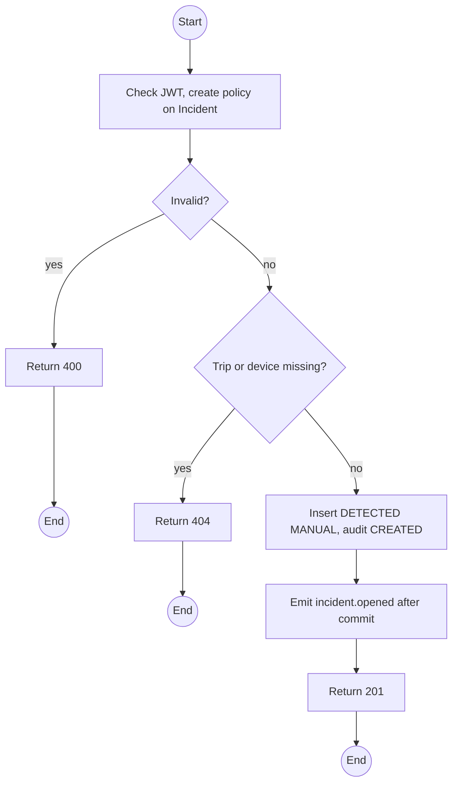
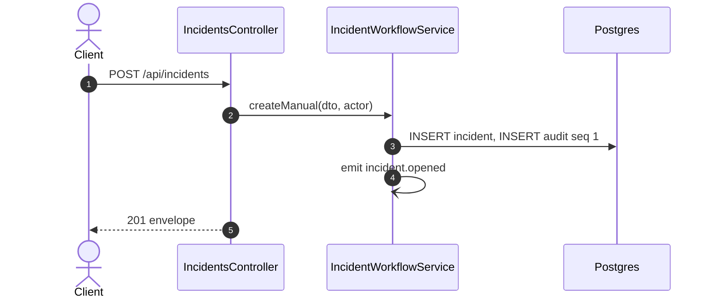

# POST /api/incidents: Raise a manual incident

> Module `incidents`. Format: `02-templates/04-api-endpoint-template.md`, with Mermaid in place of PlantUML (D-017). Envelope: D-002.

[TOC]

---
## Overview

Raises an Incident that did not come from a device SOS, for example a Guide phoning in an injury, or a whole-trip problem. Created in `DETECTED`, source `MANUAL`, confidence `CONFIRMED`, and alerted like any other.

## API Specification

| API        | URL             |
| ---------- | --------------- |
| POST | /api/incidents |
| Permission | Operator |
| Traces | UC-39 (new), FR-INC-07 (new), US-064, REQ-EVT-10 |

## Request sample

```json
{
  "tripId": "a1c3...",
  "deviceId": null,
  "title": "Ankle injury reported by phone",
  "description": "Guide called at 14:05, participant cannot walk, camp 2",
  "latitude": 11.5601,
  "longitude": 108.5402
}
```

| Field | Description | Data Type | Required | Examples |
| --- | --- | --- | --- | --- |
| tripId | Trip; required when deviceId is null | uuid | no | `a1c3...` |
| deviceId | Device; required when tripId is null | uuid | no | `0d3f...` |
| title | 1 to 120 chars | string | yes | `Ankle injury` |
| description | Up to 2000 chars | string | no | `Guide called` |
| latitude | WGS-84 | number | no | `11.5601` |
| longitude | WGS-84 | number | no | `108.5402` |

## Response sample

```json
{
  "result": {
    "id": "3e4f5a6b-7c8d-4e9f-a0b1-c2d3e4f5a6b7",
    "code": "INC-2026-000045",
    "device": null,
    "trip": {
      "id": "a1c3...",
      "code": "TRP-2026-1010-TNPD"
    },
    "unassigned": false,
    "source": "MANUAL",
    "confidence": "CONFIRMED",
    "status": "DETECTED",
    "firstEventAt": "2026-10-11T03:14:05Z",
    "lastEventAt": "2026-10-11T03:19:35Z",
    "eventCount": 0,
    "lastPosition": {
      "lat": 11.5601,
      "lon": 108.5402
    },
    "escalatedAt": null,
    "reopenCount": 0,
    "version": 0,
    "title": "Ankle injury reported by phone"
  },
  "isSuccess": true,
  "statusCode": 201,
  "message": "Incident raised"
}
```

## Validation

<table>
    <th>Status code</th>
    <th>Description</th>
    <th>Examples</th>
    <tbody>
        <tr>
            <td>400</td>
            <td>Neither trip nor device, or coordinates out of range (<code>VALIDATION_FAILED</code>)</td>
<td>

```json
{
  "result": {
    "errorCode": "VALIDATION_FAILED"
  },
  "isSuccess": false,
  "statusCode": 400,
  "message": "tripId or deviceId is required."
}
```
</td>
        </tr>
        <tr>
            <td>401</td>
            <td>Missing, malformed or expired access token (<code>UNAUTHENTICATED</code>)</td>
<td>

```json
{
  "result": {
    "errorCode": "UNAUTHENTICATED"
  },
  "isSuccess": false,
  "statusCode": 401,
  "message": "Authentication required."
}
```
</td>
        </tr>
        <tr>
            <td>403</td>
            <td>Authenticated, but the caller's role or policy does not allow this action (<code>FORBIDDEN</code>)</td>
<td>

```json
{
  "result": {
    "errorCode": "FORBIDDEN"
  },
  "isSuccess": false,
  "statusCode": 403,
  "message": "You do not have permission to perform this action."
}
```
</td>
        </tr>
        <tr>
            <td>404</td>
            <td>Trip or device not found (<code>NOT_FOUND</code>)</td>
<td>

```json
{
  "result": {
    "errorCode": "NOT_FOUND"
  },
  "isSuccess": false,
  "statusCode": 404,
  "message": "Trip not found."
}
```
</td>
        </tr>
    </tbody>
</table>

## Activity Diagram



## Sequence Diagram


