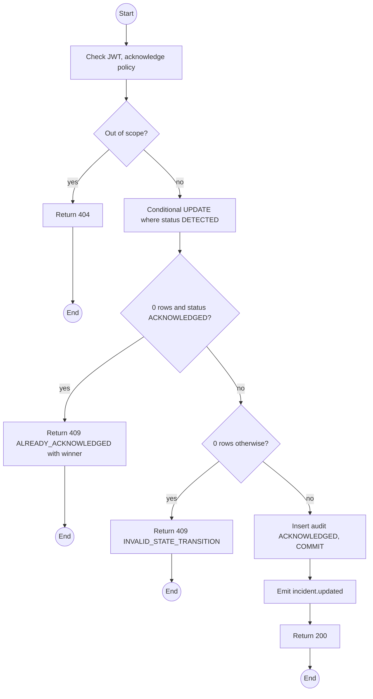
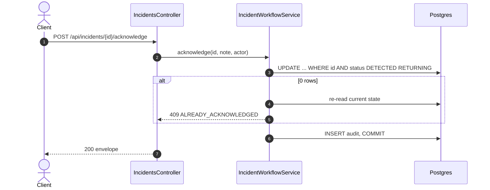

# POST /api/incidents/:id/acknowledge: Acknowledge an incident

> Module `incidents`. Format: `02-templates/04-api-endpoint-template.md`, with Mermaid in place of PlantUML (D-017). Envelope: D-002.

[TOC]

---
## Overview

The time-critical action of MF-03. One request, at most two inputs: the action and an optional note (NFR-USE-02, because every added field adds seconds to MTTA). First write wins; a concurrent second acknowledgement receives 409 with who acknowledged and when, so nobody acts on a stale view. Admin cannot acknowledge unless also an Operator.

## API Specification

| API        | URL             |
| ---------- | --------------- |
| POST | /api/incidents/:id/acknowledge |
| Permission | Operator; Guide assigned to the incident's trip |
| Concurrency | Conditional update `WHERE status = DETECTED`; first write wins |
| Traces | UC-15, FR-INC-01 (new), US-060, US-063, REQ-EVT-07, REQ-ERR-01, E03-3, NFR-USE-02 |

### Path parameters

| Field | Description | Data Type | Examples |
| --- | --- | --- | --- |
| id | Incident id | uuid | `3e4f5a6b-7c8d-4e9f-a0b1-c2d3e4f5a6b7` |

## Request sample

```json
{
  "note": "On my way, 10 minutes"
}
```

| Field | Description | Data Type | Required | Examples |
| --- | --- | --- | --- | --- |
| note | Optional, up to 500 chars | string | no | `On my way` |

## Response sample

```json
{
  "result": {
    "id": "3e4f5a6b-7c8d-4e9f-a0b1-c2d3e4f5a6b7",
    "code": "INC-2026-000045",
    "device": {
      "id": "0d3f...",
      "assetTag": "TL-0042"
    },
    "trip": {
      "id": "a1c3...",
      "code": "TRP-2026-1010-TNPD"
    },
    "unassigned": false,
    "source": "DEVICE_FALL",
    "confidence": "CONFIRMED",
    "status": "ACKNOWLEDGED",
    "firstEventAt": "2026-10-11T03:14:05Z",
    "lastEventAt": "2026-10-11T03:19:35Z",
    "eventCount": 23,
    "lastPosition": {
      "lat": 11.5601,
      "lon": 108.5402
    },
    "escalatedAt": null,
    "reopenCount": 0,
    "version": 1,
    "acknowledgedAt": "2026-10-11T03:15:02Z",
    "acknowledgedBy": {
      "id": "op-2...",
      "fullName": "Le Lan",
      "role": "OPERATOR"
    },
    "mttaSeconds": 57
  },
  "isSuccess": true,
  "statusCode": 200,
  "message": "Incident acknowledged"
}
```

## Validation

<table>
    <th>Status code</th>
    <th>Description</th>
    <th>Examples</th>
    <tbody>
        <tr>
            <td>401</td>
            <td>Missing, malformed or expired access token (<code>UNAUTHENTICATED</code>)</td>
<td>

```json
{
  "result": {
    "errorCode": "UNAUTHENTICATED"
  },
  "isSuccess": false,
  "statusCode": 401,
  "message": "Authentication required."
}
```
</td>
        </tr>
        <tr>
            <td>403</td>
            <td>Admin without the Operator role, or a Customer (<code>FORBIDDEN</code>)</td>
<td>

```json
{
  "result": {
    "errorCode": "FORBIDDEN"
  },
  "isSuccess": false,
  "statusCode": 403,
  "message": "You do not have permission to perform this action."
}
```
</td>
        </tr>
        <tr>
            <td>404</td>
            <td>No such incident, or outside the Guide's trips (<code>NOT_FOUND</code>)</td>
<td>

```json
{
  "result": {
    "errorCode": "NOT_FOUND"
  },
  "isSuccess": false,
  "statusCode": 404,
  "message": "Incident not found."
}
```
</td>
        </tr>
        <tr>
            <td>409</td>
            <td>Someone else acknowledged first (<code>ALREADY_ACKNOWLEDGED</code>)</td>
<td>

```json
{
  "result": {
    "errorCode": "ALREADY_ACKNOWLEDGED",
    "status": "ACKNOWLEDGED",
    "acknowledgedBy": {
      "id": "g-1...",
      "fullName": "Tran Minh",
      "role": "GUIDE"
    },
    "acknowledgedAt": "2026-10-11T03:15:02Z"
  },
  "isSuccess": false,
  "statusCode": 409,
  "message": "Already acknowledged by Tran Minh at 03:15:02 UTC."
}
```
</td>
        </tr>
        <tr>
            <td>409</td>
            <td>Incident not DETECTED for another reason (for example CLOSED) (<code>INVALID_STATE_TRANSITION</code>)</td>
<td>

```json
{
  "result": {
    "errorCode": "INVALID_STATE_TRANSITION"
  },
  "isSuccess": false,
  "statusCode": 409,
  "message": "A closed incident cannot be acknowledged."
}
```
</td>
        </tr>
    </tbody>
</table>

## Activity Diagram



## Sequence Diagram


