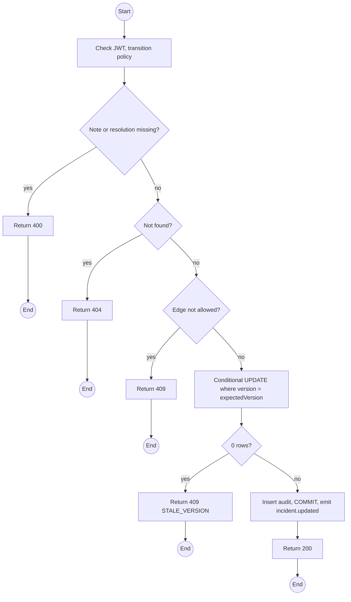
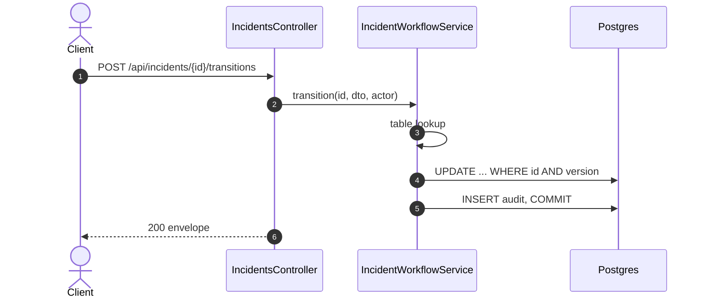

# POST /api/incidents/:id/transitions: Move an incident through its lifecycle

> Module `incidents`. Format: `02-templates/04-api-endpoint-template.md`, with Mermaid in place of PlantUML (D-017). Envelope: D-002.

[TOC]

---
## Overview

Takes `ACKNOWLEDGED` to `IN_PROGRESS`, `IN_PROGRESS` to `RESOLVED` (with a resolution), or `RESOLVED` to `CLOSED`. Every step needs a note, which lands in the append-only audit trail (BR-10). Reopening is done by the system on new device events, not through this endpoint.

## API Specification

| API        | URL             |
| ---------- | --------------- |
| POST | /api/incidents/:id/transitions |
| Permission | Operator |
| Traces | UC-16, FR-INC-02, BR-10, US-061, US-062, REQ-EVT-08, REQ-ERR-02, REQ-ERR-04 |

### Path parameters

| Field | Description | Data Type | Examples |
| --- | --- | --- | --- |
| id | Incident id | uuid | `3e4f5a6b-7c8d-4e9f-a0b1-c2d3e4f5a6b7` |

## Request sample

```json
{
  "toStatus": "RESOLVED",
  "resolution": "ASSISTED",
  "note": "Guide splinted the ankle, group walked out to camp 2, no evacuation",
  "expectedVersion": 2
}
```

| Field | Description | Data Type | Required | Examples |
| --- | --- | --- | --- | --- |
| toStatus | IN_PROGRESS, RESOLVED or CLOSED | enum | yes | `RESOLVED` |
| resolution | Required with RESOLVED: ASSISTED, SELF_RESOLVED, EVACUATED, OTHER | enum | no | `ASSISTED` |
| note | Required, up to 2000 chars | string | yes | `Guide splinted the ankle` |
| expectedVersion | Version the caller saw | int | yes | `2` |

## Response sample

```json
{
  "result": {
    "id": "3e4f5a6b-7c8d-4e9f-a0b1-c2d3e4f5a6b7",
    "code": "INC-2026-000045",
    "device": {
      "id": "0d3f...",
      "assetTag": "TL-0042"
    },
    "trip": {
      "id": "a1c3...",
      "code": "TRP-2026-1010-TNPD"
    },
    "unassigned": false,
    "source": "DEVICE_FALL",
    "confidence": "CONFIRMED",
    "status": "RESOLVED",
    "firstEventAt": "2026-10-11T03:14:05Z",
    "lastEventAt": "2026-10-11T03:19:35Z",
    "eventCount": 23,
    "lastPosition": {
      "lat": 11.5601,
      "lon": 108.5402
    },
    "escalatedAt": null,
    "reopenCount": 0,
    "version": 3,
    "resolution": "ASSISTED",
    "resolvedAt": "2026-10-11T04:02:40Z",
    "mttrSeconds": 2915
  },
  "isSuccess": true,
  "statusCode": 200,
  "message": "Incident updated"
}
```

## Validation

<table>
    <th>Status code</th>
    <th>Description</th>
    <th>Examples</th>
    <tbody>
        <tr>
            <td>400</td>
            <td>Note or resolution missing (<code>NOTE_REQUIRED</code>)</td>
<td>

```json
{
  "result": {
    "errorCode": "NOTE_REQUIRED"
  },
  "isSuccess": false,
  "statusCode": 400,
  "message": "A note is required for this transition."
}
```
</td>
        </tr>
        <tr>
            <td>401</td>
            <td>Missing, malformed or expired access token (<code>UNAUTHENTICATED</code>)</td>
<td>

```json
{
  "result": {
    "errorCode": "UNAUTHENTICATED"
  },
  "isSuccess": false,
  "statusCode": 401,
  "message": "Authentication required."
}
```
</td>
        </tr>
        <tr>
            <td>403</td>
            <td>Authenticated, but the caller's role or policy does not allow this action (<code>FORBIDDEN</code>)</td>
<td>

```json
{
  "result": {
    "errorCode": "FORBIDDEN"
  },
  "isSuccess": false,
  "statusCode": 403,
  "message": "You do not have permission to perform this action."
}
```
</td>
        </tr>
        <tr>
            <td>404</td>
            <td>No such incident, or outside the Guide's trips (<code>NOT_FOUND</code>)</td>
<td>

```json
{
  "result": {
    "errorCode": "NOT_FOUND"
  },
  "isSuccess": false,
  "statusCode": 404,
  "message": "Incident not found."
}
```
</td>
        </tr>
        <tr>
            <td>409</td>
            <td>Edge not in the table (<code>INVALID_STATE_TRANSITION</code>)</td>
<td>

```json
{
  "result": {
    "errorCode": "INVALID_STATE_TRANSITION"
  },
  "isSuccess": false,
  "statusCode": 409,
  "message": "Cannot move an incident from DETECTED to RESOLVED. Acknowledge it first."
}
```
</td>
        </tr>
        <tr>
            <td>409</td>
            <td>Version changed since the caller loaded it (<code>STALE_VERSION</code>)</td>
<td>

```json
{
  "result": {
    "errorCode": "STALE_VERSION",
    "status": "DETECTED",
    "version": 3
  },
  "isSuccess": false,
  "statusCode": 409,
  "message": "The incident changed. Reload and try again."
}
```
</td>
        </tr>
    </tbody>
</table>

## Activity Diagram



## Sequence Diagram


