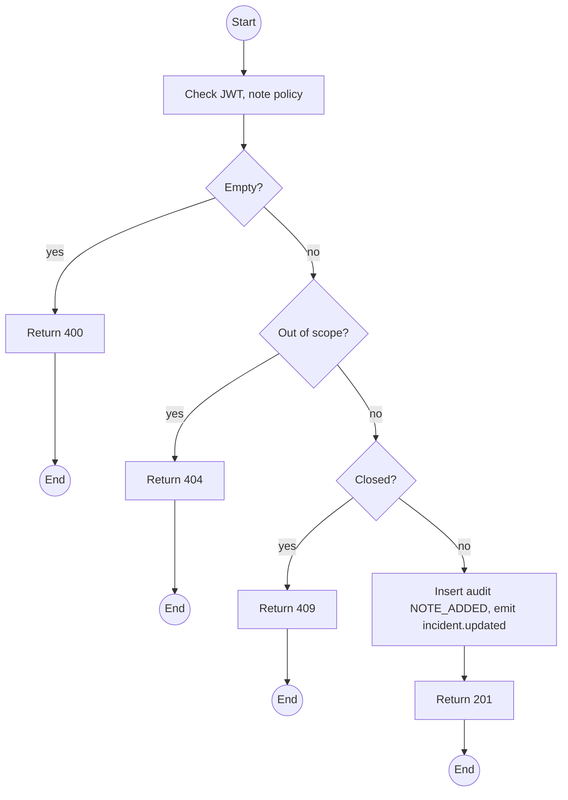
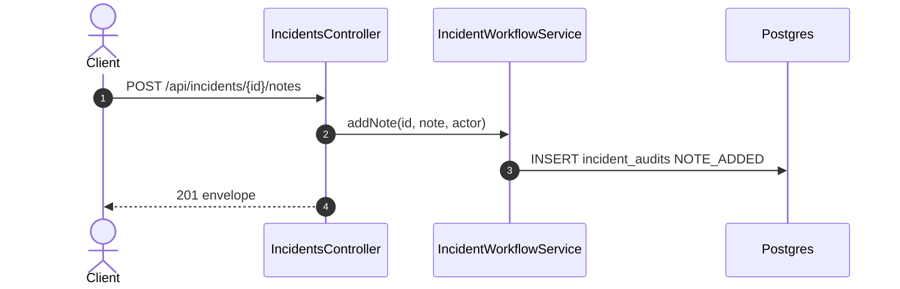

# POST /api/incidents/:id/notes: Add a response note

> Module `incidents`. Format: `02-templates/04-api-endpoint-template.md`, with Mermaid in place of PlantUML (D-017). Envelope: D-002.

[TOC]

---
## Overview

Appends a response note to the audit trail without changing state: what the Guide sees on the ground, who was called, what was decided.

## API Specification

| API        | URL             |
| ---------- | --------------- |
| POST | /api/incidents/:id/notes |
| Permission | Operator; Guide (own trips) |
| Traces | UC-17, FR-INC-03 (new), US-063, REQ-EVT-11 |

### Path parameters

| Field | Description | Data Type | Examples |
| --- | --- | --- | --- |
| id | Incident id | uuid | `3e4f5a6b-7c8d-4e9f-a0b1-c2d3e4f5a6b7` |

## Request sample

```json
{
  "note": "Reached the participant, conscious, pain in left ankle"
}
```

| Field | Description | Data Type | Required | Examples |
| --- | --- | --- | --- | --- |
| note | 1 to 2000 chars | string | yes | `Reached the participant` |

## Response sample

```json
{
  "result": {
    "incidentId": "3e4f5a6b-7c8d-4e9f-a0b1-c2d3e4f5a6b7",
    "seq": 3,
    "action": "NOTE_ADDED",
    "actor": {
      "id": "g-1...",
      "role": "GUIDE"
    },
    "note": "Reached the participant, conscious, pain in left ankle",
    "at": "2026-10-11T03:22:10Z"
  },
  "isSuccess": true,
  "statusCode": 201,
  "message": "Note added"
}
```

## Validation

<table>
    <th>Status code</th>
    <th>Description</th>
    <th>Examples</th>
    <tbody>
        <tr>
            <td>400</td>
            <td>Empty note (<code>VALIDATION_FAILED</code>)</td>
<td>

```json
{
  "result": {
    "errorCode": "VALIDATION_FAILED"
  },
  "isSuccess": false,
  "statusCode": 400,
  "message": "note should not be empty."
}
```
</td>
        </tr>
        <tr>
            <td>401</td>
            <td>Missing, malformed or expired access token (<code>UNAUTHENTICATED</code>)</td>
<td>

```json
{
  "result": {
    "errorCode": "UNAUTHENTICATED"
  },
  "isSuccess": false,
  "statusCode": 401,
  "message": "Authentication required."
}
```
</td>
        </tr>
        <tr>
            <td>403</td>
            <td>Authenticated, but the caller's role or policy does not allow this action (<code>FORBIDDEN</code>)</td>
<td>

```json
{
  "result": {
    "errorCode": "FORBIDDEN"
  },
  "isSuccess": false,
  "statusCode": 403,
  "message": "You do not have permission to perform this action."
}
```
</td>
        </tr>
        <tr>
            <td>404</td>
            <td>No such incident, or outside the Guide's trips (<code>NOT_FOUND</code>)</td>
<td>

```json
{
  "result": {
    "errorCode": "NOT_FOUND"
  },
  "isSuccess": false,
  "statusCode": 404,
  "message": "Incident not found."
}
```
</td>
        </tr>
        <tr>
            <td>409</td>
            <td>Incident closed (<code>INCIDENT_CLOSED</code>)</td>
<td>

```json
{
  "result": {
    "errorCode": "INCIDENT_CLOSED"
  },
  "isSuccess": false,
  "statusCode": 409,
  "message": "Notes cannot be added to a closed incident."
}
```
</td>
        </tr>
    </tbody>
</table>

## Activity Diagram



## Sequence Diagram


