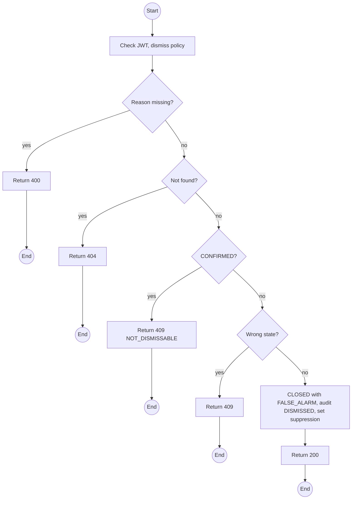
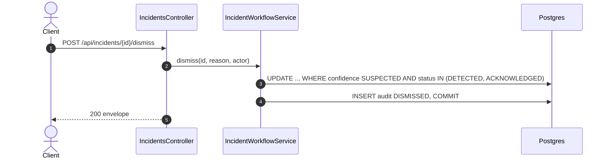

# POST /api/incidents/:id/dismiss: Dismiss a suspected episode

> Module `incidents`. Format: `02-templates/04-api-endpoint-template.md`, with Mermaid in place of PlantUML (D-017). Envelope: D-002.

[TOC]

---
## Overview

The lighter action for a cadence-inferred `SUSPECTED` Incident that turns out to be routine dense reporting: one step from `DETECTED` or `ACKNOWLEDGED` straight to `CLOSED` with resolution `FALSE_ALARM` and a reason. New suspected episodes for that device are suppressed for `incidents.suspectedSuppressMinutes`. A `CONFIRMED` Incident can never be dismissed.

## API Specification

| API        | URL             |
| ---------- | --------------- |
| POST | /api/incidents/:id/dismiss |
| Permission | Operator |
| Traces | US-088, BR-09, E03-1, REQ-EVT-09, REQ-ERR-05 |

### Path parameters

| Field | Description | Data Type | Examples |
| --- | --- | --- | --- |
| id | Incident id | uuid | `i-2...` |

## Request sample

```json
{
  "reason": "Guide confirmed by radio: participant testing the tracker, no emergency"
}
```

| Field | Description | Data Type | Required | Examples |
| --- | --- | --- | --- | --- |
| reason | Required | string | yes | `Guide confirmed by radio` |

## Response sample

```json
{
  "result": {
    "id": "i-2...",
    "code": "INC-2026-000045",
    "device": {
      "id": "0d3f...",
      "assetTag": "TL-0042"
    },
    "trip": {
      "id": "a1c3...",
      "code": "TRP-2026-1010-TNPD"
    },
    "unassigned": false,
    "source": "DEVICE_FALL",
    "confidence": "SUSPECTED",
    "status": "CLOSED",
    "firstEventAt": "2026-10-11T03:14:05Z",
    "lastEventAt": "2026-10-11T03:19:35Z",
    "eventCount": 23,
    "lastPosition": {
      "lat": 11.5601,
      "lon": 108.5402
    },
    "escalatedAt": null,
    "reopenCount": 0,
    "version": 0,
    "resolution": "FALSE_ALARM",
    "dismissedAt": "2026-10-11T03:30:00Z",
    "suppressedUntil": "2026-10-11T04:00:00Z"
  },
  "isSuccess": true,
  "statusCode": 200,
  "message": "Suspected episode dismissed"
}
```

## Validation

<table>
    <th>Status code</th>
    <th>Description</th>
    <th>Examples</th>
    <tbody>
        <tr>
            <td>400</td>
            <td>Reason missing (<code>VALIDATION_FAILED</code>)</td>
<td>

```json
{
  "result": {
    "errorCode": "VALIDATION_FAILED"
  },
  "isSuccess": false,
  "statusCode": 400,
  "message": "reason is required."
}
```
</td>
        </tr>
        <tr>
            <td>401</td>
            <td>Missing, malformed or expired access token (<code>UNAUTHENTICATED</code>)</td>
<td>

```json
{
  "result": {
    "errorCode": "UNAUTHENTICATED"
  },
  "isSuccess": false,
  "statusCode": 401,
  "message": "Authentication required."
}
```
</td>
        </tr>
        <tr>
            <td>403</td>
            <td>Authenticated, but the caller's role or policy does not allow this action (<code>FORBIDDEN</code>)</td>
<td>

```json
{
  "result": {
    "errorCode": "FORBIDDEN"
  },
  "isSuccess": false,
  "statusCode": 403,
  "message": "You do not have permission to perform this action."
}
```
</td>
        </tr>
        <tr>
            <td>404</td>
            <td>No such incident, or outside the Guide's trips (<code>NOT_FOUND</code>)</td>
<td>

```json
{
  "result": {
    "errorCode": "NOT_FOUND"
  },
  "isSuccess": false,
  "statusCode": 404,
  "message": "Incident not found."
}
```
</td>
        </tr>
        <tr>
            <td>409</td>
            <td>Incident is CONFIRMED (<code>NOT_DISMISSABLE</code>)</td>
<td>

```json
{
  "result": {
    "errorCode": "NOT_DISMISSABLE"
  },
  "isSuccess": false,
  "statusCode": 409,
  "message": "A confirmed SOS cannot be dismissed. Resolve and close it."
}
```
</td>
        </tr>
        <tr>
            <td>409</td>
            <td>Not DETECTED or ACKNOWLEDGED (<code>INVALID_STATE_TRANSITION</code>)</td>
<td>

```json
{
  "result": {
    "errorCode": "INVALID_STATE_TRANSITION"
  },
  "isSuccess": false,
  "statusCode": 409,
  "message": "Only an open suspected episode can be dismissed."
}
```
</td>
        </tr>
    </tbody>
</table>

## Activity Diagram



## Sequence Diagram


