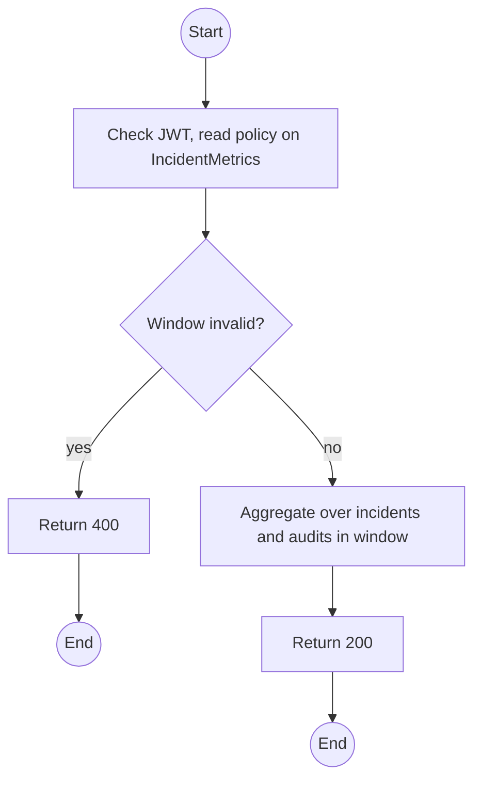
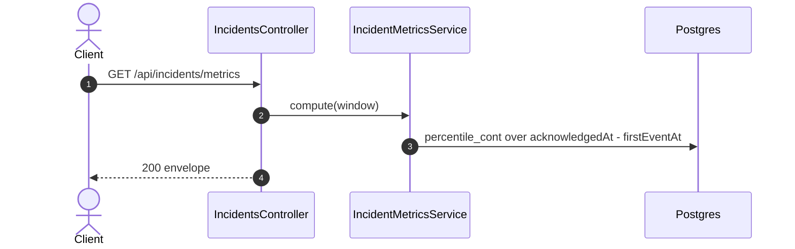

# GET /api/incidents/metrics: Response metrics (MTTA, MTTR)

> Module `incidents`. Format: `02-templates/04-api-endpoint-template.md`, with Mermaid in place of PlantUML (D-017). Envelope: D-002.

[TOC]

---
## Overview

Aggregates over a window: count by confidence and resolution, MTTA and MTTR (median, p90, mean), completion rate, reopen rate, and the share of Incidents with a complete audit trail. Computed from Incident timestamps and audit rows, so RQ3 figures trace back to records.

## API Specification

| API        | URL             |
| ---------- | --------------- |
| GET | /api/incidents/metrics |
| Permission | Operator, Admin |
| Traces | RQ3, US-072, FR-INC-09 (new) |

### Query parameters

| Field | Description | Data Type | Required | Examples |
| --- | --- | --- | --- | --- |
| from | firstEventAt lower bound | datetime | yes | `2026-11-01T00:00:00Z` |
| to | firstEventAt upper bound | datetime | yes | `2026-11-30T00:00:00Z` |
| tripId | Restrict to one trip (a drill) | uuid | no | `a1c3...` |
| includeSuspected | Include suspected episodes | bool | no | `false` |

## Request sample

No request body. Query string example:

```
GET /api/incidents/metrics?from=2026-11-01T00:00:00Z&to=2026-11-30T00:00:00Z
```

## Response sample

```json
{
  "result": {
    "window": {
      "from": "2026-11-01T00:00:00Z",
      "to": "2026-11-30T00:00:00Z"
    },
    "count": 24,
    "byConfidence": {
      "CONFIRMED": 21,
      "SUSPECTED": 3
    },
    "mttaSeconds": {
      "median": 48,
      "p90": 131,
      "mean": 62.4
    },
    "mttrSeconds": {
      "median": 1820,
      "p90": 4310,
      "mean": 2204.9
    },
    "completionRate": 0.95,
    "reopenRate": 0.08,
    "auditCompleteness": 1
  },
  "isSuccess": true,
  "statusCode": 200,
  "message": "Incident metrics computed"
}
```

## Validation

<table>
    <th>Status code</th>
    <th>Description</th>
    <th>Examples</th>
    <tbody>
        <tr>
            <td>400</td>
            <td>Window invalid or over 366 days (<code>VALIDATION_FAILED</code>)</td>
<td>

```json
{
  "result": {
    "errorCode": "VALIDATION_FAILED"
  },
  "isSuccess": false,
  "statusCode": 400,
  "message": "to must be later than from."
}
```
</td>
        </tr>
        <tr>
            <td>401</td>
            <td>Missing, malformed or expired access token (<code>UNAUTHENTICATED</code>)</td>
<td>

```json
{
  "result": {
    "errorCode": "UNAUTHENTICATED"
  },
  "isSuccess": false,
  "statusCode": 401,
  "message": "Authentication required."
}
```
</td>
        </tr>
        <tr>
            <td>403</td>
            <td>Authenticated, but the caller's role or policy does not allow this action (<code>FORBIDDEN</code>)</td>
<td>

```json
{
  "result": {
    "errorCode": "FORBIDDEN"
  },
  "isSuccess": false,
  "statusCode": 403,
  "message": "You do not have permission to perform this action."
}
```
</td>
        </tr>
    </tbody>
</table>

## Activity Diagram



## Sequence Diagram


