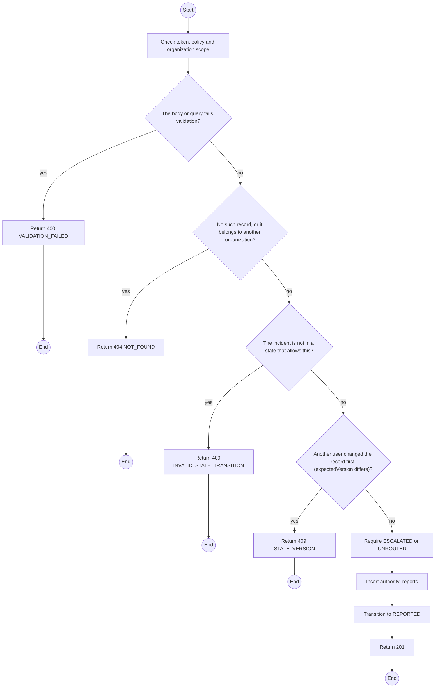
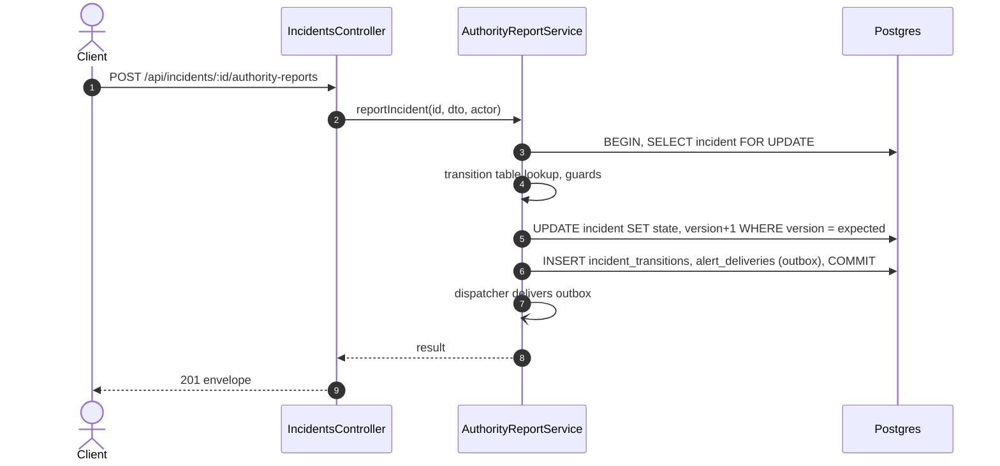

# POST /api/incidents/:id/authority-reports: Report to the authorities

> Module `incidents`. Generated from `scripts/specs/endpoints/incidents.py` by `scripts/specs/build_api_design.py`; edit the catalog, not this file. Format: `02-templates/04-api-endpoint-template.md` with Mermaid (D-017). Envelope: D-002.

[TOC]

---
## Overview

Records a report to the authorities on an `ESCALATED` or `UNROUTED` incident (agency, reference, time) and moves it to `REPORTED`. TrekLink logs and reports; it never coordinates a rescue (FR-INC-10, BR-17, NFR-LEG-05). An organization member may still acknowledge afterwards.

## API Specification

| API | URL |
| --- | --- |
| POST | /api/incidents/:id/authority-reports |
| Permission | TrekLink Staff, TrekLink Admin |
| Traces | UC-35, FR-INC-04, FR-INC-10, BR-17 |

### Path parameters

| Field | Description | Data Type | Examples |
| --- | --- | --- | --- |
| id | Incident id; members may use only their own organization's | uuid | `7a6b5c4d-3e2f-4a1b-8c9d-0e1f2a3b4c5d` |

## Request sample

```json
{
  "agency": "Lam Dong provincial rescue (114)",
  "reference": "LD-114-2026-1020-07",
  "reportedAt": "2026-10-20T03:25:00Z",
  "note": "Last position and audit log shared by phone and email.",
  "expectedVersion": 5
}
```

| Field | Description | Data Type | Required | Examples |
| --- | --- | --- | --- | --- |
| agency | Who was informed | string | yes | `Lam Dong provincial rescue (114)` |
| reference | Their case or call reference | string | yes | `LD-114-2026-1020-07` |
| reportedAt | When, not in the future | datetime | yes | `2026-10-20T03:25:00Z` |
| note | What was shared | string | no | `Last position and audit log sent` |
| expectedVersion | Incident version the caller saw | int | yes | `1` |

## Response sample

```json
{
  "result": {
    "id": "7a6b5c4d-3e2f-4a1b-8c9d-0e1f2a3b4c5d",
    "code": "INC-2026-000045",
    "device": {
      "id": "0d3f6a2b-7e11-4c55-8f0a-2b1c9e7d4a10",
      "assetTag": "TL-0042",
      "holder": {
        "name": "Le Thi E",
        "phone": "0912345678"
      }
    },
    "organizationId": "5b1d2c0e-7f3a-4e21-9c8d-1a2b3c4d5e6f",
    "contractId": "c0ffee00-1234-4abc-9def-001122334455",
    "state": "REPORTED",
    "stateChangedAt": "2026-10-20T03:15:00.000Z",
    "source": "DEVICE_FALL",
    "confidence": "CONFIRMED",
    "firstEventAt": "2026-10-20T03:14:52Z",
    "lastEventAt": "2026-10-20T03:15:00.000Z",
    "eventCount": 4,
    "lastPosition": {
      "lat": 11.5601,
      "lon": 108.5402
    },
    "stale": false,
    "owner": null,
    "tierDeadlineAt": "2026-10-20T03:17:00Z",
    "statusDueAt": null,
    "reopenCount": 0,
    "version": 6
  },
  "isSuccess": true,
  "statusCode": 201,
  "message": "Report recorded"
}
```

## Validation

<table>
    <th>Status code</th>
    <th>Description</th>
    <th>Examples</th>
    <tbody>
        <tr>
            <td>400</td>
            <td>The body or query fails validation (<code>VALIDATION_FAILED</code>)</td>
<td>

```json
{
  "result": {
    "errorCode": "VALIDATION_FAILED"
  },
  "isSuccess": false,
  "statusCode": 400,
  "message": "{field} is required."
}
```
</td>
        </tr>
        <tr>
            <td>401</td>
            <td>Missing, malformed or expired access token or API key (<code>UNAUTHENTICATED</code>)</td>
<td>

```json
{
  "result": {
    "errorCode": "UNAUTHENTICATED"
  },
  "isSuccess": false,
  "statusCode": 401,
  "message": "Authentication required."
}
```
</td>
        </tr>
        <tr>
            <td>403</td>
            <td>The caller's role, policy or organization does not allow this action (<code>FORBIDDEN</code>)</td>
<td>

```json
{
  "result": {
    "errorCode": "FORBIDDEN"
  },
  "isSuccess": false,
  "statusCode": 403,
  "message": "You do not have access to this."
}
```
</td>
        </tr>
        <tr>
            <td>404</td>
            <td>No such record, or it belongs to another organization (<code>NOT_FOUND</code>)</td>
<td>

```json
{
  "result": {
    "errorCode": "NOT_FOUND"
  },
  "isSuccess": false,
  "statusCode": 404,
  "message": "Incident not found."
}
```
</td>
        </tr>
        <tr>
            <td>409</td>
            <td>The incident is not in a state that allows this (<code>INVALID_STATE_TRANSITION</code>)</td>
<td>

```json
{
  "result": {
    "errorCode": "INVALID_STATE_TRANSITION"
  },
  "isSuccess": false,
  "statusCode": 409,
  "message": "This cannot be done while it is ACKNOWLEDGED."
}
```
</td>
        </tr>
        <tr>
            <td>409</td>
            <td>Another user changed the record first (expectedVersion differs) (<code>STALE_VERSION</code>)</td>
<td>

```json
{
  "result": {
    "errorCode": "STALE_VERSION"
  },
  "isSuccess": false,
  "statusCode": 409,
  "message": "This was changed by someone else. Reload and try again."
}
```
</td>
        </tr>
    </tbody>
</table>

## Activity Diagram



## Sequence Diagram


