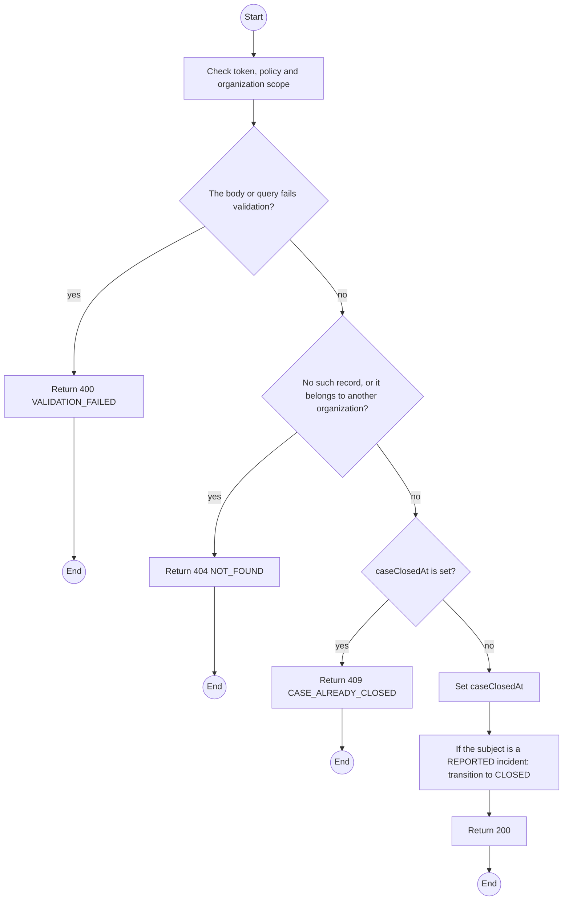
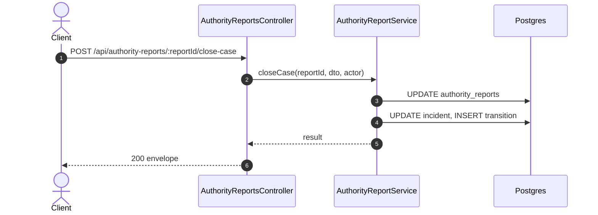

# POST /api/authority-reports/:reportId/close-case: Record the authority case closed

> Module `incidents`. Generated from `scripts/specs/endpoints/incidents.py` by `scripts/specs/build_api_design.py`; edit the catalog, not this file. Format: `02-templates/04-api-endpoint-template.md` with Mermaid (D-017). Envelope: D-002.

[TOC]

---
## Overview

Records that the authorities closed their case. A `REPORTED` incident moves to `CLOSED` (D-034); a contract report only records the time.

## API Specification

| API | URL |
| --- | --- |
| POST | /api/authority-reports/:reportId/close-case |
| Permission | TrekLink Staff, TrekLink Admin |
| Traces | UC-35, UC-37, FR-INC-04, D-034 |

### Path parameters

| Field | Description | Data Type | Examples |
| --- | --- | --- | --- |
| reportId | Authority report id | uuid | `ar-1` |

## Request sample

```json
{
  "closedAt": "2026-10-21T08:00:00Z",
  "note": "Holder found safe by the rescue team."
}
```

| Field | Description | Data Type | Required | Examples |
| --- | --- | --- | --- | --- |
| closedAt | When the authority closed it | datetime | yes | `2026-10-21T08:00:00Z` |
| note | Outcome as reported | string | no | `Holder found safe` |

## Response sample

```json
{
  "result": {
    "id": "ar-1",
    "caseClosedAt": "2026-10-21T08:00:00Z",
    "incidentState": "CLOSED"
  },
  "isSuccess": true,
  "statusCode": 200,
  "message": "Case closed"
}
```

## Validation

<table>
    <th>Status code</th>
    <th>Description</th>
    <th>Examples</th>
    <tbody>
        <tr>
            <td>400</td>
            <td>The body or query fails validation (<code>VALIDATION_FAILED</code>)</td>
<td>

```json
{
  "result": {
    "errorCode": "VALIDATION_FAILED"
  },
  "isSuccess": false,
  "statusCode": 400,
  "message": "{field} is required."
}
```
</td>
        </tr>
        <tr>
            <td>401</td>
            <td>Missing, malformed or expired access token or API key (<code>UNAUTHENTICATED</code>)</td>
<td>

```json
{
  "result": {
    "errorCode": "UNAUTHENTICATED"
  },
  "isSuccess": false,
  "statusCode": 401,
  "message": "Authentication required."
}
```
</td>
        </tr>
        <tr>
            <td>403</td>
            <td>The caller's role, policy or organization does not allow this action (<code>FORBIDDEN</code>)</td>
<td>

```json
{
  "result": {
    "errorCode": "FORBIDDEN"
  },
  "isSuccess": false,
  "statusCode": 403,
  "message": "You do not have access to this."
}
```
</td>
        </tr>
        <tr>
            <td>404</td>
            <td>No such record, or it belongs to another organization (<code>NOT_FOUND</code>)</td>
<td>

```json
{
  "result": {
    "errorCode": "NOT_FOUND"
  },
  "isSuccess": false,
  "statusCode": 404,
  "message": "Authority report not found."
}
```
</td>
        </tr>
        <tr>
            <td>409</td>
            <td>caseClosedAt is set (<code>CASE_ALREADY_CLOSED</code>)</td>
<td>

```json
{
  "result": {
    "errorCode": "CASE_ALREADY_CLOSED"
  },
  "isSuccess": false,
  "statusCode": 409,
  "message": "This cannot be done while it is CLOSED."
}
```
</td>
        </tr>
    </tbody>
</table>

## Activity Diagram



## Sequence Diagram


