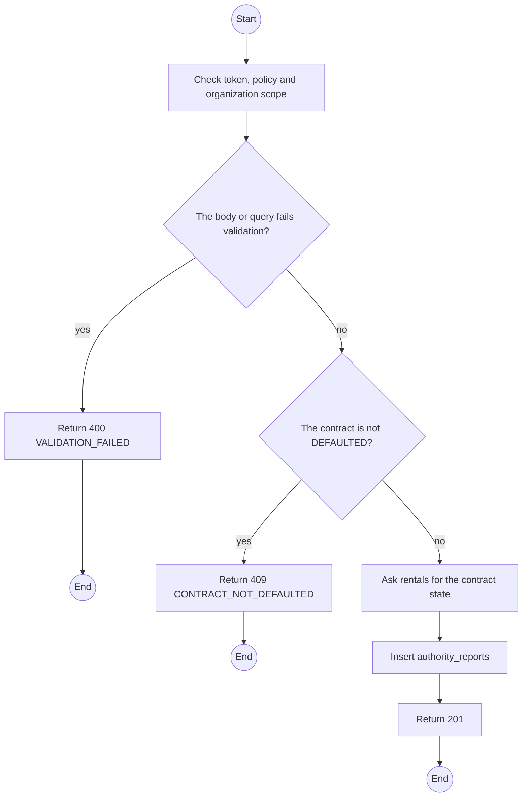
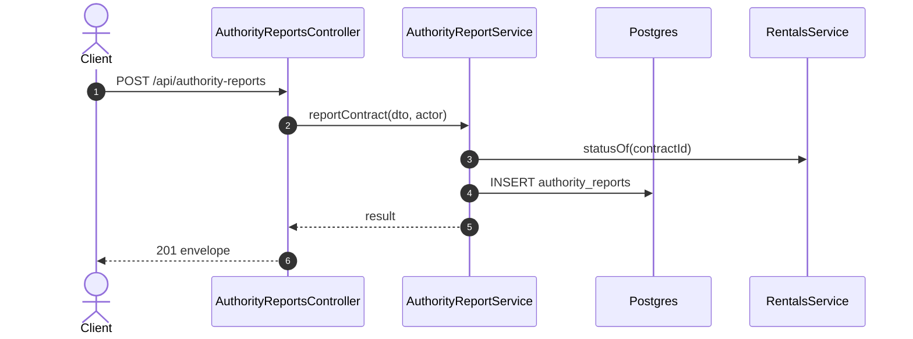

# POST /api/authority-reports: Report a defaulted contract

> Module `incidents`. Generated from `scripts/specs/endpoints/incidents.py` by `scripts/specs/build_api_design.py`; edit the catalog, not this file. Format: `02-templates/04-api-endpoint-template.md` with Mermaid (D-017). Envelope: D-002.

[TOC]

---
## Overview

Records the report to the authorities for a `DEFAULTED` contract, with the audit log and last positions as evidence (BR-17, BR-26, NFR-LEG-03).

## API Specification

| API | URL |
| --- | --- |
| POST | /api/authority-reports |
| Permission | TrekLink Staff, TrekLink Admin |
| Traces | UC-35, UC-50, BR-17, BR-26 |

## Request sample

```json
{
  "contractId": "c0ffee00-1234-4abc-9def-001122334455",
  "agency": "District 1 police",
  "reference": "PC-Q1-2026-338",
  "reportedAt": "2026-11-30T02:00:00Z"
}
```

| Field | Description | Data Type | Required | Examples |
| --- | --- | --- | --- | --- |
| contractId | A DEFAULTED contract | uuid | yes | `c0ffee00-1234-4abc-9def-001122334455` |
| agency | Who was informed | string | yes | `District police, Ward 1` |
| reference | Their reference | string | yes | `PC-Q1-2026-338` |
| reportedAt | When | datetime | yes | `2026-11-30T02:00:00Z` |
| note | What was shared | string | no | `...` |

## Response sample

```json
{
  "result": {
    "id": "ar-2",
    "contractId": "c0ffee00-1234-4abc-9def-001122334455",
    "agency": "District 1 police",
    "reference": "PC-Q1-2026-338"
  },
  "isSuccess": true,
  "statusCode": 201,
  "message": "Report recorded"
}
```

## Validation

<table>
    <th>Status code</th>
    <th>Description</th>
    <th>Examples</th>
    <tbody>
        <tr>
            <td>400</td>
            <td>The body or query fails validation (<code>VALIDATION_FAILED</code>)</td>
<td>

```json
{
  "result": {
    "errorCode": "VALIDATION_FAILED"
  },
  "isSuccess": false,
  "statusCode": 400,
  "message": "{field} is required."
}
```
</td>
        </tr>
        <tr>
            <td>401</td>
            <td>Missing, malformed or expired access token or API key (<code>UNAUTHENTICATED</code>)</td>
<td>

```json
{
  "result": {
    "errorCode": "UNAUTHENTICATED"
  },
  "isSuccess": false,
  "statusCode": 401,
  "message": "Authentication required."
}
```
</td>
        </tr>
        <tr>
            <td>403</td>
            <td>The caller's role, policy or organization does not allow this action (<code>FORBIDDEN</code>)</td>
<td>

```json
{
  "result": {
    "errorCode": "FORBIDDEN"
  },
  "isSuccess": false,
  "statusCode": 403,
  "message": "You do not have access to this."
}
```
</td>
        </tr>
        <tr>
            <td>409</td>
            <td>The contract is not DEFAULTED (<code>CONTRACT_NOT_DEFAULTED</code>)</td>
<td>

```json
{
  "result": {
    "errorCode": "CONTRACT_NOT_DEFAULTED"
  },
  "isSuccess": false,
  "statusCode": 409,
  "message": "This cannot be done while it is OVERDUE."
}
```
</td>
        </tr>
    </tbody>
</table>

## Activity Diagram



## Sequence Diagram


