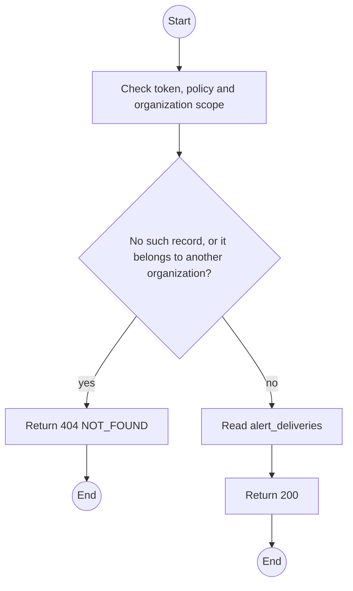
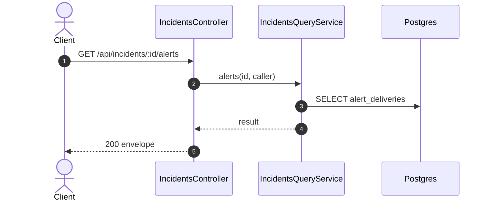

# GET /api/incidents/:id/alerts: Alert delivery log

> Module `incidents`. Generated from `scripts/specs/endpoints/incidents.py` by `scripts/specs/build_api_design.py`; edit the catalog, not this file. Format: `02-templates/04-api-endpoint-template.md` with Mermaid (D-017). Envelope: D-002.

[TOC]

---
## Overview

Every alert the incident produced: tier, recipient, channel, attempts and outcome (FR-INC-12, E03-7).

## API Specification

| API | URL |
| --- | --- |
| GET | /api/incidents/:id/alerts |
| Permission | Org Manager: own; TrekLink Staff, TrekLink Admin |
| Traces | UC-30, FR-INC-12, E03-7 |

### Path parameters

| Field | Description | Data Type | Examples |
| --- | --- | --- | --- |
| id | Incident id; members may use only their own organization's | uuid | `7a6b5c4d-3e2f-4a1b-8c9d-0e1f2a3b4c5d` |

## Request sample

No body.

## Response sample

```json
{
  "result": [
    {
      "tier": "PRIMARY",
      "recipient": "Pham Van D",
      "channel": "WEBSOCKET",
      "status": "SENT",
      "attempts": 1,
      "sentAt": "2026-10-20T03:15:00.000Z"
    },
    {
      "tier": "PRIMARY",
      "recipient": "Pham Van D",
      "channel": "EMAIL",
      "status": "PENDING",
      "attempts": 2,
      "lastError": "SMTP 451"
    }
  ],
  "isSuccess": true,
  "statusCode": 200,
  "message": "OK"
}
```

## Validation

<table>
    <th>Status code</th>
    <th>Description</th>
    <th>Examples</th>
    <tbody>
        <tr>
            <td>401</td>
            <td>Missing, malformed or expired access token or API key (<code>UNAUTHENTICATED</code>)</td>
<td>

```json
{
  "result": {
    "errorCode": "UNAUTHENTICATED"
  },
  "isSuccess": false,
  "statusCode": 401,
  "message": "Authentication required."
}
```
</td>
        </tr>
        <tr>
            <td>403</td>
            <td>The caller's role, policy or organization does not allow this action (<code>FORBIDDEN</code>)</td>
<td>

```json
{
  "result": {
    "errorCode": "FORBIDDEN"
  },
  "isSuccess": false,
  "statusCode": 403,
  "message": "You do not have access to this."
}
```
</td>
        </tr>
        <tr>
            <td>404</td>
            <td>No such record, or it belongs to another organization (<code>NOT_FOUND</code>)</td>
<td>

```json
{
  "result": {
    "errorCode": "NOT_FOUND"
  },
  "isSuccess": false,
  "statusCode": 404,
  "message": "Incident not found."
}
```
</td>
        </tr>
    </tbody>
</table>

## Activity Diagram



## Sequence Diagram


