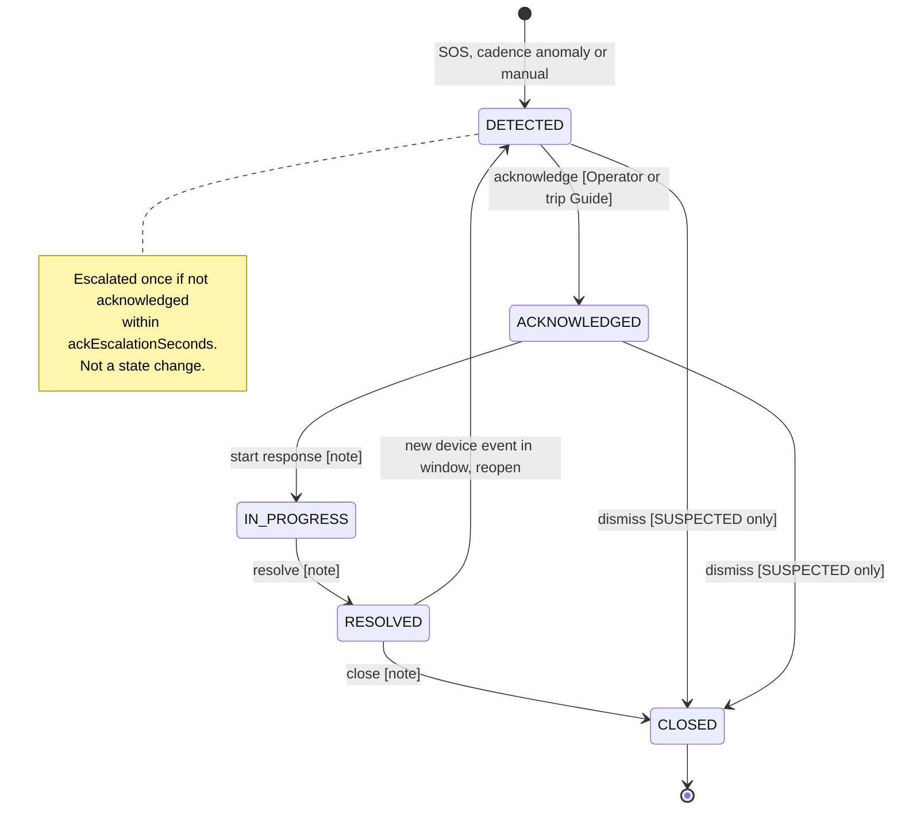
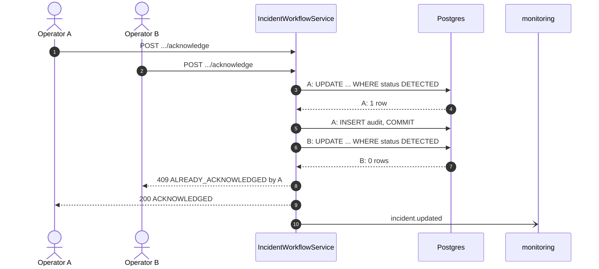

# Technical Design: incidents

> Fulfills `requirements.md` in this folder. ERD slice: `specs/platform/design.md` Figure 10. This file carries two Review 2 artefacts: the **Incident lifecycle state machine** (§2.1), one of the two UML state machines the charter grades, and the **MF-03 activity diagram** (§3.1). Both are copied to `_handoff/outbound/capstone/Documents/reports/sdd-diagrams/`.

---

## 1. Domain Model & Data Schema

```prisma
enum IncidentStatus     { DETECTED ACKNOWLEDGED IN_PROGRESS RESOLVED CLOSED }
enum IncidentSource     { DEVICE_SOS DEVICE_FALL CADENCE_INFERRED MANUAL }
enum IncidentConfidence { CONFIRMED SUSPECTED }
enum IncidentResolution { ASSISTED SELF_RESOLVED EVACUATED FALSE_ALARM OTHER }
enum IncidentAction     { CREATED ACKNOWLEDGED STARTED RESOLVED CLOSED REOPENED DISMISSED CONFIDENCE_UPGRADED ESCALATED NOTE_ADDED }

model Incident {
  id               String             @id @default(uuid())
  code             String             @unique        // INC-2026-000045
  deviceId         String?                           // null only for a manual trip-level incident
  tripId           String?                           // null when unassigned (E03-4)
  rentalId         String?
  unassigned       Boolean            @default(false)
  source           IncidentSource
  confidence       IncidentConfidence
  status           IncidentStatus     @default(DETECTED)
  openedByEventId  String?            @unique        // GatewayEvent.eventId that opened it (D-006 split)
  firstEventAt     DateTime                           // device event time basis for MTTA
  lastEventAt      DateTime                           // correlation window anchor
  eventCount       Int                @default(1)
  lastLatitude     Float?
  lastLongitude    Float?
  title            String?
  description      String?
  acknowledgedAt   DateTime?
  acknowledgedById String?
  resolvedAt       DateTime?
  resolution       IncidentResolution?
  closedAt         DateTime?
  escalatedAt      DateTime?
  reopenCount      Int                @default(0)
  dismissedAt      DateTime?
  createdById      String?                            // manual incidents
  version          Int                @default(0)     // optimistic concurrency
  createdAt        DateTime           @default(now())
  updatedAt        DateTime           @updatedAt
  audits           IncidentAudit[]
  @@index([deviceId, status, lastEventAt])            // the correlation lookup
  @@index([tripId, status])
  @@index([status, createdAt])
  @@map("incidents")
}

model IncidentAudit {
  id         String          @id @default(uuid())
  incidentId String
  incident   Incident        @relation(fields: [incidentId], references: [id], onDelete: Restrict)
  seq        Int                                      // 1, 2, 3 per incident
  action     IncidentAction
  actorId    String?                                  // null = SYSTEM
  actorRole  String                                   // OPERATOR, GUIDE, SYSTEM
  fromStatus IncidentStatus?
  toStatus   IncidentStatus?
  note       String?
  refEventId String?                                  // GatewayEvent that caused a system action
  createdAt  DateTime        @default(now())
  @@unique([incidentId, seq])
  @@map("incident_audits")                            // append-only trigger (platform task 1.5)
}
```

Changes from the current `schema.prisma`: `eventId @unique` is gone (D-006: it conflated packet and episode keys); `openedByEventId`, `lastEventAt`, `confidence` and `source` are added; the audit relation no longer cascades on delete, because a cascade is a delete path on an append-only trail (BR-11).

---

## 2. Service / Business Logic Design

### 2.1 Incident lifecycle state machine

See **Figure 1**.



***Figure 1***: Incident lifecycle, 5 states, `Detected, Acknowledged, In Progress, Resolved, Closed` (charter §2). Reopen (UC-26, E03-6) returns to `DETECTED` so someone must acknowledge again; dismissal is the lighter path for a suspected episode (US-088). Escalation is a flag, not a state.

| From | To | Actor | Guard | Audit action | Required by |
|---|---|---|---|---|---|
| (none) | DETECTED | SYSTEM (device), Operator (manual) | none | CREATED | UC-13, US-064 |
| DETECTED | ACKNOWLEDGED | Operator; Guide of the trip | first write wins | ACKNOWLEDGED | UC-15, E03-3 |
| ACKNOWLEDGED | IN_PROGRESS | Operator | note | STARTED | UC-16 |
| IN_PROGRESS | RESOLVED | Operator | note, resolution | RESOLVED | UC-16 |
| RESOLVED | CLOSED | Operator | note | CLOSED | UC-16 |
| RESOLVED | DETECTED | SYSTEM | device event within window | REOPENED | UC-26, E03-6, BR-12 |
| DETECTED, ACKNOWLEDGED | CLOSED | Operator | `confidence = SUSPECTED`, reason | DISMISSED | US-088 |

Non-transition audit actions: `CONFIDENCE_UPGRADED` (SUSPECTED to CONFIRMED, E03-1), `ESCALATED` (REQ-STA-01), `NOTE_ADDED` (UC-17). The table lives in `incident-fsm.ts`; it is the only place these edges exist.

### 2.2 Services

| Service | Responsibility |
|---|---|
| `IncidentsService` (exported) | correlation entry points for `gateway-sync`; reads for `monitoring` |
| `IncidentWorkflowService` | acknowledge, transitions, dismiss, notes, manual create |
| `IncidentEscalationJob` | scheduled escalation sweep |
| `IncidentMetricsService` | MTTA, MTTR, counts per window |

### 2.3 Correlation entry points (called by `gateway-sync` inside its transaction)

```ts
correlateSos(event: TrekLinkEvent, tx: Tx): Promise<{ incidentId: string; action: 'CREATED' | 'APPENDED' | 'REOPENED' | 'UPGRADED' }>
appendBeacon(deviceId: string, event: TrekLinkEvent, tx: Tx): Promise<{ incidentId: string } | null>
raiseSuspected(deviceId: string, evidence: { eventIds: string[]; windowSeconds: number }, tx: Tx): Promise<{ incidentId: string } | null>
```

All three start with `SELECT pg_advisory_xact_lock(hashtext('incident:' || deviceId))`. The lock is released at commit of the caller's transaction, so two packets of one episode processed concurrently are serialised and the second sees the first's Incident (REQ-UBI-05). Then:

1. `candidate` = the latest Incident for the device with `status <> 'CLOSED'` and `lastEventAt >= event.receivedAt - episodeWindow`, ordered by `lastEventAt desc`.
2. `correlateSos`: no candidate: create (`DETECTED`, `CONFIRMED`, source from event kind, trip from `RentalsService.findActiveAssignmentForDevice`, else `unassigned`). Candidate `SUSPECTED`: set `CONFIRMED`, audit `CONFIDENCE_UPGRADED`. Candidate `RESOLVED`: reopen. Always: `lastEventAt = max`, `eventCount + 1`, last position.
3. `appendBeacon`: no candidate returns `null` (gateway-sync then runs cadence detection). Otherwise same append and reopen rules.
4. `raiseSuspected`: candidate exists returns it; a dismissal for this device within `suspectedSuppressMinutes` returns `null`; else create `DETECTED`, `SUSPECTED`, source `CADENCE_INFERRED`.

Domain events are queued and emitted after the caller commits (platform design §2.3).

**Time basis.** `lastEventAt`, `firstEventAt` and the window comparison use the event's `eventTime` (device time when valid, else receipt time), never arrival order, because stock firmware drains a queued backlog one entry per reconnect (O-001, `gateway-sync` REQ-UBI-02).

**Episodes that never beacon.** A fall auto-SOS sends one position and one text frame and then stops (`FallDetectionModule.cpp:140-145`), and an SOS raised before the first GPS fix sends no positions (`PositionModule.cpp:352-355`). Such an Incident receives no appends; its window lapses after `episodeWindowSeconds`, which is harmless because the Incident stays open until an operator closes it. A second trigger from the device after that creates a new Incident (E03-5), which is correct for a second fall.

**Why the window is anchored on `lastEventAt`, not on creation.** A beacon runs at 30 s indefinitely (`TrekLinkSOSHelper.cpp:181`), so an ongoing episode keeps its Incident alive however long it lasts. The window only closes after `episodeWindowSeconds` of silence, which is what E03-5 means by "episode window expires".

### 2.4 Acknowledgement race (E03-3)

`UPDATE incidents SET status='ACKNOWLEDGED', acknowledged_at=now(), acknowledged_by_id=$actor, version=version+1 WHERE id=$id AND status='DETECTED' RETURNING *`. Zero rows means someone else won; the service re-reads and throws 409 `ALREADY_ACKNOWLEDGED` carrying `acknowledgedBy`, `acknowledgedAt` and the current `status` in `result`. The conditional update is the arbitration; no read-then-write window exists.

### 2.5 Metrics (RQ3)

- **MTTA** = `acknowledgedAt - firstEventAt` (device time basis: the moment the first packet of the episode was received by the platform). Proposal; the alternative basis is `createdAt`, which differs only when a suspected episode is created late. C-003.
- **MTTR** = `resolvedAt - firstEventAt`.
- Completion rate = closed with a non-`FALSE_ALARM` resolution / all non-dismissed.
- Traceability score input: share of Incidents whose audit trail has every transition with actor and note (a data-quality metric for RQ3).

### 2.6 Error catalogue

| Code | HTTP | Raised when |
|---|---|---|
| `ALREADY_ACKNOWLEDGED` | 409 | lost the acknowledge race; `result` carries the winner |
| `STALE_VERSION` | 409 | `expectedVersion` mismatch |
| `INVALID_STATE_TRANSITION` | 409 | edge not in the table |
| `NOT_DISMISSABLE` | 409 | dismiss on a `CONFIRMED` Incident |
| `INCIDENT_CLOSED` | 409 | note or append on `CLOSED` |
| `NOTE_REQUIRED` | 400 | transition without its note |

---

## 3. Flows

### 3.1 MF-03 activity diagram

Split into two figures joined by a connector, for the reason given in `specs/rentals/design.md` §3.1. See **Figure 2** and **Figure 3**.

```mermaid
swimlane-beta TB
    subgraph device["TrekLink Device"]
        d1((SOS: position and<br/>text frame, then<br/>beacons 5 s, 30 s))
    end
    subgraph gateway["Gateway"]
        w1[Tag P0,<br/>deliver first]
    end
    subgraph cloud["Cloud Backend"]
        b1{Text frame, or<br/>beacon cadence?}
        b3((Routine,<br/>no Incident))
        b4{Incident in<br/>window?}
        b5[Create DETECTED]
        b6[Append; reopen<br/>if RESOLVED]
        b7((To part 2))
    end
    d1 --> w1 --> b1
    b1 -->|neither| b3
    b1 -->|"text: CONFIRMED"| b4
    b1 -->|"cadence: SUSPECTED"| b4
    b4 -->|no| b5 --> b7
    b4 -->|yes| b6 --> b7
```

***Figure 2***: MF-03 activity, part 1 of 2, from SOS to one Incident. The single decision on text frame or cadence is what keeps an SOS alive when its one text frame is lost over RF (E03-1); the window decision is what keeps one episode to one Incident (E03-2, E03-5) and reopens a resolved one (E03-6).

```mermaid
swimlane-beta TB
    subgraph cloud["Cloud Backend"]
        b0((From part 1))
        f1[Fork]
        b1[Persist, then emit<br/>after commit]
        b2{Acknowledged within<br/>escalation time?}
        b3[Escalate: alert<br/>all Staff again]
        b4[Close, audit<br/>complete]
    end
    subgraph staff["Operator"]
        t1{Confidence<br/>SUSPECTED?}
        t2[Dismiss as<br/>false alarm]
        t3[Acknowledge]
        t4[In Progress,<br/>coordinate]
        t5[Resolve, then close]
    end
    subgraph guide["Guide of the trip"]
        g1[Receive alert]
        g2[Confirm situation,<br/>send notes]
    end
    b0 --> f1
    f1 --> b1 --> b2
    f1 --> g1 --> g2 --> t4
    b2 -->|no| b3 --> t1
    b2 -->|yes| t1
    t1 -->|"yes, false alarm"| t2 --> b4
    t1 -->|"no, or real"| t3 --> t4 --> t5 --> b4
```

***Figure 3***: MF-03 activity, part 2 of 2, response. The fork sends the alert to Staff and to the trip's Guide in parallel; escalation re-alerts Staff when nobody acknowledges in time. A suspected episode can be dismissed without the full resolve and close sequence.

### 3.2 Two Operators acknowledge at once (E03-3)

See **Figure 4**.



***Figure 4***: First write wins through a conditional update. The loser sees who acknowledged and when, so no update is lost and nobody acts twice.

---

## 4. API Endpoints in this module

| # | Method | Route | Permission | Spec |
|---|---|---|---|---|
| 01 | GET | `/api/incidents` | Operator, Admin; Guide (own trips) | `api-design/01-get-incidents-list.md` |
| 02 | GET | `/api/incidents/:id` | Operator, Admin; Guide (own trips) | `api-design/02-get-incidents-detail.md` |
| 03 | POST | `/api/incidents` | Operator | `api-design/03-post-incidents-create.md` |
| 04 | POST | `/api/incidents/:id/acknowledge` | Operator; Guide (own trips) | `api-design/04-post-incidents-acknowledge.md` |
| 05 | POST | `/api/incidents/:id/transitions` | Operator | `api-design/05-post-incidents-transition.md` |
| 06 | POST | `/api/incidents/:id/notes` | Operator; Guide (own trips) | `api-design/06-post-incidents-notes.md` |
| 07 | POST | `/api/incidents/:id/dismiss` | Operator | `api-design/07-post-incidents-dismiss.md` |
| 08 | GET | `/api/incidents/metrics` | Operator, Admin | `api-design/08-get-incidents-metrics.md` |

The correlated packet timeline of an Incident is read through `gateway-sync` `listEvents` with `incidentId`, so `incidents` never reads `GatewayEvent`.

---

## 5. Frontend impact

- `widgets/IncidentQueueWidget` beside the map, not below the fold (`06-frontend-conventions.md` §4 Pattern B): `SUSPECTED` rows hatched and labelled, never colour alone (monochrome rule for print, and WCAG).
- `features/AcknowledgeIncidentButton`: one button plus optional note (NFR-USE-02).
- `pages/IncidentDetailPage`: audit timeline, packet timeline from `gateway-sync`, transition menu, dismiss for suspected only.
- Guide view: own-trip incidents, acknowledge, notes.
