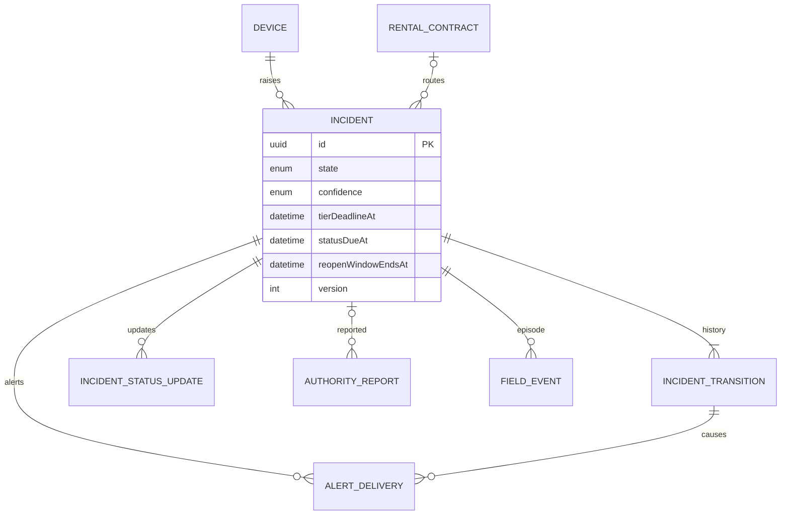
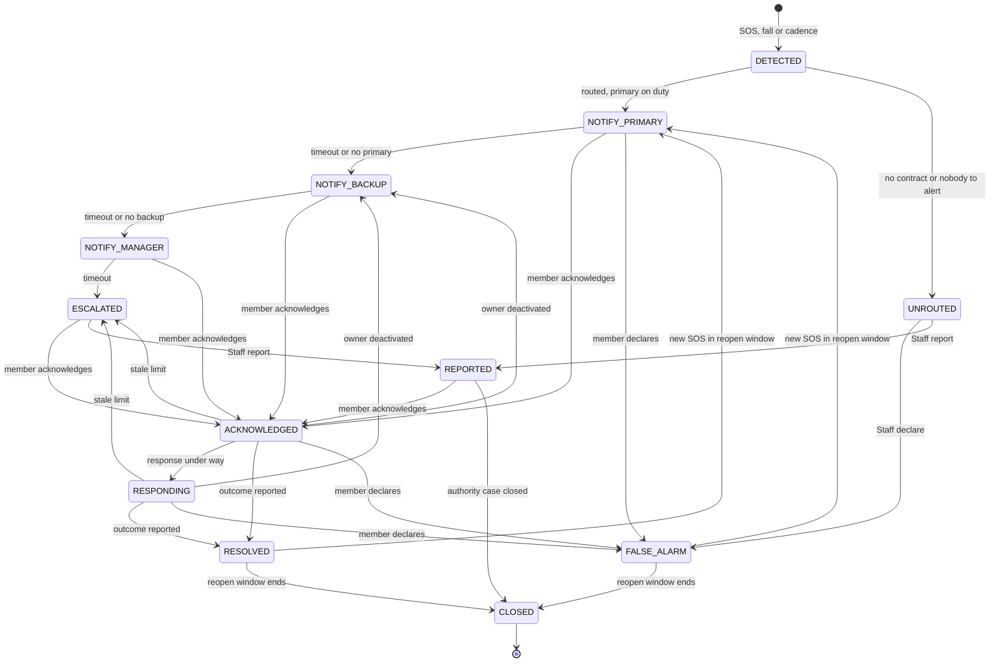
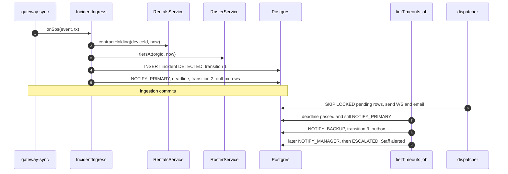

# Technical Design: incidents

> Fulfills `requirements.md` in this folder. Schema: the `// @module incidents` block of
> `backend/prisma/schema.prisma` is authoritative. The lifecycle is D-034 as amended by D-038.

---

## 1. Data model

```mermaid
erDiagram
    DEVICE ||--o{ INCIDENT : "raises"
    RENTAL_CONTRACT |o--o{ INCIDENT : "routes"
    INCIDENT ||--|{ INCIDENT_TRANSITION : "history"
    INCIDENT ||--o{ INCIDENT_STATUS_UPDATE : "updates"
    INCIDENT ||--o{ ALERT_DELIVERY : "alerts"
    INCIDENT_TRANSITION ||--o{ ALERT_DELIVERY : "causes"
    INCIDENT |o--o{ AUTHORITY_REPORT : "reported"
    INCIDENT ||--o{ FIELD_EVENT : "episode"
    INCIDENT {
        uuid id PK
        enum state
        enum confidence
        datetime tierDeadlineAt
        datetime statusDueAt
        datetime reopenWindowEndsAt
        int version
    }
```

***Figure 1***: incidents slice. Routing (`contractId`, `organizationId`) is fixed at creation and redone
only on reopen.

---

## 2. Incident lifecycle (D-034, D-038)

```mermaid
stateDiagram-v2
    [*] --> DETECTED : SOS, fall or cadence
    DETECTED --> NOTIFY_PRIMARY : routed, primary on duty
    DETECTED --> UNROUTED : no contract or nobody to alert
    NOTIFY_PRIMARY --> NOTIFY_BACKUP : timeout or no primary
    NOTIFY_BACKUP --> NOTIFY_MANAGER : timeout or no backup
    NOTIFY_MANAGER --> ESCALATED : timeout
    NOTIFY_PRIMARY --> ACKNOWLEDGED : member acknowledges
    NOTIFY_BACKUP --> ACKNOWLEDGED : member acknowledges
    NOTIFY_MANAGER --> ACKNOWLEDGED : member acknowledges
    ESCALATED --> ACKNOWLEDGED : member acknowledges
    REPORTED --> ACKNOWLEDGED : member acknowledges
    ACKNOWLEDGED --> RESPONDING : response under way
    ACKNOWLEDGED --> ESCALATED : stale limit
    RESPONDING --> ESCALATED : stale limit
    ACKNOWLEDGED --> NOTIFY_BACKUP : owner deactivated
    RESPONDING --> NOTIFY_BACKUP : owner deactivated
    ACKNOWLEDGED --> RESOLVED : outcome reported
    RESPONDING --> RESOLVED : outcome reported
    NOTIFY_PRIMARY --> FALSE_ALARM : member declares
    ACKNOWLEDGED --> FALSE_ALARM : member declares
    RESPONDING --> FALSE_ALARM : member declares
    UNROUTED --> FALSE_ALARM : Staff declare
    UNROUTED --> REPORTED : Staff report
    ESCALATED --> REPORTED : Staff report
    REPORTED --> CLOSED : authority case closed
    RESOLVED --> NOTIFY_PRIMARY : new SOS in reopen window
    FALSE_ALARM --> NOTIFY_PRIMARY : new SOS in reopen window
    RESOLVED --> CLOSED : reopen window ends
    FALSE_ALARM --> CLOSED : reopen window ends
    CLOSED --> [*]
```

***Figure 2***: Incident lifecycle; SRS Figures 23 and 24. `NOTIFY_BACKUP` and `NOTIFY_MANAGER` also go
to `FALSE_ALARM` (D-034 "`NOTIFY_*`"); those two arrows are omitted from the figure for legibility.
`DETECTED` is transient: routing happens in the creating transaction.

| Timer column | Set when entering | Cleared when leaving |
|---|---|---|
| `tierDeadlineAt` | `NOTIFY_PRIMARY` (+ primary timeout), `NOTIFY_BACKUP`, `NOTIFY_MANAGER` | any `NOTIFY_*` |
| `statusDueAt` | `ACKNOWLEDGED`, `RESPONDING`, and on each status update (+ stale limit) | those two states |
| `reopenWindowEndsAt` | `RESOLVED`, `FALSE_ALARM` (+ reopen window) | those two states |

**Empty tiers.** Entering a `NOTIFY_*` state whose tier has nobody (no shift, no primary, no backup)
continues immediately to the next tier in the same transaction, one transition row each, so the audit
trail shows the skip (BR-16). A Manager tier is never empty while the organization has an active
Manager (`organizations` REQ-UBI-02); if it is, the incident goes to `ESCALATED`.

**Transition implementation.** `IncidentLifecycle.apply(incidentId, event, actor, expectedVersion?, tx)`:
`SELECT ... FOR UPDATE`, look up `(state, event)` in the table, check guards (owner, actor kind,
organization), `UPDATE ... SET state, version = version + 1 ... WHERE id AND version`, insert the
transition row with the next `seq`, insert outbox rows, all in one transaction. A loser of a race reads
the winner's row and answers 409 with the owner (MSG27).

---

## 3. Alert routing and delivery

| Transition into | Recipients | Channels |
|---|---|---|
| `NOTIFY_PRIMARY`, `NOTIFY_BACKUP` | that tier's member | WebSocket, web inbox, email |
| `NOTIFY_MANAGER` | every active Manager | WebSocket, web inbox, email |
| `ESCALATED`, `UNROUTED` | every TrekLink Staff and Admin, plus the organization's Managers for `ESCALATED` | WebSocket, web inbox, email (MSG34) |
| any change | the organization's stream | API event |
| stale flag | owner, or the current tier | WebSocket, web inbox |

The dispatcher job reads `alert_deliveries WHERE status = PENDING AND nextAttemptAt <= now()` with
`FOR UPDATE SKIP LOCKED`, sends, and sets `SENT`, or bumps `attempts` and `nextAttemptAt` with backoff
`base × 2^attempts`, or `FAILED` at the limit. WebSocket delivery emits the in-process event `incident.alert`,
whose synchronous listener in `monitoring` publishes to the recipient's room `user:<id>`
(`ws-live-contract.md`); `incidents` never imports `monitoring`. It counts as sent when the listener
returns, whether or not a socket is connected, because the web inbox holds the same alert.

---

## 4. Correlation

`IncidentIngress.onSos(event, tx)` is called by `gateway-sync` inside the ingestion transaction:

1. Lock the device's incident outside `CLOSED`, if any (`incidents_one_open_per_device`).
2. If none: create, route (§2), return.
3. If `RESOLVED` or `FALSE_ALARM` and the event is within the reopen window: reopen.
4. Otherwise, if within the correlation window of `lastEventAt`: append (event count, last position,
   `CONFIRMED` upgrade for a suspected incident).
5. Otherwise (open, but older than the window): append too. One open incident per device means a new
   episode on an open incident is the same emergency still running.

`onPosition(event, tx)` appends positions of an open incident (`gatewaySync.retroTagGraceSeconds`
before the SOS included) and counts cadence for `SUSPECTED` creation.

---

## 5. Services and ports

| Export | Used by |
|---|---|
| `IncidentIngress.onSos(event, tx)`, `onPosition(event, tx)` | gateway-sync |
| `IncidentsService.markDeviceStale(deviceId, stale, lastPosition)` | monitoring |
| `IncidentsService.openByDevices(ids)`, `incidentsOfDevice(id)`, `responseTimes(range)`, `alertDeliveryStats()` | monitoring |
| provider of `CONTRACT_CLOSE_CHECKS` | rentals |

Listens to `member.deactivated` (REQ-EVT-11). Emits `incident.changed`, `audit.record`.

---

## 6. Scheduler jobs

`incidents.tierTimeouts`, `incidents.staleResponses`, `incidents.closeAfterReopenWindow`,
`incidents.deliverAlerts`: `platform` design §4.6. Each selects by its deadline column and state, then
calls `apply()` with the expected state, so a job racing a human action loses cleanly.

---

## 7. Error catalogue

| Code | HTTP |
|---|---|
| `INVALID_STATE_TRANSITION` | 409 |
| `ALREADY_OWNED` | 409 |
| `NOT_OWNER` | 403 |
| `STALE_VERSION` | 409 |
| `CASE_ALREADY_CLOSED` | 409 |
| `CONTRACT_NOT_DEFAULTED` | 409 |

---

## 8. Sequence: SOS to escalation

```mermaid
sequenceDiagram
    autonumber
    participant G as gateway-sync
    participant I as IncidentIngress
    participant R as RentalsService
    participant O as RosterService
    participant DB as Postgres
    participant J as tierTimeouts job
    participant D as dispatcher
    G->>I: onSos(event, tx)
    I->>R: contractHolding(deviceId, now)
    I->>O: tiersAt(orgId, now)
    I->>DB: INSERT incident DETECTED, transition 1
    I->>DB: NOTIFY_PRIMARY, deadline, transition 2, outbox rows
    Note over G,DB: ingestion commits
    D->>DB: SKIP LOCKED pending rows, send WS and email
    J->>DB: deadline passed and still NOTIFY_PRIMARY
    J->>DB: NOTIFY_BACKUP, transition 3, outbox
    J->>DB: later NOTIFY_MANAGER, then ESCALATED, Staff alerted
```

***Figure 3***: MF-03 from the SOS to escalation, with nobody answering.

---

## 9. Testing strategy

Transition matrix over 12 states × events; race tests for acknowledge and for job versus human; restart
test with pending deadlines (fake clock); replay ×10; empty-tier skipping; reopen inside and outside the
window; outbox retry and `FAILED` without blocking escalation; cross-organization 404.
