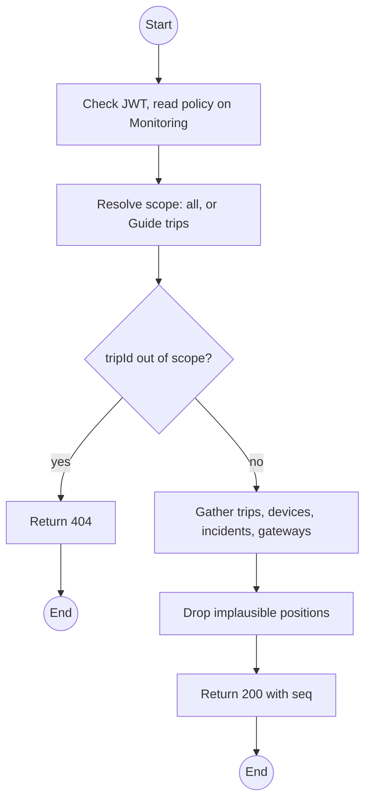
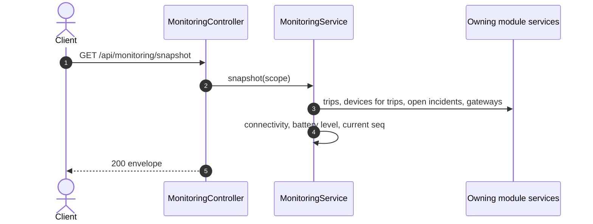

# GET /api/monitoring/snapshot: Live operational snapshot

> Module `monitoring`. Format: `02-templates/04-api-endpoint-template.md`, with Mermaid in place of PlantUML (D-017). Envelope: D-002.

[TOC]

---
## Overview

Everything the live dashboard needs on first load and after any reconnect: active trips, their devices with last position, battery level and connectivity, open incidents, gateway states, and the current socket `seq`. Scope is applied server-side: a Guide gets only their trips; a `tripId` outside scope returns 404.

## API Specification

| API        | URL             |
| ---------- | --------------- |
| GET | /api/monitoring/snapshot |
| Permission | Operator, Admin; Guide (own trips) |
| Traces | UC-14, FR-MON-01 (new), FR-MON-06 (new), US-038, US-046, E04-3, E03-7, REQ-EVT-07 |

### Query parameters

| Field | Description | Data Type | Required | Examples |
| --- | --- | --- | --- | --- |
| tripId | One trip only | uuid | no | `a1c3...` |

## Request sample

No request body. Query string example:

```
GET /api/monitoring/snapshot
```

## Response sample

```json
{
  "result": {
    "seq": 1041,
    "generatedAt": "2026-10-11T03:20:00Z",
    "trips": [
      {
        "id": "a1c3...",
        "code": "TRP-2026-1010-TNPD",
        "status": "IN_PROGRESS",
        "guides": [
          "Tran Minh",
          "Le Hoa"
        ]
      }
    ],
    "devices": [
      {
        "id": "0d3f...",
        "assetTag": "TL-0042",
        "tripId": "a1c3...",
        "participant": "Nguyen Van A",
        "position": {
          "lat": 11.5601,
          "lon": 108.5402,
          "eventTime": "2026-10-11T03:19:35Z"
        },
        "batteryPct": 28,
        "batteryLevel": "WARNING",
        "connectivity": "LIVE",
        "lastSeenAt": "2026-10-11T03:19:35Z"
      },
      {
        "id": "1a2b...",
        "assetTag": "TL-0051",
        "tripId": "a1c3...",
        "position": {
          "lat": 11.5588,
          "lon": 108.5379,
          "eventTime": "2026-10-11T03:09:10Z"
        },
        "batteryPct": 61,
        "batteryLevel": "OK",
        "connectivity": "STALE",
        "lastSeenAt": "2026-10-11T03:09:10Z"
      }
    ],
    "incidents": [
      {
        "id": "3e4f...",
        "code": "INC-2026-000045",
        "status": "DETECTED",
        "confidence": "CONFIRMED",
        "deviceId": "0d3f...",
        "escalated": false
      }
    ],
    "gateways": [
      {
        "gatewayKey": "!a4b1c2d3",
        "state": "LIVE",
        "lastPacketAt": "2026-10-11T03:19:35Z"
      }
    ]
  },
  "isSuccess": true,
  "statusCode": 200,
  "message": "Snapshot retrieved"
}
```

| Field | Description | Data Type | Examples |
| --- | --- | --- | --- |
| seq | Socket sequence the snapshot is consistent with | int | `1041` |
| devices[].connectivity | LIVE, STALE, BUFFERING, NEVER_SEEN | enum | `STALE` |
| devices[].position.eventTime | Time of the position, device clock when valid | datetime | n/a |

## Validation

<table>
    <th>Status code</th>
    <th>Description</th>
    <th>Examples</th>
    <tbody>
        <tr>
            <td>401</td>
            <td>Missing, malformed or expired access token (<code>UNAUTHENTICATED</code>)</td>
<td>

```json
{
  "result": {
    "errorCode": "UNAUTHENTICATED"
  },
  "isSuccess": false,
  "statusCode": 401,
  "message": "Authentication required."
}
```
</td>
        </tr>
        <tr>
            <td>403</td>
            <td>Authenticated, but the caller's role or policy does not allow this action (<code>FORBIDDEN</code>)</td>
<td>

```json
{
  "result": {
    "errorCode": "FORBIDDEN"
  },
  "isSuccess": false,
  "statusCode": 403,
  "message": "You do not have permission to perform this action."
}
```
</td>
        </tr>
        <tr>
            <td>404</td>
            <td>`tripId` outside the caller's scope (<code>NOT_FOUND</code>)</td>
<td>

```json
{
  "result": {
    "errorCode": "NOT_FOUND"
  },
  "isSuccess": false,
  "statusCode": 404,
  "message": "Trip not found."
}
```
</td>
        </tr>
    </tbody>
</table>

## Activity Diagram



## Sequence Diagram


