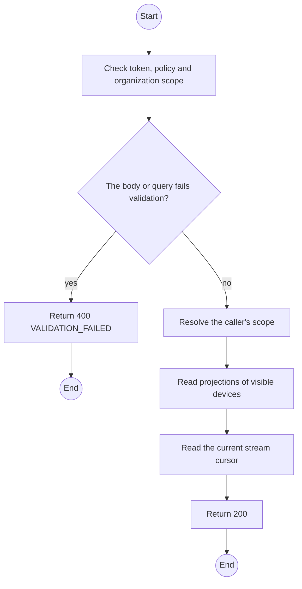
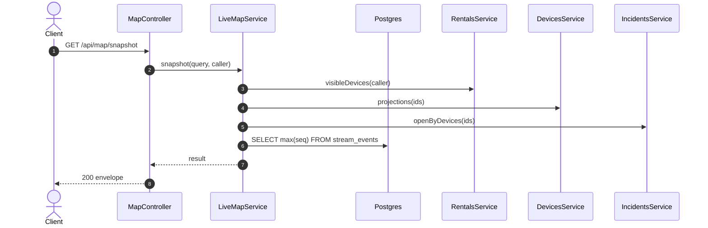

# GET /api/map/snapshot: Live map snapshot

> Module `monitoring`. Generated from `scripts/specs/endpoints/monitoring.py` by `scripts/specs/build_api_design.py`; edit the catalog, not this file. Format: `02-templates/04-api-endpoint-template.md` with Mermaid (D-017). Envelope: D-002.

[TOC]

---
## Overview

The initial state the live map draws before it subscribes: every device the caller may see with its last plotted position, battery, staleness, holder label and open incident, plus the organization's Field Stations, and the stream cursor to subscribe from (FR-MON-02, FR-MON-03, FR-AUTH-11).

## API Specification

| API | URL |
| --- | --- |
| GET | /api/map/snapshot |
| Permission | Org Manager, Org Operator: own; TrekLink Staff, TrekLink Admin |
| Traces | UC-38, UC-41, FR-AUTH-11, FR-MON-02, FR-MON-03, BR-19, BR-21 |

### Query parameters

| Field | Description | Data Type | Required | Examples |
| --- | --- | --- | --- | --- |
| organizationId | TrekLink staff: one organization; omit for the fleet | uuid | no | `5b1d2c0e-7f3a-4e21-9c8d-1a2b3c4d5e6f` |

## Request sample

No body.

## Response sample

```json
{
  "result": {
    "cursor": 88213,
    "devices": [
      {
        "id": "0d3f6a2b-7e11-4c55-8f0a-2b1c9e7d4a10",
        "assetTag": "TL-0042",
        "hardwareVariant": "treklink-v3",
        "holder": {
          "name": "Le Thi E"
        },
        "position": {
          "lat": 11.5601,
          "lon": 108.5402,
          "at": "2026-10-20T03:15:00.000Z"
        },
        "batteryPct": 81,
        "lastSeenAt": "2026-10-20T03:15:00.000Z",
        "stale": false,
        "openIncident": null,
        "contractCode": "RC-2026-0042"
      }
    ],
    "fieldStations": [
      {
        "id": "f1e2d3c4-b5a6-4978-8a9b-0c1d2e3f4a5b",
        "name": "Ta Nang basecamp laptop",
        "lastSyncAt": "2026-10-20T03:15:00.000Z",
        "stale": false
      }
    ]
  },
  "isSuccess": true,
  "statusCode": 200,
  "message": "OK"
}
```

## Validation

<table>
    <th>Status code</th>
    <th>Description</th>
    <th>Examples</th>
    <tbody>
        <tr>
            <td>400</td>
            <td>The body or query fails validation (<code>VALIDATION_FAILED</code>)</td>
<td>

```json
{
  "result": {
    "errorCode": "VALIDATION_FAILED"
  },
  "isSuccess": false,
  "statusCode": 400,
  "message": "{field} is required."
}
```
</td>
        </tr>
        <tr>
            <td>401</td>
            <td>Missing, malformed or expired access token or API key (<code>UNAUTHENTICATED</code>)</td>
<td>

```json
{
  "result": {
    "errorCode": "UNAUTHENTICATED"
  },
  "isSuccess": false,
  "statusCode": 401,
  "message": "Authentication required."
}
```
</td>
        </tr>
        <tr>
            <td>403</td>
            <td>The caller's role, policy or organization does not allow this action (<code>FORBIDDEN</code>)</td>
<td>

```json
{
  "result": {
    "errorCode": "FORBIDDEN"
  },
  "isSuccess": false,
  "statusCode": 403,
  "message": "You do not have access to this."
}
```
</td>
        </tr>
    </tbody>
</table>

## Activity Diagram



## Sequence Diagram


