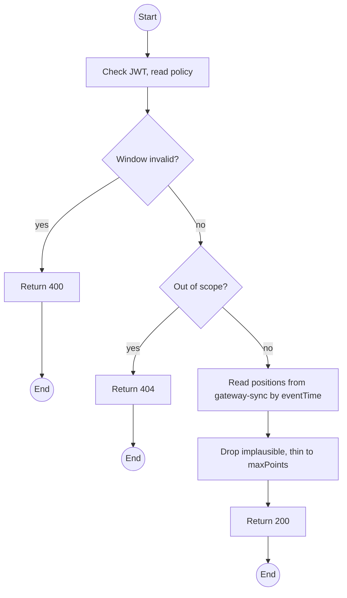
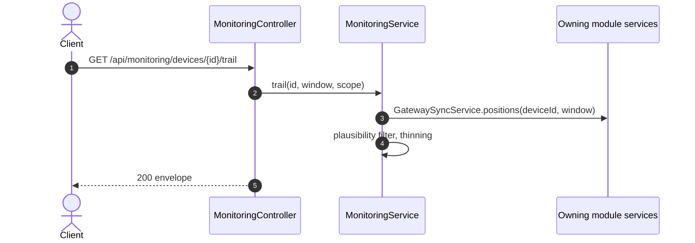

# GET /api/monitoring/devices/:id/trail: Device position trail

> Module `monitoring`. Format: `02-templates/04-api-endpoint-template.md`, with Mermaid in place of PlantUML (D-017). Envelope: D-002.

[TOC]

---
## Overview

Positions of one device in a window, ordered by `eventTime`, thinned to at most `maxPoints`, with implausible points excluded. Used for the breadcrumb line on the map and for incident review. Reads `gateway-sync` events; stores nothing.

## API Specification

| API        | URL             |
| ---------- | --------------- |
| GET | /api/monitoring/devices/:id/trail |
| Permission | Operator, Admin; Guide (own trips) |
| Traces | UC-14, US-056, REQ-UBI-02 of gateway-sync, E04-4 |

### Path parameters

| Field | Description | Data Type | Examples |
| --- | --- | --- | --- |
| id | Device id | uuid | `0d3f...` |

### Query parameters

| Field | Description | Data Type | Required | Examples |
| --- | --- | --- | --- | --- |
| from | eventTime lower bound | datetime | yes | `2026-10-11T00:00:00Z` |
| to | eventTime upper bound; default now | datetime | no | `2026-10-11T04:00:00Z` |
| maxPoints | Default 500, max 2000 | int | no | `500` |

## Request sample

No request body. Query string example:

```
GET /api/monitoring/devices/{id}/trail?from=2026-10-11T00:00:00Z
```

## Response sample

```json
{
  "result": {
    "deviceId": "0d3f...",
    "points": [
      {
        "lat": 11.5544,
        "lon": 108.5381,
        "eventTime": "2026-10-11T00:05:00Z",
        "priority": "P2"
      },
      {
        "lat": 11.5601,
        "lon": 108.5402,
        "eventTime": "2026-10-11T03:14:05Z",
        "priority": "P1"
      }
    ],
    "thinned": false,
    "excludedImplausible": 0
  },
  "isSuccess": true,
  "statusCode": 200,
  "message": "Trail retrieved"
}
```

## Validation

<table>
    <th>Status code</th>
    <th>Description</th>
    <th>Examples</th>
    <tbody>
        <tr>
            <td>400</td>
            <td>Window invalid or over 72 h (<code>VALIDATION_FAILED</code>)</td>
<td>

```json
{
  "result": {
    "errorCode": "VALIDATION_FAILED"
  },
  "isSuccess": false,
  "statusCode": 400,
  "message": "The window cannot exceed 72 hours."
}
```
</td>
        </tr>
        <tr>
            <td>401</td>
            <td>Missing, malformed or expired access token (<code>UNAUTHENTICATED</code>)</td>
<td>

```json
{
  "result": {
    "errorCode": "UNAUTHENTICATED"
  },
  "isSuccess": false,
  "statusCode": 401,
  "message": "Authentication required."
}
```
</td>
        </tr>
        <tr>
            <td>403</td>
            <td>Authenticated, but the caller's role or policy does not allow this action (<code>FORBIDDEN</code>)</td>
<td>

```json
{
  "result": {
    "errorCode": "FORBIDDEN"
  },
  "isSuccess": false,
  "statusCode": 403,
  "message": "You do not have permission to perform this action."
}
```
</td>
        </tr>
        <tr>
            <td>404</td>
            <td>Device outside scope (<code>NOT_FOUND</code>)</td>
<td>

```json
{
  "result": {
    "errorCode": "NOT_FOUND"
  },
  "isSuccess": false,
  "statusCode": 404,
  "message": "Device not found."
}
```
</td>
        </tr>
    </tbody>
</table>

## Activity Diagram



## Sequence Diagram


