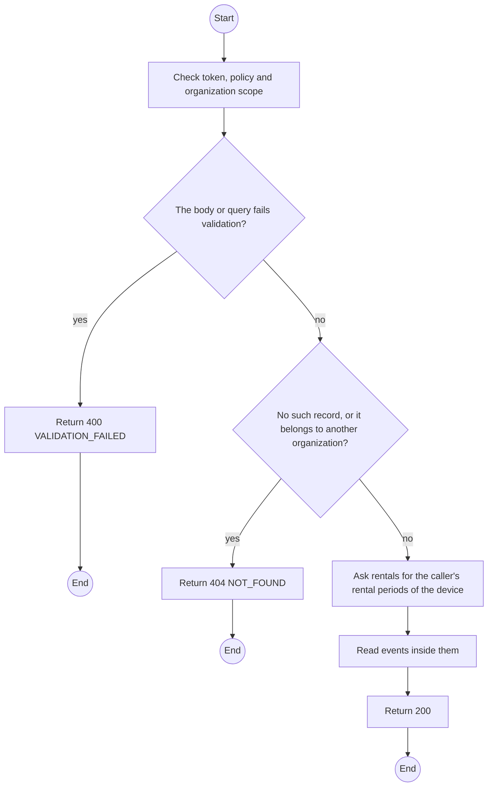
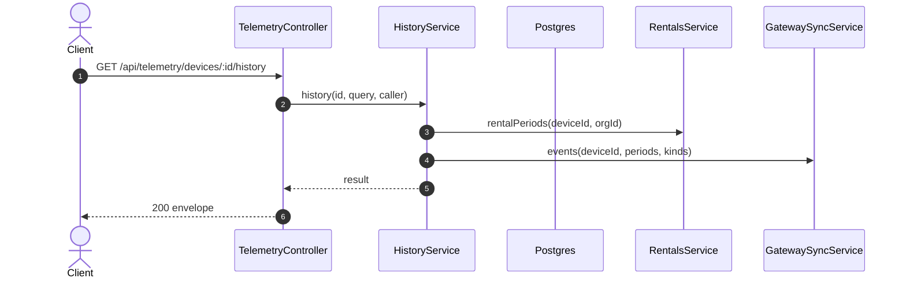

# GET /api/telemetry/devices/:id/history: Device position and telemetry history

> Module `monitoring`. Generated from `scripts/specs/endpoints/monitoring.py` by `scripts/specs/build_api_design.py`; edit the catalog, not this file. Format: `02-templates/04-api-endpoint-template.md` with Mermaid (D-017). Envelope: D-002.

[TOC]

---
## Overview

Positions and telemetry of one device over a period, clipped to the periods the caller's organization rented it (from handover to check-in). Unplotted implausible positions are excluded (FR-MON-07, FR-MON-04).

## API Specification

| API | URL |
| --- | --- |
| GET | /api/telemetry/devices/:id/history |
| Permission | Org Manager, Org Operator: own; TrekLink Staff, TrekLink Admin |
| Traces | UC-40, FR-AUTH-11, FR-MON-07, BR-19 |

### Path parameters

| Field | Description | Data Type | Examples |
| --- | --- | --- | --- |
| id | Device id | uuid | `0d3f6a2b-7e11-4c55-8f0a-2b1c9e7d4a10` |

### Query parameters

| Field | Description | Data Type | Required | Examples |
| --- | --- | --- | --- | --- |
| from | Inclusive start | datetime | yes | `2026-10-20T00:00:00Z` |
| to | Exclusive end, at most 7 days after from | datetime | yes | `2026-10-21T00:00:00Z` |
| kind | `POSITION`, `TELEMETRY` or both | enum[] | no | `["POSITION"]` |
| format | `json` or `csv` | enum | no | `json` |

## Request sample

No body.

## Response sample

```json
{
  "result": {
    "deviceId": "0d3f6a2b-7e11-4c55-8f0a-2b1c9e7d4a10",
    "clippedTo": [
      {
        "from": "2026-10-20T02:00:00Z",
        "to": "2026-10-21T00:00:00Z"
      }
    ],
    "points": [
      {
        "at": "2026-10-20T03:15:00.000Z",
        "kind": "POSITION",
        "lat": 11.5601,
        "lon": 108.5402,
        "altitude": 1320,
        "batteryPct": 81
      }
    ]
  },
  "isSuccess": true,
  "statusCode": 200,
  "message": "OK"
}
```

## Validation

<table>
    <th>Status code</th>
    <th>Description</th>
    <th>Examples</th>
    <tbody>
        <tr>
            <td>400</td>
            <td>The body or query fails validation (<code>VALIDATION_FAILED</code>)</td>
<td>

```json
{
  "result": {
    "errorCode": "VALIDATION_FAILED"
  },
  "isSuccess": false,
  "statusCode": 400,
  "message": "{field} is required."
}
```
</td>
        </tr>
        <tr>
            <td>401</td>
            <td>Missing, malformed or expired access token or API key (<code>UNAUTHENTICATED</code>)</td>
<td>

```json
{
  "result": {
    "errorCode": "UNAUTHENTICATED"
  },
  "isSuccess": false,
  "statusCode": 401,
  "message": "Authentication required."
}
```
</td>
        </tr>
        <tr>
            <td>403</td>
            <td>The caller's role, policy or organization does not allow this action (<code>FORBIDDEN</code>)</td>
<td>

```json
{
  "result": {
    "errorCode": "FORBIDDEN"
  },
  "isSuccess": false,
  "statusCode": 403,
  "message": "You do not have access to this."
}
```
</td>
        </tr>
        <tr>
            <td>404</td>
            <td>No such record, or it belongs to another organization (<code>NOT_FOUND</code>)</td>
<td>

```json
{
  "result": {
    "errorCode": "NOT_FOUND"
  },
  "isSuccess": false,
  "statusCode": 404,
  "message": "Device not found."
}
```
</td>
        </tr>
    </tbody>
</table>

## Activity Diagram



## Sequence Diagram


