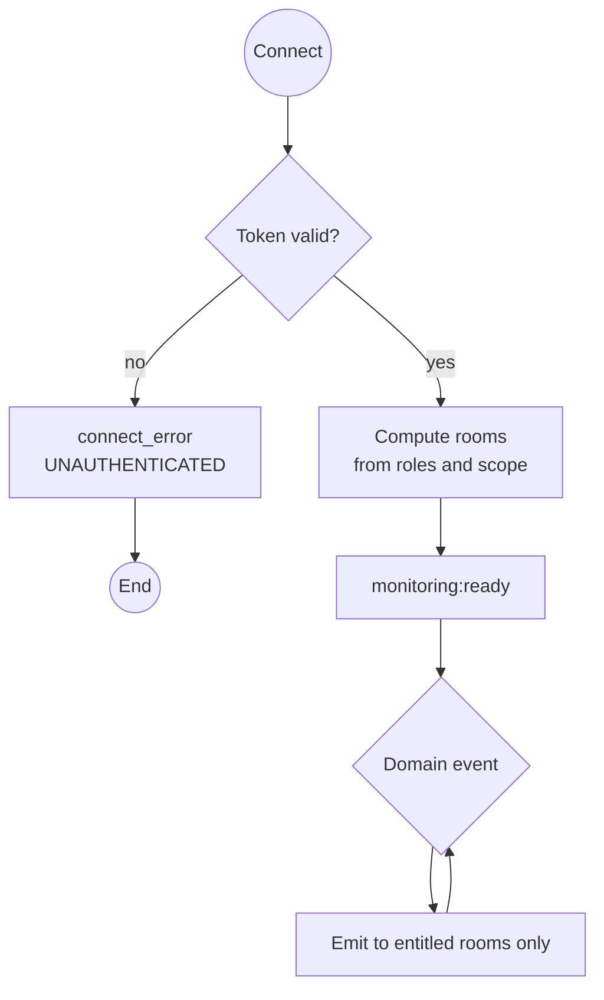

# WS `/monitoring`: live operational feed

> Module `monitoring`. A Socket.io namespace, not an HTTP endpoint, so messages carry their own frame instead of the D-002 envelope; errors on connect use the same `errorCode` vocabulary as the HTTP API. Documented in the endpoint format so the frontend builds against one contract (`04-architecture-conventions.md` §4.3).

[TOC]

---
## Overview

One connection per browser tab, opened by `shared/socket/socketClient.ts`. The server verifies the access token, computes the socket's rooms from roles and Guide trip scope, and pushes device, gateway, incident and trip events to the rooms entitled to them. The client never names a room.

## API Specification

| API        | URL             |
| ---------- | --------------- |
| WS (Socket.io v4) | namespace `/monitoring` on the backend origin |
| Permission | any authenticated user with `read Monitoring`; Customers are refused |
| Auth | `io(url + "/monitoring", { auth: { token: accessToken } })` |
| Traces | UC-14, FR-MON-01, FR-MON-02, FR-MON-06, BR-13, E04-3, E04-5, US-053, US-058 |

## Request sample

The client sends nothing after connecting. The handshake:

```json
{ "auth": { "token": "eyJhbGciOiJIUzI1NiJ9..." } }
```

| Field | Description | Data Type | Required | Examples |
| --- | --- | --- | --- | --- |
| auth.token | Current access token; refreshed and reconnected on expiry | string | yes | `eyJ...` |

## Response sample

Every server message has this frame:

```json
{
  "seq": 1042,
  "type": "device:position",
  "eventTime": "2026-10-11T03:19:35Z",
  "emittedAt": "2026-10-11T03:19:36Z",
  "data": { "deviceId": "0d3f...", "tripId": "a1c3...", "lat": 11.5601, "lon": 108.5402, "alt": 1320, "priority": "P1", "incidentId": "3e4f..." }
}
```

| Field | Description | Data Type | Examples |
| --- | --- | --- | --- |
| seq | Increasing per message across the namespace; a gap means messages were missed, fetch the snapshot | int | `1042` |
| type | One of the catalogue in `design.md` §2.3 | string | `incident:new` |
| eventTime | Time of the underlying event, device time when valid | datetime | `2026-10-11T03:19:35Z` |
| emittedAt | Server time of emission; `emittedAt - commit` is the ≤2 s NFR | datetime | `2026-10-11T03:19:36Z` |
| data | Type-specific body | object | n/a |

## Validation

| Situation | What the client sees | Client action |
| --- | --- | --- |
| No or invalid token | `connect_error` with `data.errorCode = UNAUTHENTICATED` | refresh the token, reconnect; on refresh failure go to login |
| Customer account | `connect_error` with `data.errorCode = FORBIDDEN` | do not retry |
| Token expired while connected | `disconnect` with reason `TOKEN_EXPIRED` | refresh, reconnect, then snapshot |
| Network loss | `disconnect`, automatic reconnect | show "reconnecting", then snapshot on `monitoring:ready` |
| `seq` gap | none from the server | `GET /api/monitoring/snapshot` |
| Scope changed (assignment) | `monitoring:scope-changed` | refetch the snapshot |

## Activity Diagram



## Sequence Diagram

See `specs/monitoring/design.md` Figures 1 and 2.
