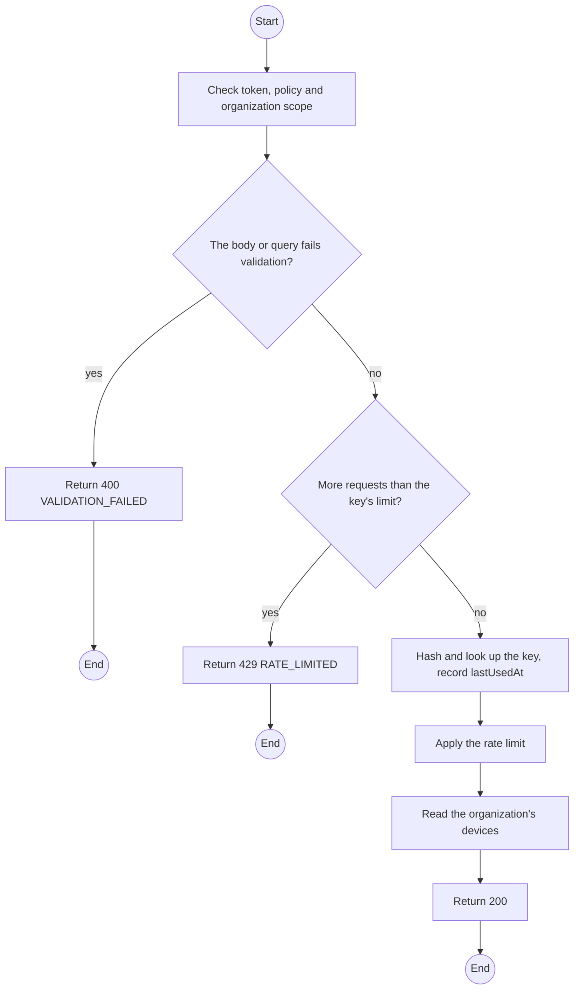
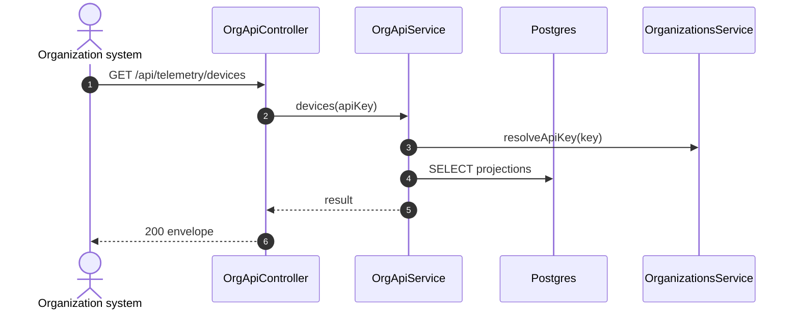

# GET /api/telemetry/devices: Organization API: devices and last state

> Module `monitoring`. Generated from `scripts/specs/endpoints/monitoring.py` by `scripts/specs/build_api_design.py`; edit the catalog, not this file. Format: `02-templates/04-api-endpoint-template.md` with Mermaid (D-017). Envelope: D-002.

[TOC]

---
## Overview

For the organization's own system: every device it currently rents with its last position, battery, staleness and holder label (UC-39). Authenticated by `X-Api-Key`, read-only, rate limited (`monitoring.apiRateLimitPerMinute`, E04-5).

## API Specification

| API | URL |
| --- | --- |
| GET | /api/telemetry/devices |
| Permission | Organization API key |
| Traces | UC-39, FR-AUTH-11, FR-MON-06, FR-ORG-06, BR-20 |

### Query parameters

| Field | Description | Data Type | Required | Examples |
| --- | --- | --- | --- | --- |
| X-Api-Key | Organization API key (read-only) | string | yes | `tlk_7Hc2...` |

## Request sample

No body.

## Response sample

```json
{
  "result": {
    "cursor": 88213,
    "devices": [
      {
        "id": "0d3f6a2b-7e11-4c55-8f0a-2b1c9e7d4a10",
        "assetTag": "TL-0042",
        "hardwareVariant": "treklink-v3",
        "holder": {
          "name": "Le Thi E"
        },
        "position": {
          "lat": 11.5601,
          "lon": 108.5402,
          "at": "2026-10-20T03:15:00.000Z"
        },
        "batteryPct": 81,
        "lastSeenAt": "2026-10-20T03:15:00.000Z",
        "stale": false,
        "openIncident": null,
        "contractCode": "RC-2026-0042"
      }
    ]
  },
  "isSuccess": true,
  "statusCode": 200,
  "message": "OK"
}
```

## Validation

<table>
    <th>Status code</th>
    <th>Description</th>
    <th>Examples</th>
    <tbody>
        <tr>
            <td>400</td>
            <td>The body or query fails validation (<code>VALIDATION_FAILED</code>)</td>
<td>

```json
{
  "result": {
    "errorCode": "VALIDATION_FAILED"
  },
  "isSuccess": false,
  "statusCode": 400,
  "message": "{field} is required."
}
```
</td>
        </tr>
        <tr>
            <td>401</td>
            <td>Missing, malformed or expired access token or API key (<code>UNAUTHENTICATED</code>)</td>
<td>

```json
{
  "result": {
    "errorCode": "UNAUTHENTICATED"
  },
  "isSuccess": false,
  "statusCode": 401,
  "message": "Authentication required."
}
```
</td>
        </tr>
        <tr>
            <td>403</td>
            <td>The caller's role, policy or organization does not allow this action (<code>FORBIDDEN</code>)</td>
<td>

```json
{
  "result": {
    "errorCode": "FORBIDDEN"
  },
  "isSuccess": false,
  "statusCode": 403,
  "message": "You do not have access to this."
}
```
</td>
        </tr>
        <tr>
            <td>429</td>
            <td>More requests than the key's limit (<code>RATE_LIMITED</code>)</td>
<td>

```json
{
  "result": {
    "errorCode": "RATE_LIMITED"
  },
  "isSuccess": false,
  "statusCode": 429,
  "message": "Too many requests. Retry after 12 seconds."
}
```
</td>
        </tr>
    </tbody>
</table>

## Activity Diagram



## Sequence Diagram


