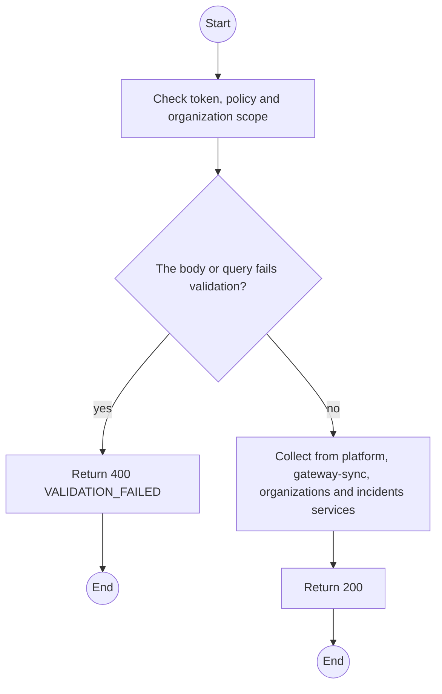
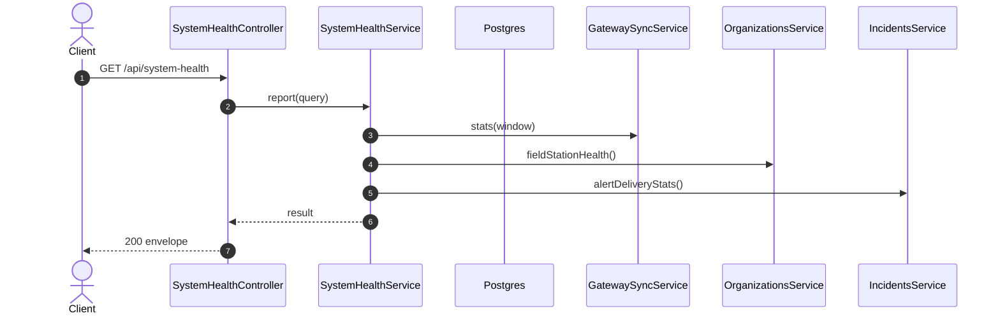

# GET /api/system-health: System health

> Module `monitoring`. Generated from `scripts/specs/endpoints/monitoring.py` by `scripts/specs/build_api_design.py`; edit the catalog, not this file. Format: `02-templates/04-api-endpoint-template.md` with Mermaid (D-017). Envelope: D-002.

[TOC]

---
## Overview

Ingestion rate, duplicate and malformed counts, Field Station connectivity, Stage B devices buffering, failed alert deliveries and the platform health (FR-MON-10, FR-EVT-13).

## API Specification

| API | URL |
| --- | --- |
| GET | /api/system-health |
| Permission | TrekLink Admin |
| Traces | UC-42, FR-EVT-13, FR-MON-10 |

### Query parameters

| Field | Description | Data Type | Required | Examples |
| --- | --- | --- | --- | --- |
| windowMinutes | Look-back for rates, default 60 | int | no | `60` |

## Request sample

No body.

## Response sample

```json
{
  "result": {
    "health": {
      "status": "ok",
      "components": {
        "database": "up",
        "mqtt": "up"
      }
    },
    "ingestion": {
      "perMinute": 41.2,
      "accepted": 2471,
      "duplicates": 12,
      "malformed": 0,
      "unknownDevice": 1
    },
    "fieldStations": {
      "total": 6,
      "stale": 1,
      "maxQueueDepth": [
        0,
        0,
        14,
        230
      ]
    },
    "devicesBuffering": 2,
    "alerts": {
      "pending": 0,
      "failed": 1
    }
  },
  "isSuccess": true,
  "statusCode": 200,
  "message": "OK"
}
```

## Validation

<table>
    <th>Status code</th>
    <th>Description</th>
    <th>Examples</th>
    <tbody>
        <tr>
            <td>400</td>
            <td>The body or query fails validation (<code>VALIDATION_FAILED</code>)</td>
<td>

```json
{
  "result": {
    "errorCode": "VALIDATION_FAILED"
  },
  "isSuccess": false,
  "statusCode": 400,
  "message": "{field} is required."
}
```
</td>
        </tr>
        <tr>
            <td>401</td>
            <td>Missing, malformed or expired access token or API key (<code>UNAUTHENTICATED</code>)</td>
<td>

```json
{
  "result": {
    "errorCode": "UNAUTHENTICATED"
  },
  "isSuccess": false,
  "statusCode": 401,
  "message": "Authentication required."
}
```
</td>
        </tr>
        <tr>
            <td>403</td>
            <td>The caller's role, policy or organization does not allow this action (<code>FORBIDDEN</code>)</td>
<td>

```json
{
  "result": {
    "errorCode": "FORBIDDEN"
  },
  "isSuccess": false,
  "statusCode": 403,
  "message": "You do not have access to this."
}
```
</td>
        </tr>
    </tbody>
</table>

## Activity Diagram



## Sequence Diagram


