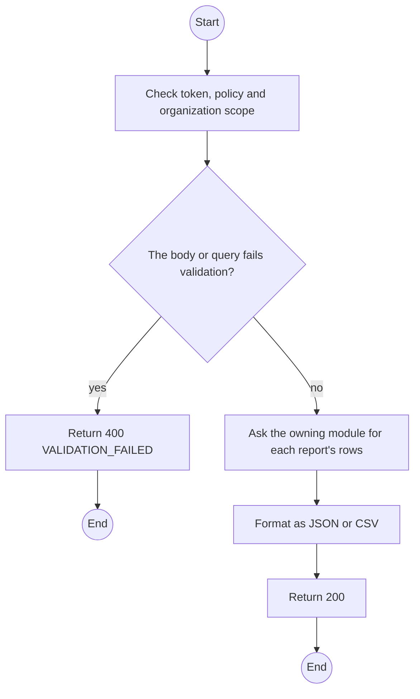
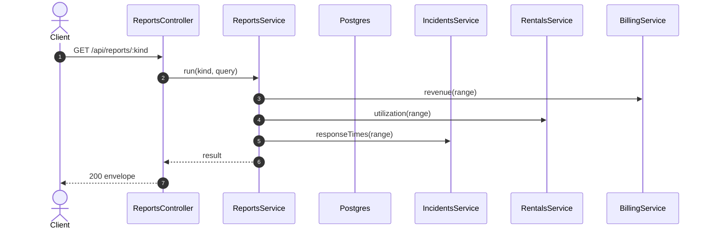

# GET /api/reports/:kind: Reports

> Module `monitoring`. Generated from `scripts/specs/endpoints/monitoring.py` by `scripts/specs/build_api_design.py`; edit the catalog, not this file. Format: `02-templates/04-api-endpoint-template.md` with Mermaid (D-017). Envelope: D-002.

[TOC]

---
## Overview

Utilization, revenue per variant, overdue contracts, lost units, and time-to-acknowledge and time-to-resolve over a date range; `format=csv` returns the rows as CSV text in `result` (FR-BILL-10).

## API Specification

| API | URL |
| --- | --- |
| GET | /api/reports/:kind |
| Permission | TrekLink Staff, TrekLink Admin |
| Traces | UC-59, FR-BILL-10 |

### Path parameters

| Field | Description | Data Type | Examples |
| --- | --- | --- | --- |
| kind | `utilization`, `revenue`, `overdue`, `lost`, `incident-times` | enum | `revenue` |

### Query parameters

| Field | Description | Data Type | Required | Examples |
| --- | --- | --- | --- | --- |
| from | Inclusive start | date | yes | `2026-10-01` |
| to | Exclusive end | date | yes | `2026-11-01` |
| format | `json` or `csv` | enum | no | `json` |

## Request sample

No body.

## Response sample

```json
{
  "result": {
    "kind": "revenue",
    "from": "2026-10-01",
    "to": "2026-11-01",
    "rows": [
      {
        "variant": "treklink-v3",
        "invoicedVnd": 18000000,
        "paidVnd": 13500000
      }
    ]
  },
  "isSuccess": true,
  "statusCode": 200,
  "message": "OK"
}
```

## Validation

<table>
    <th>Status code</th>
    <th>Description</th>
    <th>Examples</th>
    <tbody>
        <tr>
            <td>400</td>
            <td>The body or query fails validation (<code>VALIDATION_FAILED</code>)</td>
<td>

```json
{
  "result": {
    "errorCode": "VALIDATION_FAILED"
  },
  "isSuccess": false,
  "statusCode": 400,
  "message": "{field} is required."
}
```
</td>
        </tr>
        <tr>
            <td>401</td>
            <td>Missing, malformed or expired access token or API key (<code>UNAUTHENTICATED</code>)</td>
<td>

```json
{
  "result": {
    "errorCode": "UNAUTHENTICATED"
  },
  "isSuccess": false,
  "statusCode": 401,
  "message": "Authentication required."
}
```
</td>
        </tr>
        <tr>
            <td>403</td>
            <td>The caller's role, policy or organization does not allow this action (<code>FORBIDDEN</code>)</td>
<td>

```json
{
  "result": {
    "errorCode": "FORBIDDEN"
  },
  "isSuccess": false,
  "statusCode": 403,
  "message": "You do not have access to this."
}
```
</td>
        </tr>
    </tbody>
</table>

## Activity Diagram



## Sequence Diagram


