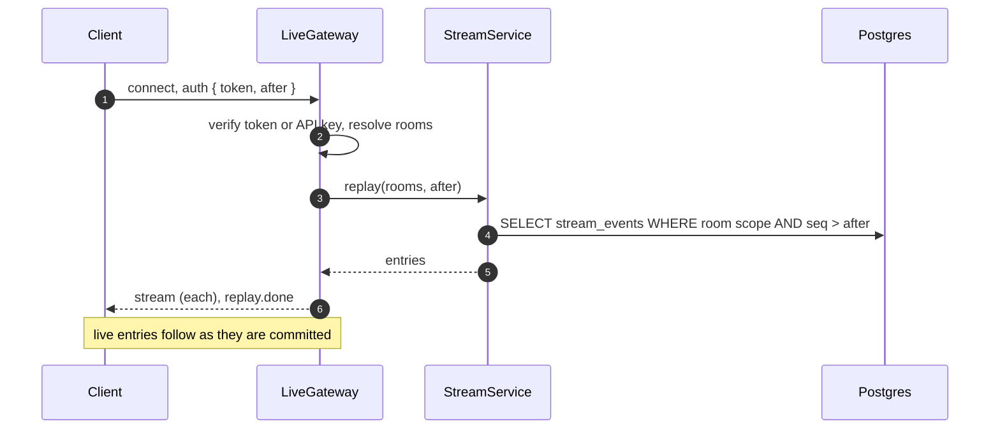

# WebSocket live contract: Socket.io namespace `/live`

> Module `monitoring`. Hand-written: push is not request and response, so it has no D-002 envelope. Every
> payload below is the `payload` of a `StreamEvent` row (schema `monitoring`), so a push and a REST replay
> (`GET /api/telemetry/stream`) carry the same shape.

[TOC]

---
## Overview

One authenticated socket per client (FR-MON-02). The server joins it to rooms on connect and never lets
the client choose a room, so organization scoping is enforced on the server (FR-AUTH-11, NFR-SEC-03).

| Client | Handshake `auth` | Rooms joined |
|---|---|---|
| Web user, organization member | `{ "token": "<access JWT>", "after": <cursor?> }` | `org:<organizationId>` |
| Web user, TrekLink Staff or Admin | same | `fleet` (every organization plus platform-wide entries) |
| Organization system | `{ "apiKey": "tlk_...", "after": <cursor?> }` | `org:<organizationId>` |

A failed handshake answers `connect_error` with `{ "errorCode": "UNAUTHENTICATED" }` and closes. A token
expiring during the session is refreshed by the client with `emit("auth.refresh", { token })`; an API key
revoked during the session closes the socket with `{ "errorCode": "KEY_REVOKED" }` (E04-5).

## Replay on connect and reconnect (FR-MON-05, E04-3)

When `after` is given the server first sends every entry of the client's rooms with `seq > after`, in
order, then `{ "type": "replay.done", "cursor": <seq> }`, then live entries. The web client shows
MSG32 ("Reconnecting. Live data is paused.") from disconnect to `replay.done`. A cursor older than
`monitoring.streamRetentionHours` gets `{ "type": "replay.expired" }` and the client reloads
`GET /api/map/snapshot`.

## Server-to-client event: `stream`

Every live entry is emitted as the event `stream` with this body:

```json
{ "seq": 88214, "type": "device.position", "deviceId": "0d3f6a2b-...", "payload": { }, "createdAt": "2026-10-20T03:15:00.000Z" }
```

| `type` | `payload` | Source |
|---|---|---|
| `device.position` | `{ lat, lon, altitude, at }`; never an unplotted position (FR-MON-04) | gateway-sync after commit, throttled by `monitoring.positionEmitMinIntervalMs` per device |
| `device.telemetry` | `{ batteryPct, at }` | gateway-sync |
| `device.stale` | `{ stale: true, lastSeenAt }` or `{ stale: false }` | staleness sweep (FR-MON-03, BR-21) |
| `device.label` | `{ holder: { name } \| null }` | rentals (FR-CON-14) |
| `device.released` | `{ checkedInAt }`; the client removes the device; nothing more is sent for it to that organization (FR-MON-08) | rentals on check-in |
| `incident.changed` | `{ incidentId, code, state, tier, ownerName, lastPosition, stale }` | incidents after commit (FR-INC-12) |
| `incident.alert` | `{ incidentId, code, deviceLabel, holderName, at, message }`; MSG31 for the recipient's tier | incidents outbox, WEBSOCKET channel, sent only to the recipient's personal room `user:<id>` |
| `station.stale` | `{ fieldStationId, stale, lastSyncAt }` | staleness sweep (E04-2) |

`incident.alert` is the only event addressed to a person rather than a room. Every other type goes to
`org:<id>` of the device's renting organization and to `fleet`.

## Client-to-server events

| Event | Body | Effect |
|---|---|---|
| `auth.refresh` | `{ token }` | Re-validates; on failure the socket closes |
| `ack` | `{ seq }` | Optional; the server records the client's last cursor for diagnostics only |

No client event changes data: acknowledgement and every other action go through REST with a policy check.

## Sequence Diagram


