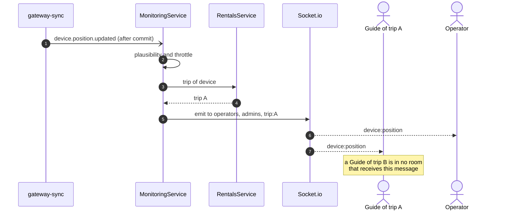
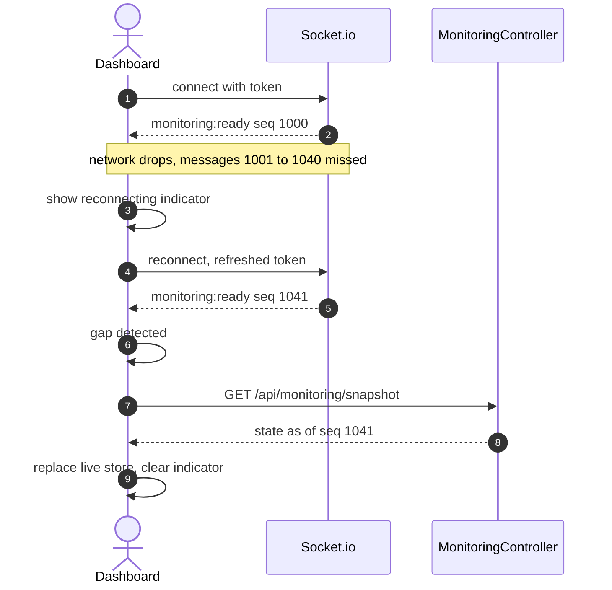

# Technical Design: monitoring

> Fulfills `requirements.md` in this folder. This module owns no tables; it reads the `devices` projection, `gateway-sync` events and gateways, `incidents` and `trips` through their exported services, and pushes over Socket.io.

---

## 1. Domain Model

No Prisma models. In-memory state, rebuilt from the database at start:

| State | Purpose | Rebuilt from |
|---|---|---|
| `connectivity: Map<deviceId, DeviceConnectivity>` | emit only on transitions (REQ-EVT-04) | `DevicesService` projection plus latest queue report |
| `gatewayState: Map<gatewayId, LIVE or STALE>` | emit only on transitions (REQ-EVT-05) | `GatewaySyncService.gateways()` |
| `seq: number` | message ordering and gap detection (REQ-UBI-03) | starts at the current epoch milliseconds, so a restart never reuses a value |
| `lastEmit: Map<deviceId, ms>` | position throttle | empty |

Single-instance assumption stated in requirements §1. With a second instance, `seq` and the maps would move to Redis via the Socket.io Redis adapter; nothing else changes.

---

## 2. Service / Business Logic Design

### 2.1 Rooms and scope

| Room | Who joins | Receives |
|---|---|---|
| `operators` | users holding `OPERATOR` | everything |
| `admins` | users holding `ADMIN` | everything (read access generalises Staff, `06-requirements-foundation.md` §2) |
| `trip:{tripId}` | Guides whose scope contains the trip | that trip's devices, incidents, trip status |

`MonitoringGateway.handleConnection`: verify the JWT with the `auth` strategy (same `ver` check as HTTP), build the ability, compute rooms, `socket.join()`. Guide rooms come from `TripsService.activeTripIdsForGuide(userId)` (trips in `READY`, `IN_PROGRESS`, `EMERGENCY`). A timer disconnects the socket at token expiry (REQ-EVT-08).

Routing an event: `devicesForTrip` and `findActiveAssignmentForDevice` (from `rentals`) give the trip of a device. The emitter targets `operators`, `admins` and `trip:{tripId}` when a trip exists. No emit ever targets a room the server did not compute.

See **Figure 1**.



***Figure 1***: Server-side scoping at the emit. The browser never receives data it may not see, which is the MF-04 rule and the E04-5 test.

### 2.2 Connectivity sweep

`monitoring.staleSweep` runs every `monitoring.staleSweepSeconds` on the platform scheduler:

```
for each device with lastSeenAt not null and status in (RENTED, IN_FIELD):
    state = buffering ? BUFFERING
          : now - lastSeenAt > deviceStaleSeconds ? STALE
          : LIVE
    if state != connectivity[device]: emit device:connectivity; connectivity[device] = state
for each gateway:
    same with gatewayStaleSeconds and gateway:health
```

`device.position.updated` sets `LIVE` immediately, so recovery is visible without waiting for the sweep.

### 2.3 Socket message catalogue

Every message: `{ seq, type, eventTime, emittedAt, data }`.

| Event | `data` | Rooms |
|---|---|---|
| `monitoring:ready` | `{ rooms, seq }` | the socket |
| `monitoring:scope-changed` | `{ rooms }` | the socket |
| `device:position` | `{ deviceId, tripId, lat, lon, alt, priority, incidentId }` | ops, admins, trip |
| `device:telemetry` | `{ deviceId, tripId, batteryPct, batteryLevel }` | ops, admins, trip |
| `device:connectivity` | `{ deviceId, tripId, state, lastSeenAt }` | ops, admins, trip |
| `gateway:health` | `{ gatewayKey, state, lastPacketAt }` | ops, admins; trip rooms of trips whose devices used it in the last hour |
| `incident:new` | incident summary with `confidence` | ops, admins, trip |
| `incident:updated` | `{ incidentId, status, actor, version }` | ops, admins, trip |
| `incident:escalated` | `{ incidentId }` | ops, admins |
| `trip:status` | `{ tripId, from, to }` | ops, admins, trip |

### 2.4 Error catalogue

| Code | Where | Raised when |
|---|---|---|
| `UNAUTHENTICATED` | socket connect error | missing or invalid token |
| `TOKEN_EXPIRED` | socket disconnect reason | token lifetime reached |
| `NOT_FOUND` | HTTP 404 | snapshot or trail outside scope |
| `VALIDATION_FAILED` | HTTP 400 | trail window invalid |

---

## 3. Sequence Flow: reconnect and resync (E04-3)

See **Figure 2**.



***Figure 2***: A visible reconnecting state and a snapshot on every gap, so the dashboard never silently diverges from the server (E04-3, E03-7).

---

## 4. API Endpoints in this module

| # | Method | Route | Permission | Spec |
|---|---|---|---|---|
| 01 | GET | `/api/monitoring/snapshot` | Operator, Admin; Guide (own trips) | `api-design/01-get-monitoring-snapshot.md` |
| 02 | GET | `/api/monitoring/devices/:id/trail` | Operator, Admin; Guide (own trips) | `api-design/02-get-monitoring-device-trail.md` |
| 03 | WS | namespace `/monitoring` | authenticated | `api-design/03-ws-monitoring-events.md` |

---

## 5. Frontend impact

`shared/socket/socketClient.ts` (one connection, token in `auth`, reconnect with refresh), `entities/live` Zustand store keyed by device and incident, `widgets/LiveMapWidget` subscribing to the store, `widgets/GatewayHealthWidget`, `widgets/IncidentQueueWidget`. Detailed in `specs/frontend/design.md`.
