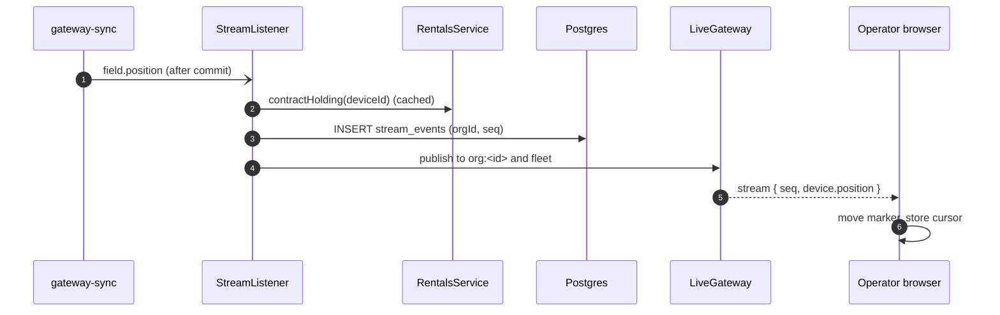

# Technical Design: monitoring

> Fulfills `requirements.md` in this folder. Schema: the `// @module monitoring` block of
> `backend/prisma/schema.prisma` is authoritative. Push contract: [ws-live-contract.md](api-design/ws-live-contract.md).

---

## 1. Data model

`StreamEvent(seq, organizationId?, type, deviceId?, payload, createdAt)`: one row per live update; `seq`
is the cursor for both the WebSocket replay and `GET /api/telemetry/stream`. Rows are pruned after
`monitoring.streamRetentionHours`. `organizationId` null means platform-wide (fleet room only).

Everything else this module shows is read through other modules' services; it owns no other table.

---

## 2. Rooms and scoping

| Room | Joined by | Receives |
|---|---|---|
| `fleet` | TrekLink Staff and Admin | every entry |
| `org:<id>` | members and API keys of the organization | entries with that `organizationId` |
| `user:<id>` | that user | `incident.alert` only |

The organization of an entry is the one renting the device when the entry is written:
`rentals.contractHolding(deviceId, now)`, cached per device and invalidated by `device.handedOver` and
`device.checkedIn`. That is what keeps a device that moves from A to B from leaking A's old entries to B
or B's new ones to A (AC-01).

---

## 3. Jobs

| Job | Rule |
|---|---|
| `monitoring.staleSweep` | every `monitoring.staleSweepSeconds`: devices whose `lastSeenAt` crossed the threshold since the last run, Field Stations likewise; emit transitions only (stale and recovered), tell `incidents.markDeviceStale` |
| `monitoring.pruneStream` | hourly: delete entries older than the retention |

---

## 4. Read-model services

| Endpoint | Composed from |
|---|---|
| `GET /api/map/snapshot` | `rentals.visibleDevices`, `devices.projections`, `incidents.openByDevices`, `organizations` stations, the max `seq` |
| `GET /api/telemetry/devices/:id/history` | `rentals.rentalPeriods`, `gatewaySync.events` |
| `GET /api/devices/:id/history` | `devices.trail`, `rentals.contractsOfDevice`, `incidents.incidentsOfDevice` |
| `GET /api/reports/:kind` | `rentals.utilization`, `billing.revenue`, `rentals` overdue and lost lists, `incidents.responseTimes` |
| `GET /api/system-health` | `HealthService`, `gatewaySync.stats`, `organizations` station health, `incidents.alertDeliveryStats` |

Reports return JSON or CSV text in the envelope; time-to-acknowledge and time-to-resolve are medians and
95th percentiles over the range.

---

## 5. Client side (specified in `specs/frontend/`)

Leaflet with the tile URL and attribution from `GET /api/map/config`, the overlay layer from the same
response, markers by state (normal, low battery, stale, incident), a reconnecting banner, and a map error
state that leaves the lists working. Tiles go from the browser to OpenStreetMap with the browser's own
User-Agent and Referer; nothing prefetches tiles (D-031 tile policy).

---

## 6. Error catalogue

| Code | HTTP |
|---|---|
| `CURSOR_EXPIRED` | 410 |
| `RATE_LIMITED` | 429 |

---

## 7. Sequence: live update to the map

```mermaid
sequenceDiagram
    autonumber
    participant G as gateway-sync
    participant L as StreamListener
    participant R as RentalsService
    participant DB as Postgres
    participant W as LiveGateway
    participant C as Operator browser
    G-)L: field.position (after commit)
    L->>R: contractHolding(deviceId) (cached)
    L->>DB: INSERT stream_events (orgId, seq)
    L->>W: publish to org:<id> and fleet
    W-->>C: stream { seq, device.position }
    C->>C: move marker, store cursor
```

***Figure 1***: MF-04 push path.

---

## 8. Testing strategy

Scoping tests with two organizations and a device moving between them; replay and expiry; throttling;
stale transitions only once; rate limit per key; report numbers against seeded data.
