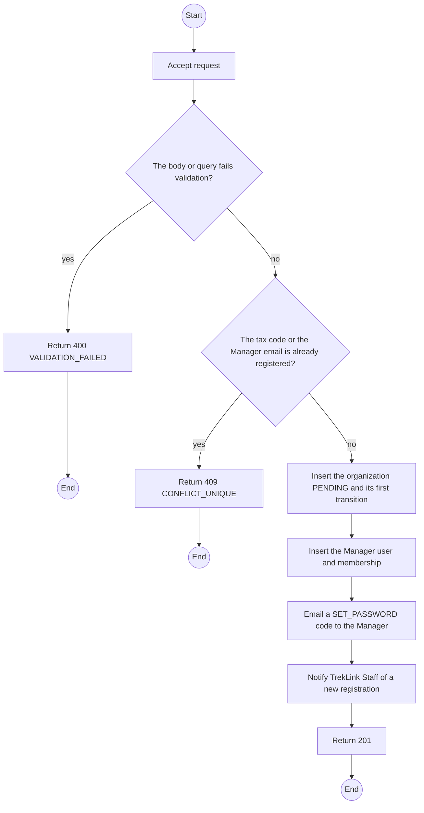
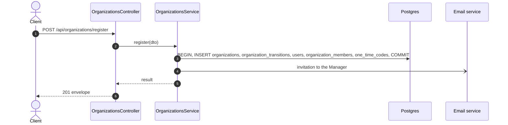

# POST /api/organizations/register: Register an organization

> Module `organizations`. Generated from `scripts/specs/endpoints/organizations.py` by `scripts/specs/build_api_design.py`; edit the catalog, not this file. Format: `02-templates/04-api-endpoint-template.md` with Mermaid (D-017). Envelope: D-002.

[TOC]

---
## Overview

A Guest registers a company with its tax code and the Manager's contact. The organization is created `PENDING` with its Manager account, which can sign in but cannot request a contract until the organization is verified and approved (FR-ORG-01).

## API Specification

| API | URL |
| --- | --- |
| POST | /api/organizations/register |
| Permission | Public |
| Traces | UC-01, FR-ORG-01, MSG04, MSG10 |

## Request sample

```json
{
  "legalName": "ACME Trek Co., Ltd.",
  "taxCode": "0312345678",
  "address": "12 Nguyen Hue, District 1, Ho Chi Minh City",
  "contactPhone": "0281234567",
  "managerFullName": "Nguyen Van A",
  "managerEmail": "manager@acme-trek.vn",
  "managerPhone": "0901234567"
}
```

| Field | Description | Data Type | Required | Examples |
| --- | --- | --- | --- | --- |
| legalName | Registered company name | string | yes | `ACME Trek Co., Ltd.` |
| taxCode | Vietnamese tax code, 10 or 13 digits | string | yes | `0312345678` |
| address | Registered address | string | yes | `12 Nguyen Hue, ...` |
| contactPhone | Company phone | string | yes | `0281234567` |
| managerFullName | Manager's name | string | yes | `Nguyen Van A` |
| managerEmail | Manager's email; becomes the login | string | yes | `manager@acme-trek.vn` |
| managerPhone | Manager's phone | string | yes | `0901234567` |

## Response sample

```json
{
  "result": {
    "organizationId": "5b1d2c0e-7f3a-4e21-9c8d-1a2b3c4d5e6f",
    "code": "ORG-0007",
    "status": "PENDING"
  },
  "isSuccess": true,
  "statusCode": 201,
  "message": "Registration received. Visit the TrekLink counter or call us to verify your organization."
}
```

## Validation

<table>
    <th>Status code</th>
    <th>Description</th>
    <th>Examples</th>
    <tbody>
        <tr>
            <td>400</td>
            <td>The body or query fails validation (<code>VALIDATION_FAILED</code>)</td>
<td>

```json
{
  "result": {
    "errorCode": "VALIDATION_FAILED"
  },
  "isSuccess": false,
  "statusCode": 400,
  "message": "{field} is required."
}
```
</td>
        </tr>
        <tr>
            <td>409</td>
            <td>The tax code or the Manager email is already registered (<code>CONFLICT_UNIQUE</code>)</td>
<td>

```json
{
  "result": {
    "errorCode": "CONFLICT_UNIQUE"
  },
  "isSuccess": false,
  "statusCode": 409,
  "message": "0312345678 is already registered."
}
```
</td>
        </tr>
    </tbody>
</table>

## Activity Diagram



## Sequence Diagram


