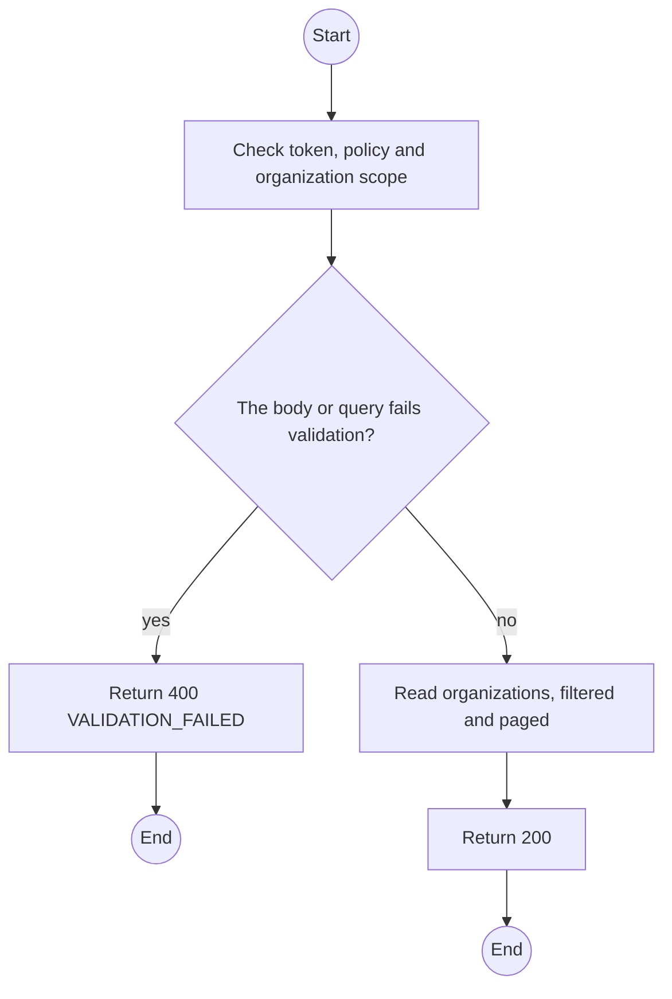
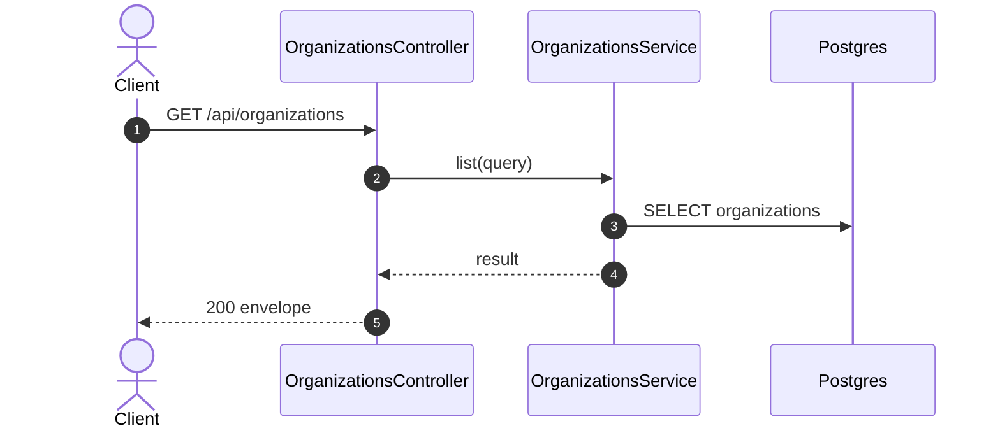

# GET /api/organizations: List organizations

> Module `organizations`. Generated from `scripts/specs/endpoints/organizations.py` by `scripts/specs/build_api_design.py`; edit the catalog, not this file. Format: `02-templates/04-api-endpoint-template.md` with Mermaid (D-017). Envelope: D-002.

[TOC]

---
## Overview

Lists organizations with filters; the Staff verification queue is `status=PENDING`.

## API Specification

| API | URL |
| --- | --- |
| GET | /api/organizations |
| Permission | TrekLink Staff, TrekLink Admin |
| Traces | UC-02, UC-03, UC-07 |

### Query parameters

| Field | Description | Data Type | Required | Examples |
| --- | --- | --- | --- | --- |
| status | OrganizationStatus | enum | no | `PENDING` |
| q | Name, code or tax code contains | string | no | `acme` |
| pageNumber | 1-based page | int | no | `1` |
| pageSize | Items per page, at most MAX_PAGE_SIZE | int | no | `20` |

## Request sample

No body.

## Response sample

```json
{
  "result": {
    "items": [
      {
        "id": "5b1d2c0e-7f3a-4e21-9c8d-1a2b3c4d5e6f",
        "code": "ORG-0007",
        "legalName": "ACME Trek Co., Ltd.",
        "taxCode": "0312345678",
        "address": "12 Nguyen Hue, District 1, Ho Chi Minh City",
        "contactEmail": "ops@acme-trek.vn",
        "contactPhone": "0281234567",
        "status": "ACTIVE",
        "statusChangedAt": "2026-10-20T03:15:00.000Z",
        "verifiedAt": "2026-10-20T03:15:00.000Z",
        "decidedAt": "2026-10-20T03:15:00.000Z",
        "channelKeyVersion": 1,
        "version": 3
      }
    ],
    "pageNumber": 1,
    "pageSize": 20,
    "totalCount": 12,
    "totalPages": 1
  },
  "isSuccess": true,
  "statusCode": 200,
  "message": "OK"
}
```

## Validation

<table>
    <th>Status code</th>
    <th>Description</th>
    <th>Examples</th>
    <tbody>
        <tr>
            <td>400</td>
            <td>The body or query fails validation (<code>VALIDATION_FAILED</code>)</td>
<td>

```json
{
  "result": {
    "errorCode": "VALIDATION_FAILED"
  },
  "isSuccess": false,
  "statusCode": 400,
  "message": "{field} is required."
}
```
</td>
        </tr>
        <tr>
            <td>401</td>
            <td>Missing, malformed or expired access token or API key (<code>UNAUTHENTICATED</code>)</td>
<td>

```json
{
  "result": {
    "errorCode": "UNAUTHENTICATED"
  },
  "isSuccess": false,
  "statusCode": 401,
  "message": "Authentication required."
}
```
</td>
        </tr>
        <tr>
            <td>403</td>
            <td>The caller's role, policy or organization does not allow this action (<code>FORBIDDEN</code>)</td>
<td>

```json
{
  "result": {
    "errorCode": "FORBIDDEN"
  },
  "isSuccess": false,
  "statusCode": 403,
  "message": "You do not have access to this."
}
```
</td>
        </tr>
    </tbody>
</table>

## Activity Diagram



## Sequence Diagram


