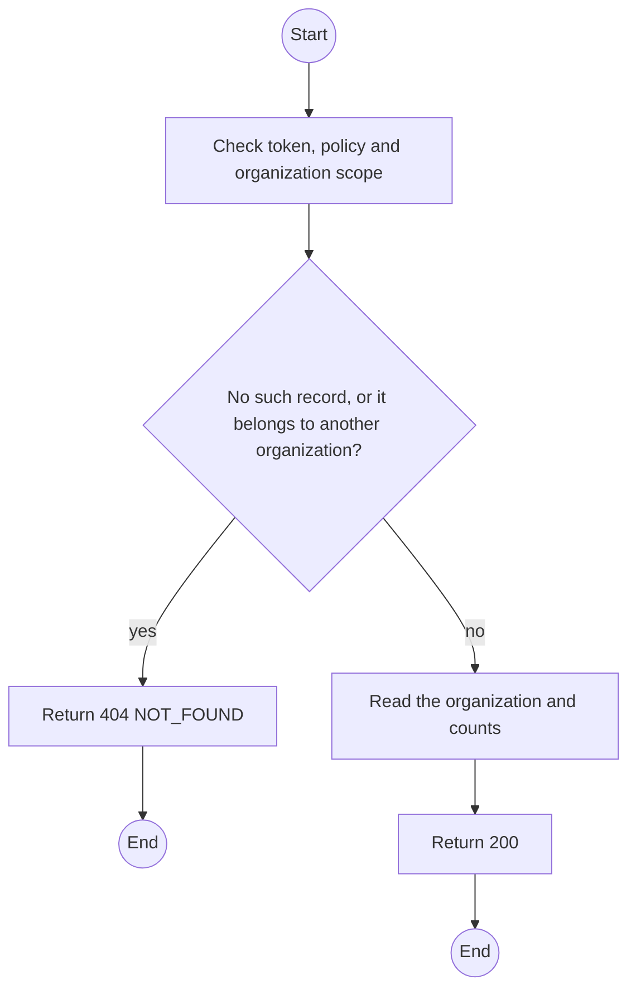
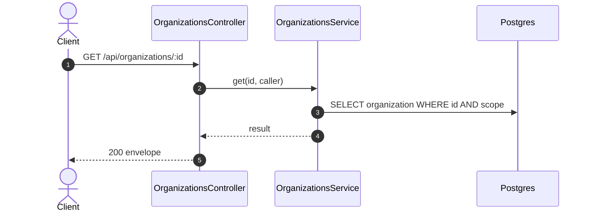

# GET /api/organizations/:id: Organization detail

> Module `organizations`. Generated from `scripts/specs/endpoints/organizations.py` by `scripts/specs/build_api_design.py`; edit the catalog, not this file. Format: `02-templates/04-api-endpoint-template.md` with Mermaid (D-017). Envelope: D-002.

[TOC]

---
## Overview

Returns one organization with its verification record and counts of members, running contracts and open incidents.

## API Specification

| API | URL |
| --- | --- |
| GET | /api/organizations/:id |
| Permission | TrekLink Staff, TrekLink Admin; members: own |
| Traces | UC-02, UC-03, FR-AUTH-11 |

### Path parameters

| Field | Description | Data Type | Examples |
| --- | --- | --- | --- |
| id | Organization id; members may use only their own | uuid | `5b1d2c0e-7f3a-4e21-9c8d-1a2b3c4d5e6f` |

## Request sample

No body.

## Response sample

```json
{
  "result": {
    "id": "5b1d2c0e-7f3a-4e21-9c8d-1a2b3c4d5e6f",
    "code": "ORG-0007",
    "legalName": "ACME Trek Co., Ltd.",
    "taxCode": "0312345678",
    "address": "12 Nguyen Hue, District 1, Ho Chi Minh City",
    "contactEmail": "ops@acme-trek.vn",
    "contactPhone": "0281234567",
    "status": "ACTIVE",
    "statusChangedAt": "2026-10-20T03:15:00.000Z",
    "verifiedAt": "2026-10-20T03:15:00.000Z",
    "decidedAt": "2026-10-20T03:15:00.000Z",
    "channelKeyVersion": 1,
    "version": 3,
    "verification": {
      "method": "IN_PERSON",
      "documentsSeen": [
        "Business registration",
        "Manager ID card"
      ],
      "masterContractRef": "MC-2026-0007",
      "verifiedBy": "Tran Thi B"
    },
    "counts": {
      "members": 4,
      "runningContracts": 1,
      "openIncidents": 0
    }
  },
  "isSuccess": true,
  "statusCode": 200,
  "message": "OK"
}
```

## Validation

<table>
    <th>Status code</th>
    <th>Description</th>
    <th>Examples</th>
    <tbody>
        <tr>
            <td>401</td>
            <td>Missing, malformed or expired access token or API key (<code>UNAUTHENTICATED</code>)</td>
<td>

```json
{
  "result": {
    "errorCode": "UNAUTHENTICATED"
  },
  "isSuccess": false,
  "statusCode": 401,
  "message": "Authentication required."
}
```
</td>
        </tr>
        <tr>
            <td>403</td>
            <td>The caller's role, policy or organization does not allow this action (<code>FORBIDDEN</code>)</td>
<td>

```json
{
  "result": {
    "errorCode": "FORBIDDEN"
  },
  "isSuccess": false,
  "statusCode": 403,
  "message": "You do not have access to this."
}
```
</td>
        </tr>
        <tr>
            <td>404</td>
            <td>No such record, or it belongs to another organization (<code>NOT_FOUND</code>)</td>
<td>

```json
{
  "result": {
    "errorCode": "NOT_FOUND"
  },
  "isSuccess": false,
  "statusCode": 404,
  "message": "Organization not found."
}
```
</td>
        </tr>
    </tbody>
</table>

## Activity Diagram



## Sequence Diagram


