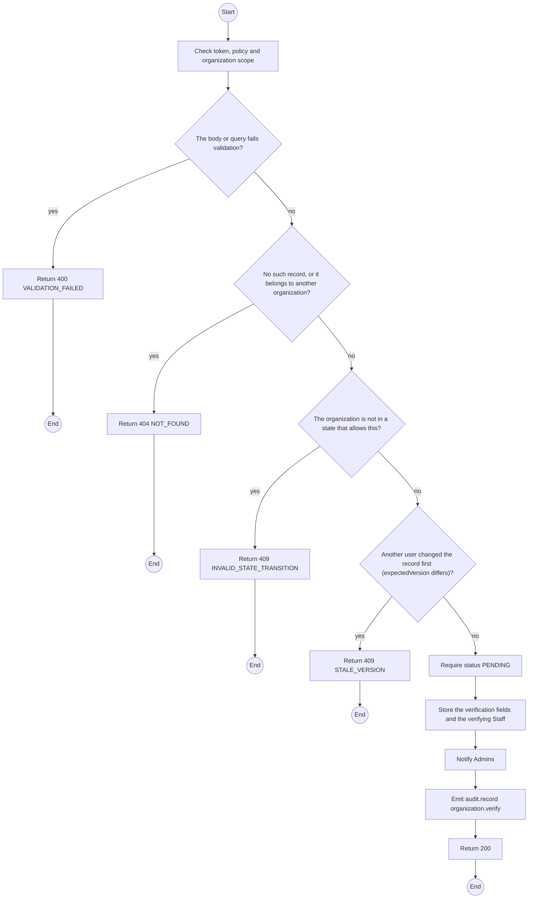
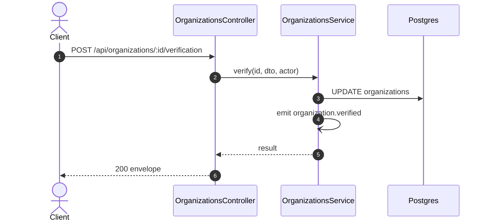

# POST /api/organizations/:id/verification: Record verification

> Module `organizations`. Generated from `scripts/specs/endpoints/organizations.py` by `scripts/specs/build_api_design.py`; edit the catalog, not this file. Format: `02-templates/04-api-endpoint-template.md` with Mermaid (D-017). Envelope: D-002.

[TOC]

---
## Overview

Records the in-person or phone verification: documents seen and the signed master contract number. Admins are notified that the organization awaits approval (FR-ORG-02).

## API Specification

| API | URL |
| --- | --- |
| POST | /api/organizations/:id/verification |
| Permission | TrekLink Staff |
| Traces | UC-02, FR-ORG-02 |

### Path parameters

| Field | Description | Data Type | Examples |
| --- | --- | --- | --- |
| id | Organization id; members may use only their own | uuid | `5b1d2c0e-7f3a-4e21-9c8d-1a2b3c4d5e6f` |

## Request sample

```json
{
  "method": "IN_PERSON",
  "documentsSeen": [
    "Business registration",
    "Manager ID card"
  ],
  "masterContractRef": "MC-2026-0007",
  "expectedVersion": 0
}
```

| Field | Description | Data Type | Required | Examples |
| --- | --- | --- | --- | --- |
| method | `IN_PERSON` or `PHONE` | enum | yes | `IN_PERSON` |
| documentsSeen | Documents checked | string[] | yes | `["Business registration"]` |
| masterContractRef | Number on the signed master contract | string | yes | `MC-2026-0007` |
| expectedVersion | Version the caller saw; mismatch returns 409 | int | yes | `3` |

## Response sample

```json
{
  "result": {
    "id": "5b1d2c0e-7f3a-4e21-9c8d-1a2b3c4d5e6f",
    "code": "ORG-0007",
    "legalName": "ACME Trek Co., Ltd.",
    "taxCode": "0312345678",
    "address": "12 Nguyen Hue, District 1, Ho Chi Minh City",
    "contactEmail": "ops@acme-trek.vn",
    "contactPhone": "0281234567",
    "status": "PENDING",
    "statusChangedAt": "2026-10-20T03:15:00.000Z",
    "verifiedAt": "2026-10-20T03:15:00.000Z",
    "decidedAt": null,
    "channelKeyVersion": 1,
    "version": 3
  },
  "isSuccess": true,
  "statusCode": 200,
  "message": "Verification recorded"
}
```

## Validation

<table>
    <th>Status code</th>
    <th>Description</th>
    <th>Examples</th>
    <tbody>
        <tr>
            <td>400</td>
            <td>The body or query fails validation (<code>VALIDATION_FAILED</code>)</td>
<td>

```json
{
  "result": {
    "errorCode": "VALIDATION_FAILED"
  },
  "isSuccess": false,
  "statusCode": 400,
  "message": "{field} is required."
}
```
</td>
        </tr>
        <tr>
            <td>401</td>
            <td>Missing, malformed or expired access token or API key (<code>UNAUTHENTICATED</code>)</td>
<td>

```json
{
  "result": {
    "errorCode": "UNAUTHENTICATED"
  },
  "isSuccess": false,
  "statusCode": 401,
  "message": "Authentication required."
}
```
</td>
        </tr>
        <tr>
            <td>403</td>
            <td>The caller's role, policy or organization does not allow this action (<code>FORBIDDEN</code>)</td>
<td>

```json
{
  "result": {
    "errorCode": "FORBIDDEN"
  },
  "isSuccess": false,
  "statusCode": 403,
  "message": "You do not have access to this."
}
```
</td>
        </tr>
        <tr>
            <td>404</td>
            <td>No such record, or it belongs to another organization (<code>NOT_FOUND</code>)</td>
<td>

```json
{
  "result": {
    "errorCode": "NOT_FOUND"
  },
  "isSuccess": false,
  "statusCode": 404,
  "message": "Organization not found."
}
```
</td>
        </tr>
        <tr>
            <td>409</td>
            <td>The organization is not in a state that allows this (<code>INVALID_STATE_TRANSITION</code>)</td>
<td>

```json
{
  "result": {
    "errorCode": "INVALID_STATE_TRANSITION"
  },
  "isSuccess": false,
  "statusCode": 409,
  "message": "This cannot be done while it is ACTIVE."
}
```
</td>
        </tr>
        <tr>
            <td>409</td>
            <td>Another user changed the record first (expectedVersion differs) (<code>STALE_VERSION</code>)</td>
<td>

```json
{
  "result": {
    "errorCode": "STALE_VERSION"
  },
  "isSuccess": false,
  "statusCode": 409,
  "message": "This was changed by someone else. Reload and try again."
}
```
</td>
        </tr>
    </tbody>
</table>

## Activity Diagram



## Sequence Diagram


