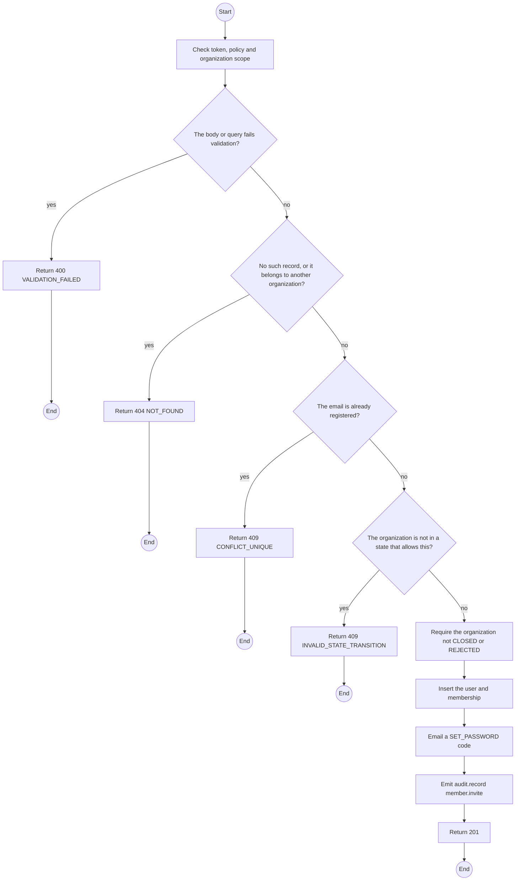
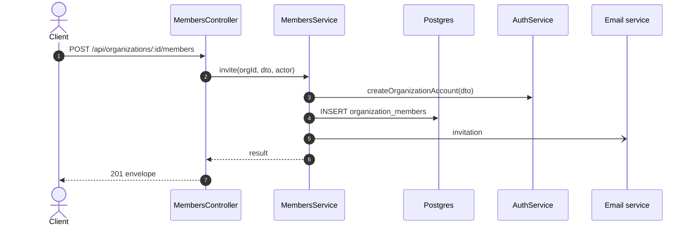

# POST /api/organizations/:id/members: Invite a member

> Module `organizations`. Generated from `scripts/specs/endpoints/organizations.py` by `scripts/specs/build_api_design.py`; edit the catalog, not this file. Format: `02-templates/04-api-endpoint-template.md` with Mermaid (D-017). Envelope: D-002.

[TOC]

---
## Overview

Invites a person by email as Manager or Operator. The account belongs to this organization only; an email already registered anywhere is refused (FR-ORG-04).

## API Specification

| API | URL |
| --- | --- |
| POST | /api/organizations/:id/members |
| Permission | Org Manager: own |
| Traces | UC-04, FR-ORG-04, MSG10 |

### Path parameters

| Field | Description | Data Type | Examples |
| --- | --- | --- | --- |
| id | Organization id; members may use only their own | uuid | `5b1d2c0e-7f3a-4e21-9c8d-1a2b3c4d5e6f` |

## Request sample

```json
{
  "email": "operator@acme-trek.vn",
  "fullName": "Pham Van D",
  "phoneNumber": "0907654321",
  "role": "OPERATOR"
}
```

| Field | Description | Data Type | Required | Examples |
| --- | --- | --- | --- | --- |
| email | Email | string | yes | `operator@acme-trek.vn` |
| fullName | Full name | string | yes | `Pham Van D` |
| phoneNumber | Phone, used in alert contact cards | string | no | `0907654321` |
| role | `MANAGER` or `OPERATOR` | enum | yes | `OPERATOR` |

## Response sample

```json
{
  "result": {
    "id": "6c5b4a39-2817-4f06-9e5d-4c3b2a190807",
    "userId": "3f2e1d0c-9b8a-4c7d-8e6f-5a4b3c2d1e0f",
    "email": "operator@acme-trek.vn",
    "fullName": "Pham Van D",
    "role": "OPERATOR",
    "invitationPending": true,
    "deactivatedAt": null
  },
  "isSuccess": true,
  "statusCode": 201,
  "message": "Invitation sent"
}
```

## Validation

<table>
    <th>Status code</th>
    <th>Description</th>
    <th>Examples</th>
    <tbody>
        <tr>
            <td>400</td>
            <td>The body or query fails validation (<code>VALIDATION_FAILED</code>)</td>
<td>

```json
{
  "result": {
    "errorCode": "VALIDATION_FAILED"
  },
  "isSuccess": false,
  "statusCode": 400,
  "message": "{field} is required."
}
```
</td>
        </tr>
        <tr>
            <td>401</td>
            <td>Missing, malformed or expired access token or API key (<code>UNAUTHENTICATED</code>)</td>
<td>

```json
{
  "result": {
    "errorCode": "UNAUTHENTICATED"
  },
  "isSuccess": false,
  "statusCode": 401,
  "message": "Authentication required."
}
```
</td>
        </tr>
        <tr>
            <td>403</td>
            <td>The caller's role, policy or organization does not allow this action (<code>FORBIDDEN</code>)</td>
<td>

```json
{
  "result": {
    "errorCode": "FORBIDDEN"
  },
  "isSuccess": false,
  "statusCode": 403,
  "message": "You do not have access to this."
}
```
</td>
        </tr>
        <tr>
            <td>404</td>
            <td>No such record, or it belongs to another organization (<code>NOT_FOUND</code>)</td>
<td>

```json
{
  "result": {
    "errorCode": "NOT_FOUND"
  },
  "isSuccess": false,
  "statusCode": 404,
  "message": "Organization not found."
}
```
</td>
        </tr>
        <tr>
            <td>409</td>
            <td>The email is already registered (<code>CONFLICT_UNIQUE</code>)</td>
<td>

```json
{
  "result": {
    "errorCode": "CONFLICT_UNIQUE"
  },
  "isSuccess": false,
  "statusCode": 409,
  "message": "operator@acme-trek.vn is already registered."
}
```
</td>
        </tr>
        <tr>
            <td>409</td>
            <td>The organization is not in a state that allows this (<code>INVALID_STATE_TRANSITION</code>)</td>
<td>

```json
{
  "result": {
    "errorCode": "INVALID_STATE_TRANSITION"
  },
  "isSuccess": false,
  "statusCode": 409,
  "message": "This cannot be done while it is CLOSED."
}
```
</td>
        </tr>
    </tbody>
</table>

## Activity Diagram



## Sequence Diagram


