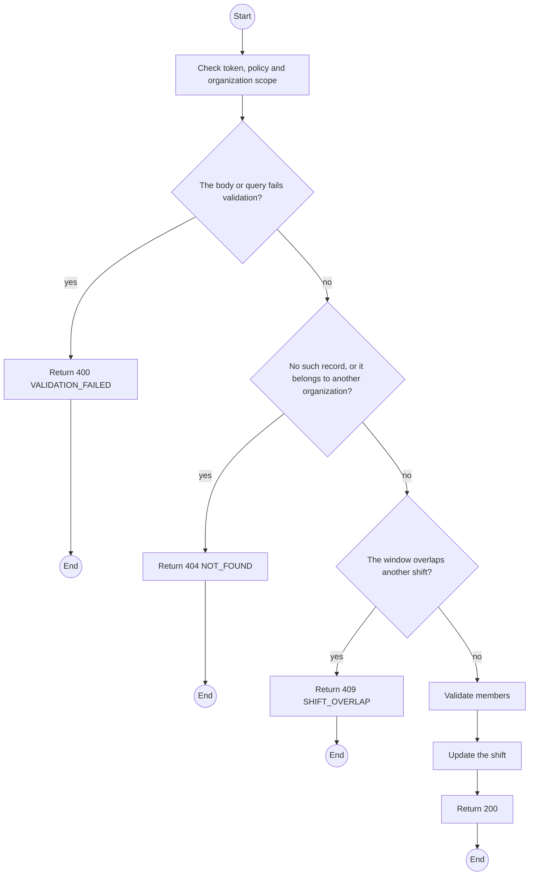
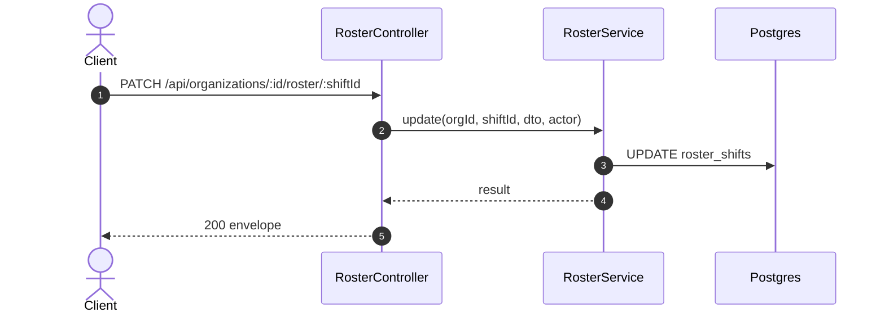

# PATCH /api/organizations/:id/roster/:shiftId: Edit a shift

> Module `organizations`. Generated from `scripts/specs/endpoints/organizations.py` by `scripts/specs/build_api_design.py`; edit the catalog, not this file. Format: `02-templates/04-api-endpoint-template.md` with Mermaid (D-017). Envelope: D-002.

[TOC]

---
## Overview

Changes a shift's window or members. A change takes effect for the next alert; an incident already in a tier keeps its recipient.

## API Specification

| API | URL |
| --- | --- |
| PATCH | /api/organizations/:id/roster/:shiftId |
| Permission | Org Manager: own |
| Traces | UC-05, FR-ORG-05 |

### Path parameters

| Field | Description | Data Type | Examples |
| --- | --- | --- | --- |
| id | Organization id; members may use only their own | uuid | `5b1d2c0e-7f3a-4e21-9c8d-1a2b3c4d5e6f` |
| shiftId | Shift id | uuid | `s-1` |

## Request sample

```json
{
  "backupMemberId": "8d7c6b5a-..."
}
```

| Field | Description | Data Type | Required | Examples |
| --- | --- | --- | --- | --- |
| startsAt | Start | datetime | no | `...` |
| endsAt | End | datetime | no | `...` |
| primaryMemberId | Member or null | uuid | no | `...` |
| backupMemberId | Member or null | uuid | no | `...` |

## Response sample

```json
{
  "result": {
    "shift": {
      "id": "s-1",
      "startsAt": "2026-10-20T00:00:00Z",
      "endsAt": "2026-10-20T12:00:00Z",
      "primary": {
        "memberId": "6c5b4a39-2817-4f06-9e5d-4c3b2a190807",
        "fullName": "Pham Van D"
      },
      "backup": null
    },
    "warnings": []
  },
  "isSuccess": true,
  "statusCode": 200,
  "message": "Saved."
}
```

## Validation

<table>
    <th>Status code</th>
    <th>Description</th>
    <th>Examples</th>
    <tbody>
        <tr>
            <td>400</td>
            <td>The body or query fails validation (<code>VALIDATION_FAILED</code>)</td>
<td>

```json
{
  "result": {
    "errorCode": "VALIDATION_FAILED"
  },
  "isSuccess": false,
  "statusCode": 400,
  "message": "{field} is required."
}
```
</td>
        </tr>
        <tr>
            <td>401</td>
            <td>Missing, malformed or expired access token or API key (<code>UNAUTHENTICATED</code>)</td>
<td>

```json
{
  "result": {
    "errorCode": "UNAUTHENTICATED"
  },
  "isSuccess": false,
  "statusCode": 401,
  "message": "Authentication required."
}
```
</td>
        </tr>
        <tr>
            <td>403</td>
            <td>The caller's role, policy or organization does not allow this action (<code>FORBIDDEN</code>)</td>
<td>

```json
{
  "result": {
    "errorCode": "FORBIDDEN"
  },
  "isSuccess": false,
  "statusCode": 403,
  "message": "You do not have access to this."
}
```
</td>
        </tr>
        <tr>
            <td>404</td>
            <td>No such record, or it belongs to another organization (<code>NOT_FOUND</code>)</td>
<td>

```json
{
  "result": {
    "errorCode": "NOT_FOUND"
  },
  "isSuccess": false,
  "statusCode": 404,
  "message": "Shift not found."
}
```
</td>
        </tr>
        <tr>
            <td>409</td>
            <td>The window overlaps another shift (<code>SHIFT_OVERLAP</code>)</td>
<td>

```json
{
  "result": {
    "errorCode": "SHIFT_OVERLAP"
  },
  "isSuccess": false,
  "statusCode": 409,
  "message": "This shift overlaps another one."
}
```
</td>
        </tr>
    </tbody>
</table>

## Activity Diagram



## Sequence Diagram


