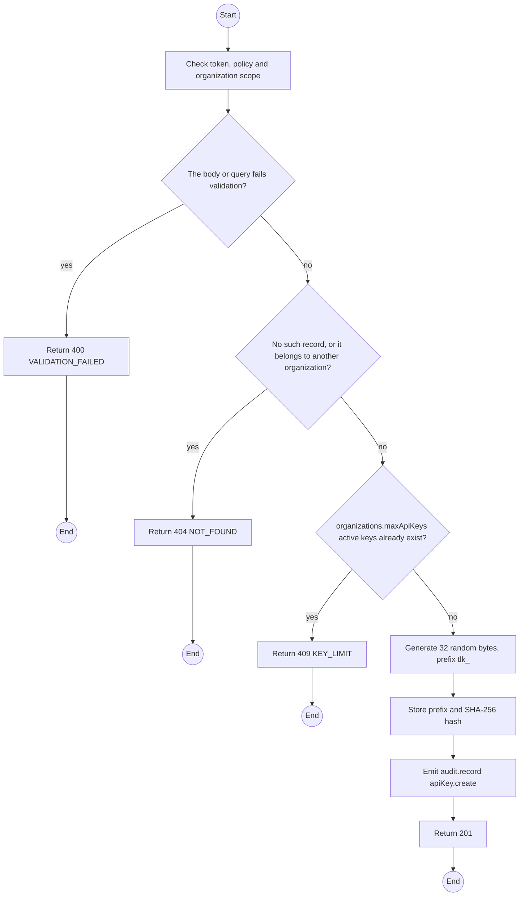
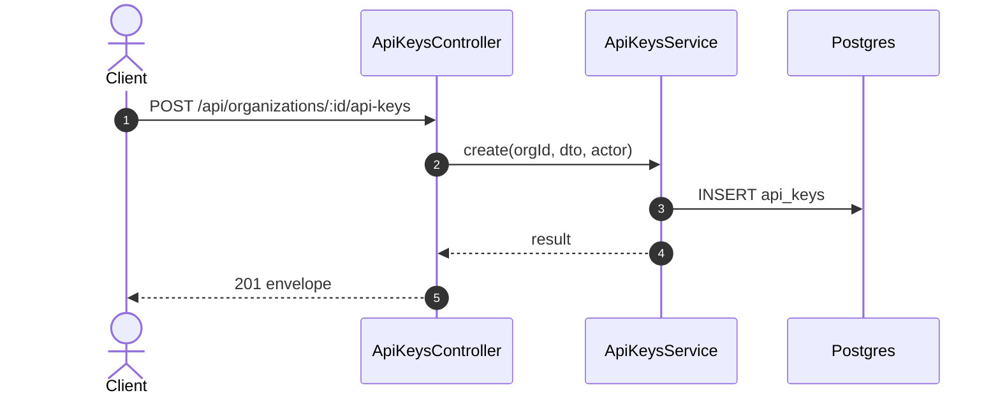

# POST /api/organizations/:id/api-keys: Create an API key

> Module `organizations`. Generated from `scripts/specs/endpoints/organizations.py` by `scripts/specs/build_api_design.py`; edit the catalog, not this file. Format: `02-templates/04-api-endpoint-template.md` with Mermaid (D-017). Envelope: D-002.

[TOC]

---
## Overview

Creates a named read-only key scoped to the organization. The key is returned once and only its SHA-256 hash is stored (FR-ORG-06, NFR-SEC-02).

## API Specification

| API | URL |
| --- | --- |
| POST | /api/organizations/:id/api-keys |
| Permission | Org Manager: own |
| Traces | UC-06, FR-ORG-06, BR-20 |

### Path parameters

| Field | Description | Data Type | Examples |
| --- | --- | --- | --- |
| id | Organization id; members may use only their own | uuid | `5b1d2c0e-7f3a-4e21-9c8d-1a2b3c4d5e6f` |

## Request sample

```json
{
  "name": "ERP integration"
}
```

| Field | Description | Data Type | Required | Examples |
| --- | --- | --- | --- | --- |
| name | Label | string | yes | `ERP integration` |

## Response sample

```json
{
  "result": {
    "id": "k-1",
    "name": "ERP integration",
    "prefix": "tlk_7Hc2",
    "createdAt": "2026-10-20T03:15:00.000Z",
    "lastUsedAt": null,
    "revokedAt": null,
    "key": "tlk_7Hc2Qm...full-key-shown-once"
  },
  "isSuccess": true,
  "statusCode": 201,
  "message": "API key created. Copy it now; it will not be shown again."
}
```

## Validation

<table>
    <th>Status code</th>
    <th>Description</th>
    <th>Examples</th>
    <tbody>
        <tr>
            <td>400</td>
            <td>The body or query fails validation (<code>VALIDATION_FAILED</code>)</td>
<td>

```json
{
  "result": {
    "errorCode": "VALIDATION_FAILED"
  },
  "isSuccess": false,
  "statusCode": 400,
  "message": "{field} is required."
}
```
</td>
        </tr>
        <tr>
            <td>401</td>
            <td>Missing, malformed or expired access token or API key (<code>UNAUTHENTICATED</code>)</td>
<td>

```json
{
  "result": {
    "errorCode": "UNAUTHENTICATED"
  },
  "isSuccess": false,
  "statusCode": 401,
  "message": "Authentication required."
}
```
</td>
        </tr>
        <tr>
            <td>403</td>
            <td>The caller's role, policy or organization does not allow this action (<code>FORBIDDEN</code>)</td>
<td>

```json
{
  "result": {
    "errorCode": "FORBIDDEN"
  },
  "isSuccess": false,
  "statusCode": 403,
  "message": "You do not have access to this."
}
```
</td>
        </tr>
        <tr>
            <td>404</td>
            <td>No such record, or it belongs to another organization (<code>NOT_FOUND</code>)</td>
<td>

```json
{
  "result": {
    "errorCode": "NOT_FOUND"
  },
  "isSuccess": false,
  "statusCode": 404,
  "message": "Organization not found."
}
```
</td>
        </tr>
        <tr>
            <td>409</td>
            <td>organizations.maxApiKeys active keys already exist (<code>KEY_LIMIT</code>)</td>
<td>

```json
{
  "result": {
    "errorCode": "KEY_LIMIT"
  },
  "isSuccess": false,
  "statusCode": 409,
  "message": "Revoke an unused key before creating another."
}
```
</td>
        </tr>
    </tbody>
</table>

## Activity Diagram



## Sequence Diagram


