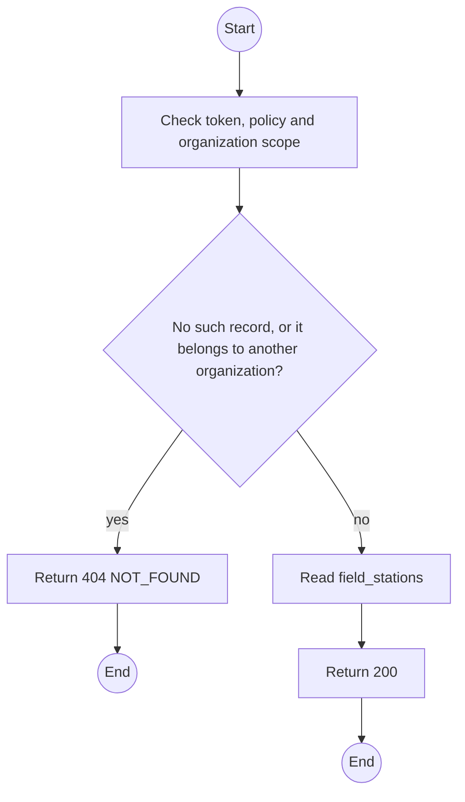
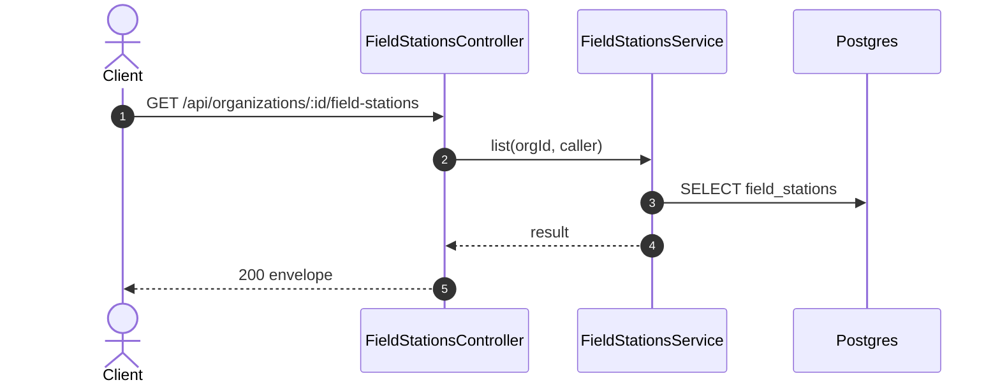

# GET /api/organizations/:id/field-stations: List Field Station credentials

> Module `organizations`. Generated from `scripts/specs/endpoints/organizations.py` by `scripts/specs/build_api_design.py`; edit the catalog, not this file. Format: `02-templates/04-api-endpoint-template.md` with Mermaid (D-017). Envelope: D-002.

[TOC]

---
## Overview

Lists the organization's Field Station credentials with their health: last sync, queue depth per tier and the retry count of the oldest queued event (FR-EVT-13).

## API Specification

| API | URL |
| --- | --- |
| GET | /api/organizations/:id/field-stations |
| Permission | Org Manager, Org Operator: own; TrekLink Staff, TrekLink Admin |
| Traces | UC-06, UC-42, FR-EVT-13, FR-EVT-14 |

### Path parameters

| Field | Description | Data Type | Examples |
| --- | --- | --- | --- |
| id | Organization id; members may use only their own | uuid | `5b1d2c0e-7f3a-4e21-9c8d-1a2b3c4d5e6f` |

## Request sample

No body.

## Response sample

```json
{
  "result": [
    {
      "id": "f1e2d3c4-b5a6-4978-8a9b-0c1d2e3f4a5b",
      "name": "Ta Nang basecamp laptop",
      "mqttUsername": "fs-org-0007-1",
      "createdAt": "2026-10-20T03:15:00.000Z",
      "revokedAt": null,
      "lastSyncAt": "2026-10-20T03:15:00.000Z",
      "queueDepth": [
        0,
        0,
        3,
        12
      ],
      "oldestRetryCount": 0
    }
  ],
  "isSuccess": true,
  "statusCode": 200,
  "message": "OK"
}
```

## Validation

<table>
    <th>Status code</th>
    <th>Description</th>
    <th>Examples</th>
    <tbody>
        <tr>
            <td>401</td>
            <td>Missing, malformed or expired access token or API key (<code>UNAUTHENTICATED</code>)</td>
<td>

```json
{
  "result": {
    "errorCode": "UNAUTHENTICATED"
  },
  "isSuccess": false,
  "statusCode": 401,
  "message": "Authentication required."
}
```
</td>
        </tr>
        <tr>
            <td>403</td>
            <td>The caller's role, policy or organization does not allow this action (<code>FORBIDDEN</code>)</td>
<td>

```json
{
  "result": {
    "errorCode": "FORBIDDEN"
  },
  "isSuccess": false,
  "statusCode": 403,
  "message": "You do not have access to this."
}
```
</td>
        </tr>
        <tr>
            <td>404</td>
            <td>No such record, or it belongs to another organization (<code>NOT_FOUND</code>)</td>
<td>

```json
{
  "result": {
    "errorCode": "NOT_FOUND"
  },
  "isSuccess": false,
  "statusCode": 404,
  "message": "Organization not found."
}
```
</td>
        </tr>
    </tbody>
</table>

## Activity Diagram



## Sequence Diagram


