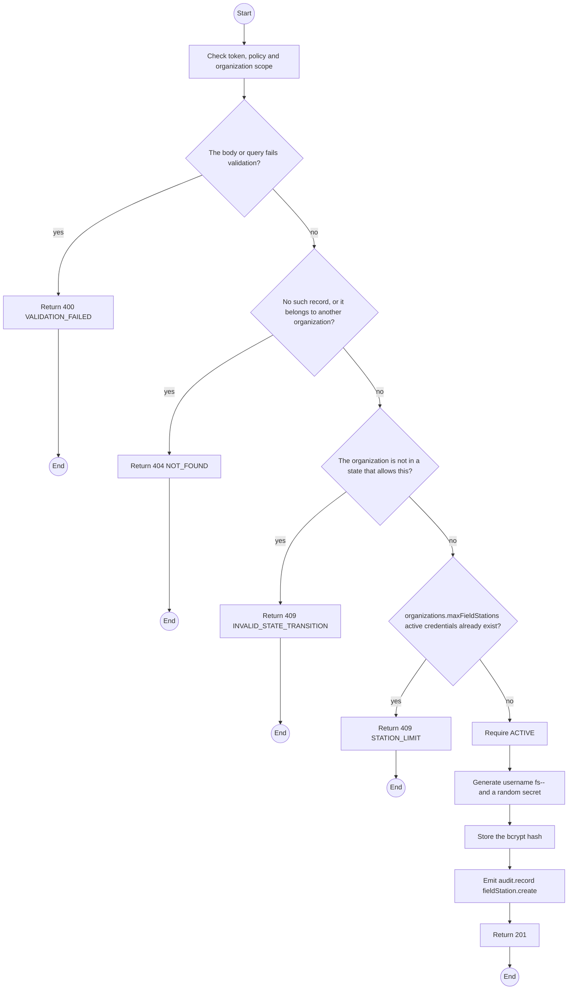
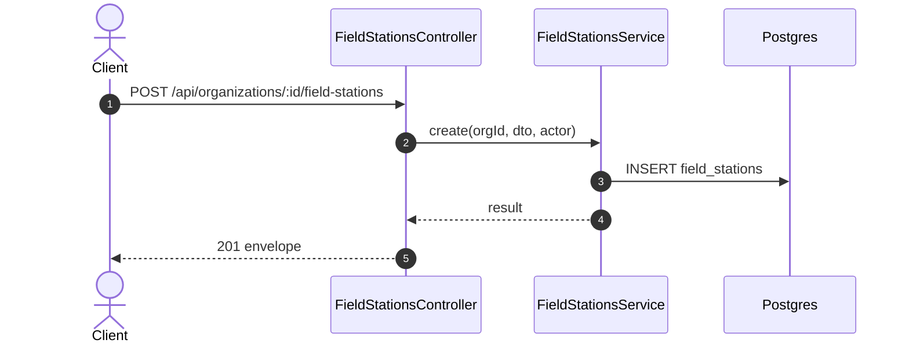

# POST /api/organizations/:id/field-stations: Create a Field Station credential

> Module `organizations`. Generated from `scripts/specs/endpoints/organizations.py` by `scripts/specs/build_api_design.py`; edit the catalog, not this file. Format: `02-templates/04-api-endpoint-template.md` with Mermaid (D-017). Envelope: D-002.

[TOC]

---
## Overview

Creates a named Field Station credential (D-037). The MQTT username and secret are returned once; only the secret's bcrypt hash is stored. The broker accepts publishes under it only for devices the organization rents (FR-EVT-14).

## API Specification

| API | URL |
| --- | --- |
| POST | /api/organizations/:id/field-stations |
| Permission | Org Manager: own |
| Traces | UC-06, FR-EVT-14, D-037 |

### Path parameters

| Field | Description | Data Type | Examples |
| --- | --- | --- | --- |
| id | Organization id; members may use only their own | uuid | `5b1d2c0e-7f3a-4e21-9c8d-1a2b3c4d5e6f` |

## Request sample

```json
{
  "name": "Ta Nang basecamp laptop"
}
```

| Field | Description | Data Type | Required | Examples |
| --- | --- | --- | --- | --- |
| name | Label, for example where the laptop runs | string | yes | `Ta Nang basecamp laptop` |

## Response sample

```json
{
  "result": {
    "id": "f1e2d3c4-b5a6-4978-8a9b-0c1d2e3f4a5b",
    "name": "Ta Nang basecamp laptop",
    "mqttUsername": "fs-org-0007-1",
    "createdAt": "2026-10-20T03:15:00.000Z",
    "revokedAt": null,
    "lastSyncAt": null,
    "queueDepth": [],
    "oldestRetryCount": 0,
    "mqttSecret": "fs_s3cr3t...shown-once",
    "brokerUrl": "mqtts://mqtt.treklink.vn:8883"
  },
  "isSuccess": true,
  "statusCode": 201,
  "message": "Field Station credential created. Copy it now; it will not be shown again."
}
```

## Validation

<table>
    <th>Status code</th>
    <th>Description</th>
    <th>Examples</th>
    <tbody>
        <tr>
            <td>400</td>
            <td>The body or query fails validation (<code>VALIDATION_FAILED</code>)</td>
<td>

```json
{
  "result": {
    "errorCode": "VALIDATION_FAILED"
  },
  "isSuccess": false,
  "statusCode": 400,
  "message": "{field} is required."
}
```
</td>
        </tr>
        <tr>
            <td>401</td>
            <td>Missing, malformed or expired access token or API key (<code>UNAUTHENTICATED</code>)</td>
<td>

```json
{
  "result": {
    "errorCode": "UNAUTHENTICATED"
  },
  "isSuccess": false,
  "statusCode": 401,
  "message": "Authentication required."
}
```
</td>
        </tr>
        <tr>
            <td>403</td>
            <td>The caller's role, policy or organization does not allow this action (<code>FORBIDDEN</code>)</td>
<td>

```json
{
  "result": {
    "errorCode": "FORBIDDEN"
  },
  "isSuccess": false,
  "statusCode": 403,
  "message": "You do not have access to this."
}
```
</td>
        </tr>
        <tr>
            <td>404</td>
            <td>No such record, or it belongs to another organization (<code>NOT_FOUND</code>)</td>
<td>

```json
{
  "result": {
    "errorCode": "NOT_FOUND"
  },
  "isSuccess": false,
  "statusCode": 404,
  "message": "Organization not found."
}
```
</td>
        </tr>
        <tr>
            <td>409</td>
            <td>The organization is not in a state that allows this (<code>INVALID_STATE_TRANSITION</code>)</td>
<td>

```json
{
  "result": {
    "errorCode": "INVALID_STATE_TRANSITION"
  },
  "isSuccess": false,
  "statusCode": 409,
  "message": "This cannot be done while it is SUSPENDED."
}
```
</td>
        </tr>
        <tr>
            <td>409</td>
            <td>organizations.maxFieldStations active credentials already exist (<code>STATION_LIMIT</code>)</td>
<td>

```json
{
  "result": {
    "errorCode": "STATION_LIMIT"
  },
  "isSuccess": false,
  "statusCode": 409,
  "message": "Revoke an unused Field Station before creating another."
}
```
</td>
        </tr>
    </tbody>
</table>

## Activity Diagram



## Sequence Diagram


