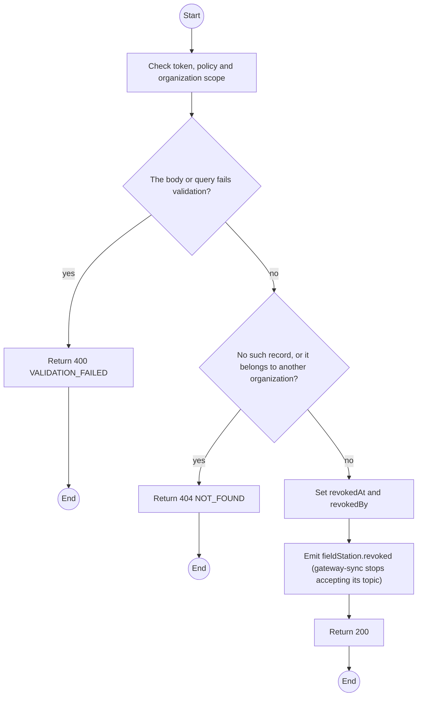
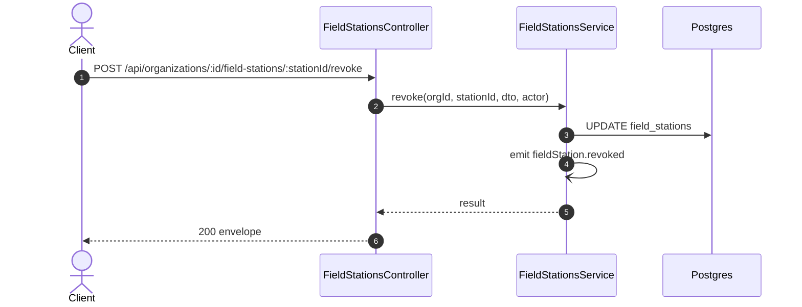

# POST /api/organizations/:id/field-stations/:stationId/revoke: Revoke a Field Station credential

> Module `organizations`. Generated from `scripts/specs/endpoints/organizations.py` by `scripts/specs/build_api_design.py`; edit the catalog, not this file. Format: `02-templates/04-api-endpoint-template.md` with Mermaid (D-017). Envelope: D-002.

[TOC]

---
## Overview

Revokes a credential; the broker refuses it from the next connection (FR-EVT-14). The broker's auth cache is at most 60 s, and from the moment of revocation the backend drops every message published under it. Events the station still holds are delivered once a new credential is configured, since the queue lives on the laptop.

## API Specification

| API | URL |
| --- | --- |
| POST | /api/organizations/:id/field-stations/:stationId/revoke |
| Permission | Org Manager: own; TrekLink Staff, TrekLink Admin |
| Traces | UC-06, FR-EVT-14, D-037 |

### Path parameters

| Field | Description | Data Type | Examples |
| --- | --- | --- | --- |
| id | Organization id; members may use only their own | uuid | `5b1d2c0e-7f3a-4e21-9c8d-1a2b3c4d5e6f` |
| stationId | Field Station id | uuid | `f1e2d3c4-b5a6-4978-8a9b-0c1d2e3f4a5b` |

## Request sample

```json
{
  "reason": "Laptop stolen"
}
```

| Field | Description | Data Type | Required | Examples |
| --- | --- | --- | --- | --- |
| reason | Why; required for TrekLink staff | string | no | `Laptop stolen` |

## Response sample

```json
{
  "result": {
    "id": "f1e2d3c4-b5a6-4978-8a9b-0c1d2e3f4a5b",
    "name": "Ta Nang basecamp laptop",
    "mqttUsername": "fs-org-0007-1",
    "createdAt": "2026-10-20T03:15:00.000Z",
    "revokedAt": "2026-10-20T03:15:00.000Z",
    "lastSyncAt": "2026-10-20T03:15:00.000Z",
    "queueDepth": [
      0,
      0,
      3,
      12
    ],
    "oldestRetryCount": 0
  },
  "isSuccess": true,
  "statusCode": 200,
  "message": "Field Station credential revoked"
}
```

## Validation

<table>
    <th>Status code</th>
    <th>Description</th>
    <th>Examples</th>
    <tbody>
        <tr>
            <td>400</td>
            <td>The body or query fails validation (<code>VALIDATION_FAILED</code>)</td>
<td>

```json
{
  "result": {
    "errorCode": "VALIDATION_FAILED"
  },
  "isSuccess": false,
  "statusCode": 400,
  "message": "{field} is required."
}
```
</td>
        </tr>
        <tr>
            <td>401</td>
            <td>Missing, malformed or expired access token or API key (<code>UNAUTHENTICATED</code>)</td>
<td>

```json
{
  "result": {
    "errorCode": "UNAUTHENTICATED"
  },
  "isSuccess": false,
  "statusCode": 401,
  "message": "Authentication required."
}
```
</td>
        </tr>
        <tr>
            <td>403</td>
            <td>The caller's role, policy or organization does not allow this action (<code>FORBIDDEN</code>)</td>
<td>

```json
{
  "result": {
    "errorCode": "FORBIDDEN"
  },
  "isSuccess": false,
  "statusCode": 403,
  "message": "You do not have access to this."
}
```
</td>
        </tr>
        <tr>
            <td>404</td>
            <td>No such record, or it belongs to another organization (<code>NOT_FOUND</code>)</td>
<td>

```json
{
  "result": {
    "errorCode": "NOT_FOUND"
  },
  "isSuccess": false,
  "statusCode": 404,
  "message": "Field Station not found."
}
```
</td>
        </tr>
    </tbody>
</table>

## Activity Diagram



## Sequence Diagram


