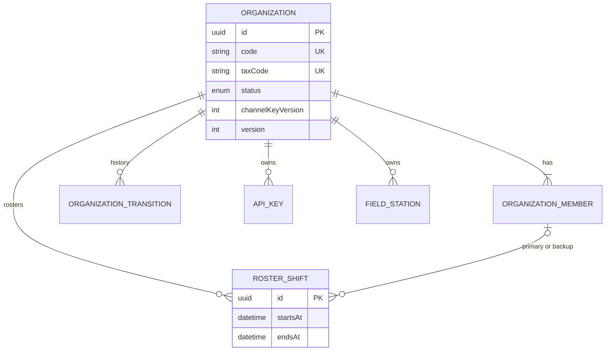
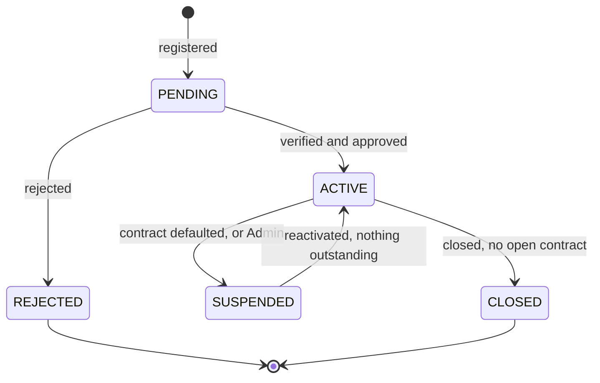
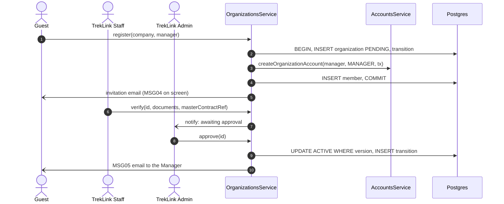

# Technical Design: organizations

> Fulfills `requirements.md` in this folder. Schema: the `// @module organizations` block of
> `backend/prisma/schema.prisma` is authoritative.

---

## 1. Data model



***Figure 1***: organizations slice. `OrganizationMember.userId` is unique: one account, one organization.

`code` is `ORG-` plus a zero-padded sequence. `channelKeyVersion` is the version of the organization's
channel key that Staff write to its devices at handover (FR-DEV-05); the key itself lives only in the
counter's provisioning tool and never in the platform (D-021, NFR-SEC-06). Rotating it is a TrekLink
procedure that bumps the version; devices on running contracts keep the version they were given.

---

## 2. Organization lifecycle (D-035)



***Figure 2***: Organization lifecycle. Verification is a recorded fact on a `PENDING` organization, not a
state, matching SRS Figure 25.

| From | To | Who | Guard |
|---|---|---|---|
| (none) | `PENDING` | Guest | unique tax code and Manager email |
| `PENDING` | `ACTIVE` | Admin | `verifiedAt` set |
| `PENDING` | `REJECTED` | Admin | reason |
| `ACTIVE` | `SUSPENDED` | Admin, or `SYSTEM` from `rentals` on default | reason |
| `SUSPENDED` | `ACTIVE` | Admin | every `ORGANIZATION_EXIT_CHECKS.canReactivate(orgId)` true |
| `ACTIVE` | `CLOSED` | Admin | every `ORGANIZATION_EXIT_CHECKS.canClose(orgId)` true |

Each transition is a compare-and-set on `version` plus one `OrganizationTransition` row in one
transaction.

---

## 3. Roster and on-duty resolution

A shift is `[startsAt, endsAt)` with an optional primary and an optional backup; the database rejects
overlaps (`roster_shifts_no_overlap`). `RosterService.tiersAt(orgId, instant)` returns:

```typescript
{ primary?: MemberContact; backup?: MemberContact; managers: MemberContact[] }
```

Only active members are returned. `incidents` calls it once when an incident is routed and again at
each tier step, so a roster edit applies to the next tier, never to an alert already sent (BR-16). A
window with no shift, or a shift with no primary, is the `NO_PRIMARY` warning; alerting then starts at
the backup tier, or at the Managers when there is no backup (D-034).

---

## 4. Keys and Field Station credentials

| | API key | Field Station credential |
|---|---|---|
| Created by | Org Manager | Org Manager (D-037) |
| Revoked by | Org Manager | Org Manager, TrekLink Staff, Admin |
| Secret | `tlk_` + 43 base64url chars; SHA-256 stored; prefix of 8 shown | `fs_` + 43 base64url chars; bcrypt stored |
| Identity | the hash | `mqttUsername` = `fs-<org code lower-case>-<n>` |
| Used by | `ApiKeyGuard` via `API_KEY_RESOLVER` | the broker's go-auth hook via `gateway-sync` |
| Health | `lastUsedAt` | `lastSyncAt`, `queueDepth`, `oldestRetryCount`, written by `gateway-sync` through `recordStationHealth()` |

SHA-256 for API keys keeps the per-request lookup an index hit; bcrypt for station secrets suits a
check made once per MQTT connection.

---

## 5. Services and ports

| Export | Used by | Purpose |
|---|---|---|
| `OrganizationsService.assertActive(orgId)` | rentals | FR-CON-02 |
| `OrganizationsService.suspendForDefault(orgId, contractCode, tx)` | rentals | FR-ORG-07 |
| `OrganizationsService.channelKeyVersion(orgId)` | rentals | provisioning |
| `RosterService.tiersAt(orgId, instant)` | incidents | routing and tiers |
| `FieldStationsService.byUsername(username)` | gateway-sync | broker hook, Stage C ingestion |
| `FieldStationsService.recordStationHealth(id, health)` | gateway-sync | FR-EVT-13 |
| provider of `ACCOUNT_CONTEXT_PROVIDER`, `API_KEY_RESOLVER` | auth | `platform` design §2.1 |

Declares `ORGANIZATION_EXIT_CHECKS` (multi): `{ canReactivate(orgId): Promise<Reason | null>; canClose(orgId): Promise<Reason | null> }`.

Events emitted: `member.deactivated`, `apiKey.revoked`, `fieldStation.revoked`, `organization.statusChanged`, `audit.record`.

---

## 6. Error catalogue

| Code | HTTP |
|---|---|
| `NOT_VERIFIED` | 409 |
| `LAST_MANAGER` | 409 |
| `BALANCE_OUTSTANDING` | 409 |
| `OPEN_CONTRACTS` | 409 |
| `SHIFT_OVERLAP` | 409 |
| `SHIFT_STARTED` | 409 |
| `MEMBER_NOT_ELIGIBLE` | 400 |
| `KEY_LIMIT` | 409 |
| `STATION_LIMIT` | 409 |
| `ORGANIZATION_NOT_ACTIVE` | 409 (raised for `rentals` by `assertActive`) |

---

## 7. Sequence: registration to approval



***Figure 3***: MF-01 onboarding.

---

## 8. Testing strategy

Lifecycle matrix unit test (every pair, allowed or 409); overlap and member-eligibility tests against
Postgres; key and station hashing; last-Manager under concurrency; cross-organization 404 on every route.
