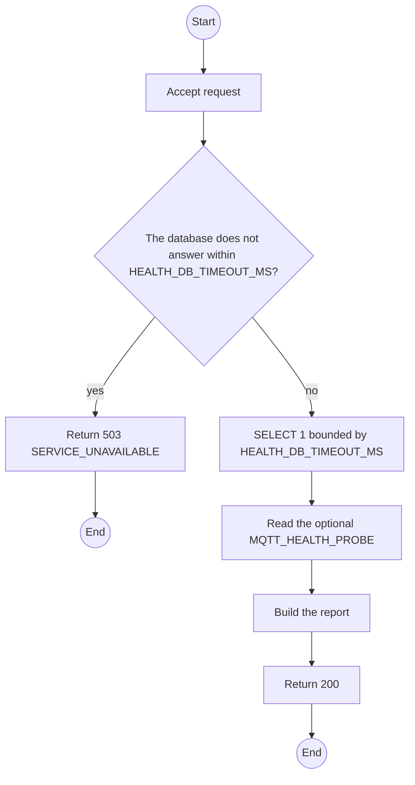
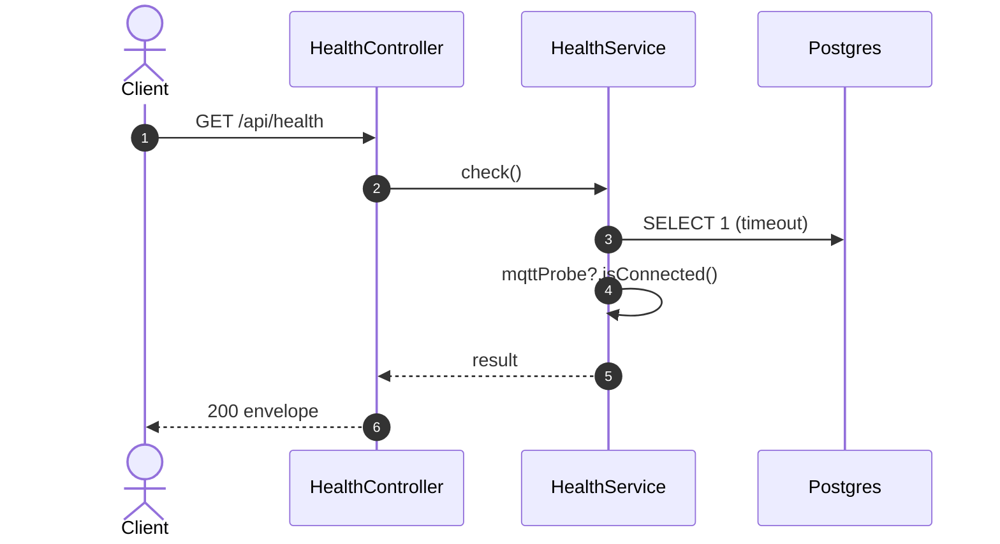

# GET /api/health: Liveness and readiness

> Module `platform`. Generated from `scripts/specs/endpoints/platform.py` by `scripts/specs/build_api_design.py`; edit the catalog, not this file. Format: `02-templates/04-api-endpoint-template.md` with Mermaid (D-017). Envelope: D-002.

[TOC]

---
## Overview

Reports process liveness, database reachability and MQTT broker reachability. Used by the deployment health check and the Admin system-health page (UC-42).

## API Specification

| API | URL |
| --- | --- |
| GET | /api/health |
| Permission | Public |
| Traces | REQ-EVT-04, D-032, NFR-AVL-01 |

## Request sample

No body.

## Response sample

```json
{
  "result": {
    "status": "ok",
    "uptimeSeconds": 8123,
    "components": {
      "database": "up",
      "mqtt": "up"
    },
    "version": "0.1.0"
  },
  "isSuccess": true,
  "statusCode": 200,
  "message": "Healthy"
}
```

| Field | Description | Data Type | Examples |
| --- | --- | --- | --- |
| status | `ok`, or `degraded` when MQTT is `down` | string | `ok` |
| components.mqtt | `up`, `down`, or `unknown` while no probe is registered | string | `unknown` |

## Validation

<table>
    <th>Status code</th>
    <th>Description</th>
    <th>Examples</th>
    <tbody>
        <tr>
            <td>503</td>
            <td>The database does not answer within HEALTH_DB_TIMEOUT_MS (<code>SERVICE_UNAVAILABLE</code>)</td>
<td>

```json
{
  "result": {
    "errorCode": "SERVICE_UNAVAILABLE"
  },
  "isSuccess": false,
  "statusCode": 503,
  "message": "Database unreachable."
}
```
</td>
        </tr>
    </tbody>
</table>

## Activity Diagram


```mermaid
flowchart TB
    S((Start))
    A0["Accept request"]
    S --> A0
    D1{"The database does not answer within HEALTH_DB_TIMEOUT_MS?"}
    A0 --> D1
    E1["Return 503 SERVICE_UNAVAILABLE"]
    D1 -->|yes| E1
    E1 --> X1((End))
    P0["SELECT 1 bounded by HEALTH_DB_TIMEOUT_MS"]
    D1 -->|no| P0
    P1["Read the optional MQTT_HEALTH_PROBE"]
    P0 --> P1
    P2["Build the report"]
    P1 --> P2
    OK["Return 200"]
    P2 --> OK
    OK --> Z((End))
```

## Sequence Diagram


```mermaid
sequenceDiagram
    autonumber
    actor C as Client
    participant Ctl as HealthController
    participant Svc as HealthService
    participant DB as Postgres
    C->>Ctl: GET /api/health
    Ctl->>Svc: check()
    Svc->>DB: SELECT 1 (timeout)
    Svc->>Svc: mqttProbe?.isConnected()
    Svc-->>Ctl: result
    Ctl-->>C: 200 envelope
```
