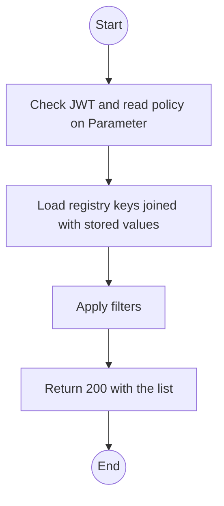
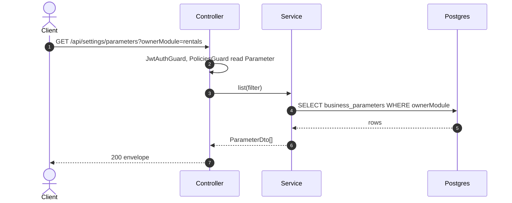

# GET /api/settings/parameters: List business parameters

> Module `platform`. Format: `02-templates/04-api-endpoint-template.md`, with Mermaid in place of PlantUML (D-017). Envelope: D-002.

[TOC]

---
## Overview

Lists every runtime business parameter with its current value, type, bounds, unit and owning module. This is the live half of the Configuration Matrix (D-015). Operators may read it so they can see, for example, the current hold duration; only Admin may change values.

## API Specification

| API        | URL             |
| ---------- | --------------- |
| GET | /api/settings/parameters |
| Permission | Admin, Operator (read only) |
| Traces | UC-19, FR-ADM-02, NFR-CFG-02, BR-23 |

### Query parameters

| Field | Description | Data Type | Required | Examples |
| --- | --- | --- | --- | --- |
| ownerModule | Filter by owning module | string | no | `rentals` |
| search | Substring match on key or description | string | no | `hold` |

## Request sample

No request body. Query string example:

```
GET /api/settings/parameters?ownerModule=rentals
```

## Response sample

```json
{
  "result": [
    {
      "key": "rentals.customerHoldMinutes",
      "value": 10,
      "valueType": "INT",
      "bounds": {
        "min": 1,
        "max": 120
      },
      "unit": "minutes",
      "ownerModule": "rentals",
      "description": "How long a customer device reservation is held before it expires",
      "version": 3,
      "updatedAt": "2026-10-02T03:15:00Z"
    }
  ],
  "isSuccess": true,
  "statusCode": 200,
  "message": "Parameters retrieved"
}
```

| Field | Description | Data Type | Examples |
| --- | --- | --- | --- |
| key | Namespaced parameter key | string | `rentals.customerHoldMinutes` |
| value | Current value, typed per valueType | json | `10` |
| valueType | INT, DECIMAL, PERCENT, DURATION_SECONDS, BOOL or JSON | enum | `INT` |
| bounds | Inclusive min and max, when declared | object | `{ "min": 1, "max": 120 }` |
| version | Increments on every change | int | `3` |

### Rules

Not paged: the registry holds a bounded, code-declared set of keys (tens, not thousands).

## Validation

<table>
    <th>Status code</th>
    <th>Description</th>
    <th>Examples</th>
    <tbody>
        <tr>
            <td>401</td>
            <td>Missing, malformed or expired access token (<code>UNAUTHENTICATED</code>)</td>
<td>

```json
{
  "result": {
    "errorCode": "UNAUTHENTICATED"
  },
  "isSuccess": false,
  "statusCode": 401,
  "message": "Authentication required."
}
```
</td>
        </tr>
        <tr>
            <td>403</td>
            <td>Authenticated, but the caller's role or policy does not allow this action (<code>FORBIDDEN</code>)</td>
<td>

```json
{
  "result": {
    "errorCode": "FORBIDDEN"
  },
  "isSuccess": false,
  "statusCode": 403,
  "message": "You do not have permission to perform this action."
}
```
</td>
        </tr>
    </tbody>
</table>

## Activity Diagram



## Sequence Diagram


