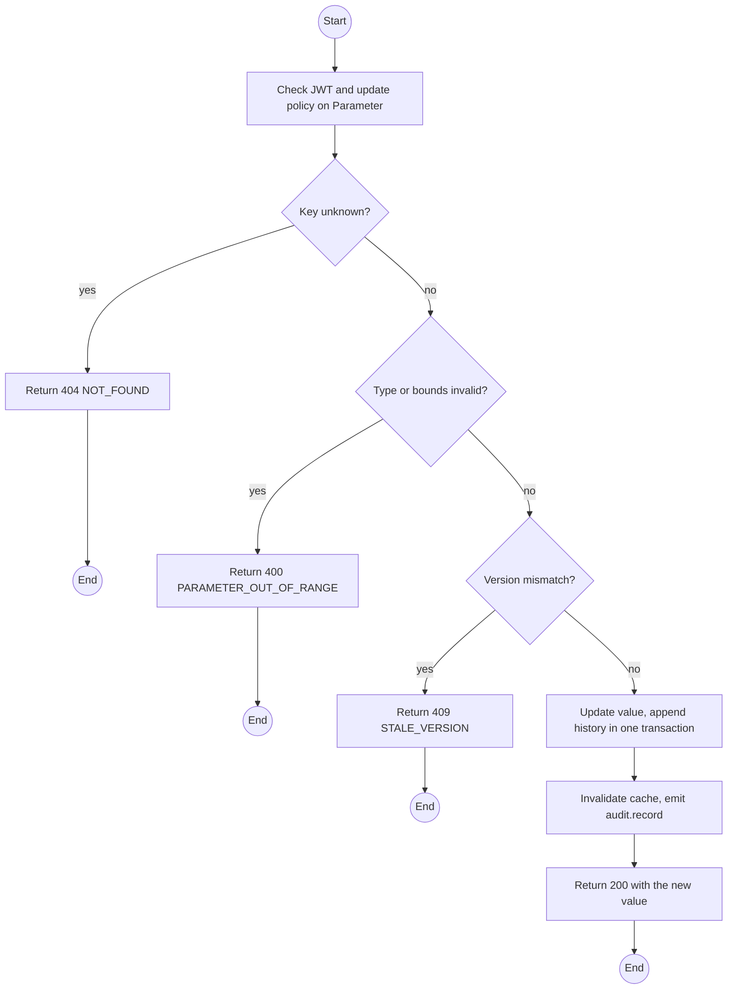
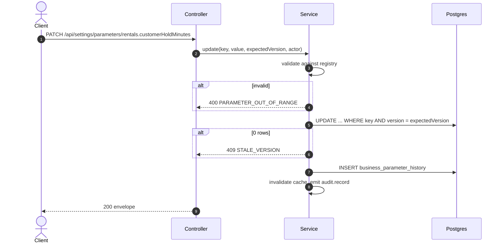

# PATCH /api/settings/parameters/:key: Update a business parameter

> Module `platform`. Format: `02-templates/04-api-endpoint-template.md`, with Mermaid in place of PlantUML (D-017). Envelope: D-002.

[TOC]

---
## Overview

Changes one runtime business parameter. The value is validated against the registry type and bounds, persisted with a history row, audited, and visible to every reader within the cache TTL. This endpoint is the demonstration path for "can this number be changed? show me now" (D-015).

## API Specification

| API        | URL             |
| ---------- | --------------- |
| PATCH | /api/settings/parameters/:key |
| Permission | Admin |
| Concurrency | `expectedVersion` optimistic check |
| Traces | UC-19, FR-ADM-02, NFR-CFG-01, BR-23, platform REQ-EVT-03, REQ-ERR-05 |

### Path parameters

| Field | Description | Data Type | Examples |
| --- | --- | --- | --- |
| key | Registered parameter key | string | `rentals.customerHoldMinutes` |

## Request sample

```json
{
  "value": 15,
  "expectedVersion": 3,
  "reason": "Peak season, customers need longer to pay"
}
```

| Field | Description | Data Type | Required | Examples |
| --- | --- | --- | --- | --- |
| value | New value; must match valueType and bounds | json | yes | `15` |
| expectedVersion | Version the Admin last saw; mismatch returns 409 | int | yes | `3` |
| reason | Why the value changed, stored in history | string | no | `Peak season` |

## Response sample

```json
{
  "result": {
    "key": "rentals.customerHoldMinutes",
    "value": 15,
    "version": 4,
    "updatedAt": "2026-10-02T03:20:00Z",
    "updatedBy": {
      "id": "b3c1f0e2-1111-4a4a-9c9c-000000000001",
      "username": "admin"
    }
  },
  "isSuccess": true,
  "statusCode": 200,
  "message": "Parameter updated"
}
```

## Validation

<table>
    <th>Status code</th>
    <th>Description</th>
    <th>Examples</th>
    <tbody>
        <tr>
            <td>400</td>
            <td>Value has the wrong type or is outside bounds (<code>PARAMETER_OUT_OF_RANGE</code>)</td>
<td>

```json
{
  "result": {
    "errorCode": "PARAMETER_OUT_OF_RANGE"
  },
  "isSuccess": false,
  "statusCode": 400,
  "message": "value must be between 1 and 120."
}
```
</td>
        </tr>
        <tr>
            <td>401</td>
            <td>Missing, malformed or expired access token (<code>UNAUTHENTICATED</code>)</td>
<td>

```json
{
  "result": {
    "errorCode": "UNAUTHENTICATED"
  },
  "isSuccess": false,
  "statusCode": 401,
  "message": "Authentication required."
}
```
</td>
        </tr>
        <tr>
            <td>403</td>
            <td>Authenticated, but the caller's role or policy does not allow this action (<code>FORBIDDEN</code>)</td>
<td>

```json
{
  "result": {
    "errorCode": "FORBIDDEN"
  },
  "isSuccess": false,
  "statusCode": 403,
  "message": "You do not have permission to perform this action."
}
```
</td>
        </tr>
        <tr>
            <td>404</td>
            <td>Key is not in the registry (<code>NOT_FOUND</code>)</td>
<td>

```json
{
  "result": {
    "errorCode": "NOT_FOUND"
  },
  "isSuccess": false,
  "statusCode": 404,
  "message": "Parameter not found."
}
```
</td>
        </tr>
        <tr>
            <td>409</td>
            <td>Parameter changed since the Admin loaded it (<code>STALE_VERSION</code>)</td>
<td>

```json
{
  "result": {
    "errorCode": "STALE_VERSION"
  },
  "isSuccess": false,
  "statusCode": 409,
  "message": "Parameter was changed by someone else. Reload and try again."
}
```
</td>
        </tr>
    </tbody>
</table>

## Activity Diagram



## Sequence Diagram


