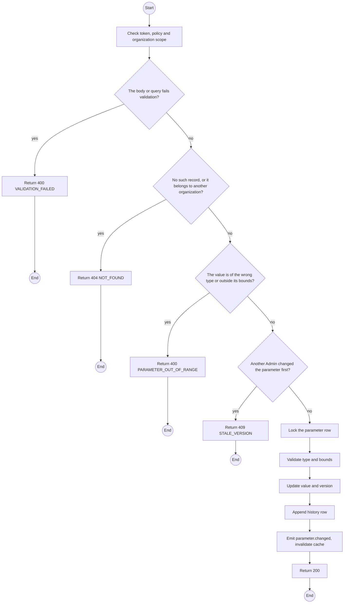
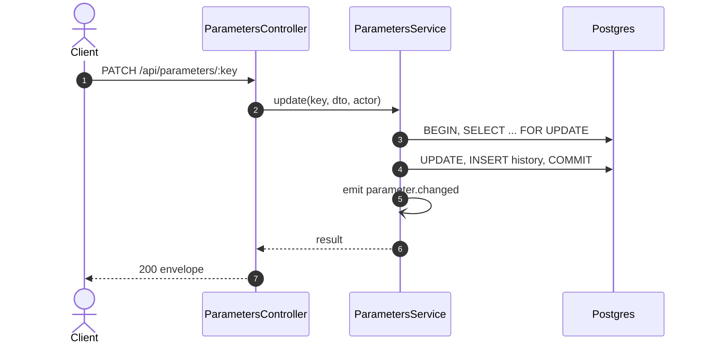

# PATCH /api/parameters/:key: Change a business parameter

> Module `platform`. Generated from `scripts/specs/endpoints/platform.py` by `scripts/specs/build_api_design.py`; edit the catalog, not this file. Format: `02-templates/04-api-endpoint-template.md` with Mermaid (D-017). Envelope: D-002.

[TOC]

---
## Overview

Changes one parameter at run time. The new value is validated against the declared type and bounds, stored, and appended to the parameter history; readers see it within the cache TTL (the D-015 "change it and show me now" demonstration).

## API Specification

| API | URL |
| --- | --- |
| PATCH | /api/parameters/:key |
| Permission | TrekLink Admin |
| Traces | UC-57, FR-CFG-01, FR-CFG-02, REQ-EVT-03, REQ-ERR-05, BR-29 |

### Path parameters

| Field | Description | Data Type | Examples |
| --- | --- | --- | --- |
| key | Parameter key | string | `incidents.primaryAckTimeoutSeconds` |

## Request sample

```json
{
  "value": 90,
  "expectedVersion": 3,
  "reason": "Faster escalation for the drill"
}
```

| Field | Description | Data Type | Required | Examples |
| --- | --- | --- | --- | --- |
| value | New value of the declared type | json | yes | `90` |
| expectedVersion | Version the Admin saw; mismatch returns 409 | int | yes | `3` |
| reason | Why it changed, kept in the history | string | no | `Faster demo` |

## Response sample

```json
{
  "result": {
    "key": "incidents.primaryAckTimeoutSeconds",
    "value": 90,
    "valueType": "DURATION_SECONDS",
    "bounds": {
      "min": 30,
      "max": 900
    },
    "unit": "seconds",
    "ownerModule": "incidents",
    "description": "How long the primary on-duty member has to acknowledge before the backup is alerted",
    "version": 4,
    "updatedAt": "2026-10-20T03:15:00.000Z"
  },
  "isSuccess": true,
  "statusCode": 200,
  "message": "Parameter updated"
}
```

## Validation

<table>
    <th>Status code</th>
    <th>Description</th>
    <th>Examples</th>
    <tbody>
        <tr>
            <td>400</td>
            <td>The body or query fails validation (<code>VALIDATION_FAILED</code>)</td>
<td>

```json
{
  "result": {
    "errorCode": "VALIDATION_FAILED"
  },
  "isSuccess": false,
  "statusCode": 400,
  "message": "{field} is required."
}
```
</td>
        </tr>
        <tr>
            <td>401</td>
            <td>Missing, malformed or expired access token or API key (<code>UNAUTHENTICATED</code>)</td>
<td>

```json
{
  "result": {
    "errorCode": "UNAUTHENTICATED"
  },
  "isSuccess": false,
  "statusCode": 401,
  "message": "Authentication required."
}
```
</td>
        </tr>
        <tr>
            <td>403</td>
            <td>The caller's role, policy or organization does not allow this action (<code>FORBIDDEN</code>)</td>
<td>

```json
{
  "result": {
    "errorCode": "FORBIDDEN"
  },
  "isSuccess": false,
  "statusCode": 403,
  "message": "You do not have access to this."
}
```
</td>
        </tr>
        <tr>
            <td>404</td>
            <td>No such record, or it belongs to another organization (<code>NOT_FOUND</code>)</td>
<td>

```json
{
  "result": {
    "errorCode": "NOT_FOUND"
  },
  "isSuccess": false,
  "statusCode": 404,
  "message": "Parameter not found."
}
```
</td>
        </tr>
        <tr>
            <td>400</td>
            <td>The value is of the wrong type or outside its bounds (<code>PARAMETER_OUT_OF_RANGE</code>)</td>
<td>

```json
{
  "result": {
    "errorCode": "PARAMETER_OUT_OF_RANGE"
  },
  "isSuccess": false,
  "statusCode": 400,
  "message": "value must be between 30 and 900."
}
```
</td>
        </tr>
        <tr>
            <td>409</td>
            <td>Another Admin changed the parameter first (<code>STALE_VERSION</code>)</td>
<td>

```json
{
  "result": {
    "errorCode": "STALE_VERSION"
  },
  "isSuccess": false,
  "statusCode": 409,
  "message": "This was changed by someone else. Reload and try again."
}
```
</td>
        </tr>
    </tbody>
</table>

## Activity Diagram



## Sequence Diagram


