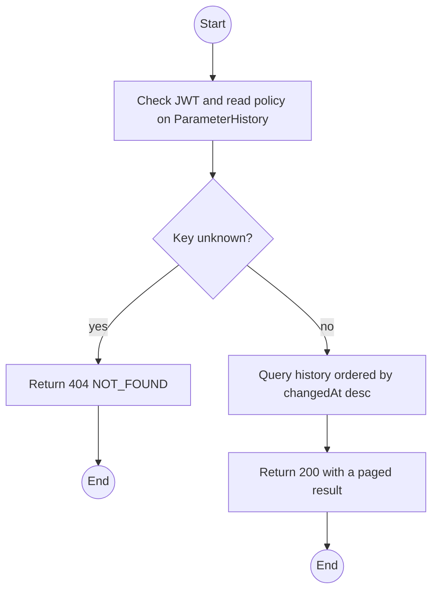
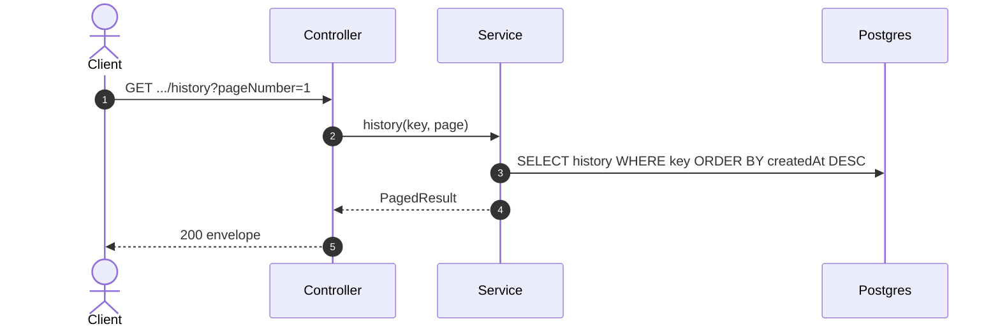

# GET /api/settings/parameters/:key/history: Parameter change history

> Module `platform`. Format: `02-templates/04-api-endpoint-template.md`, with Mermaid in place of PlantUML (D-017). Envelope: D-002.

[TOC]

---
## Overview

Paged, newest-first history of one parameter: previous value, new value, who changed it, when and why. Evidence for the Configuration Matrix "Tested? Demo?" columns.

## API Specification

| API        | URL             |
| ---------- | --------------- |
| GET | /api/settings/parameters/:key/history |
| Permission | Admin |
| Traces | UC-19, UC-20, NFR-CFG-02 |

### Path parameters

| Field | Description | Data Type | Examples |
| --- | --- | --- | --- |
| key | Registered parameter key | string | `billing.lateFeePerDevicePerDay` |

### Query parameters

| Field | Description | Data Type | Required | Examples |
| --- | --- | --- | --- | --- |
| pageNumber | 1-based page | int | no | `1` |
| pageSize | Default 20, max 100 | int | no | `20` |

## Request sample

No request body. Query string example:

```
GET /api/settings/parameters/billing.lateFeePerDevicePerDay/history?pageNumber=1&pageSize=20
```

## Response sample

```json
{
  "result": {
    "items": [
      {
        "id": "e6d9...",
        "previousValue": 50000,
        "newValue": 60000,
        "changedBy": {
          "id": "b3c1...",
          "username": "admin"
        },
        "reason": "Pricing review",
        "changedAt": "2026-10-01T02:00:00Z"
      }
    ],
    "pageNumber": 1,
    "pageSize": 20,
    "totalCount": 1,
    "totalPages": 1
  },
  "isSuccess": true,
  "statusCode": 200,
  "message": "Parameter history retrieved"
}
```

## Validation

<table>
    <th>Status code</th>
    <th>Description</th>
    <th>Examples</th>
    <tbody>
        <tr>
            <td>401</td>
            <td>Missing, malformed or expired access token (<code>UNAUTHENTICATED</code>)</td>
<td>

```json
{
  "result": {
    "errorCode": "UNAUTHENTICATED"
  },
  "isSuccess": false,
  "statusCode": 401,
  "message": "Authentication required."
}
```
</td>
        </tr>
        <tr>
            <td>403</td>
            <td>Authenticated, but the caller's role or policy does not allow this action (<code>FORBIDDEN</code>)</td>
<td>

```json
{
  "result": {
    "errorCode": "FORBIDDEN"
  },
  "isSuccess": false,
  "statusCode": 403,
  "message": "You do not have permission to perform this action."
}
```
</td>
        </tr>
        <tr>
            <td>404</td>
            <td>Key is not in the registry (<code>NOT_FOUND</code>)</td>
<td>

```json
{
  "result": {
    "errorCode": "NOT_FOUND"
  },
  "isSuccess": false,
  "statusCode": 404,
  "message": "Parameter not found."
}
```
</td>
        </tr>
    </tbody>
</table>

## Activity Diagram



## Sequence Diagram


