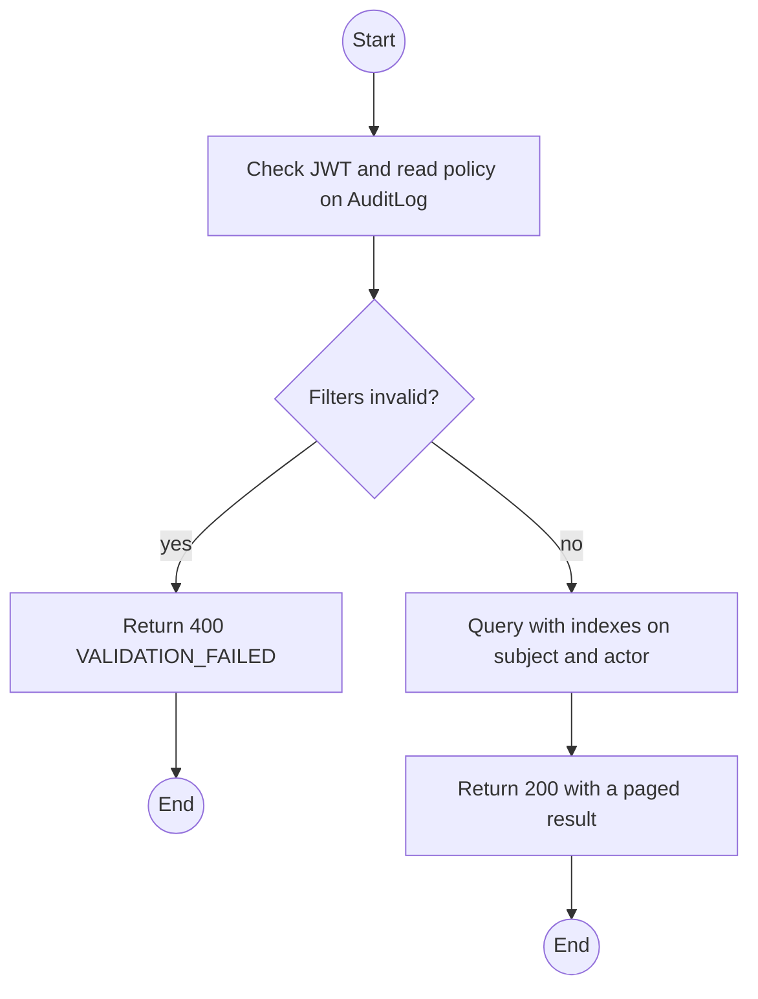
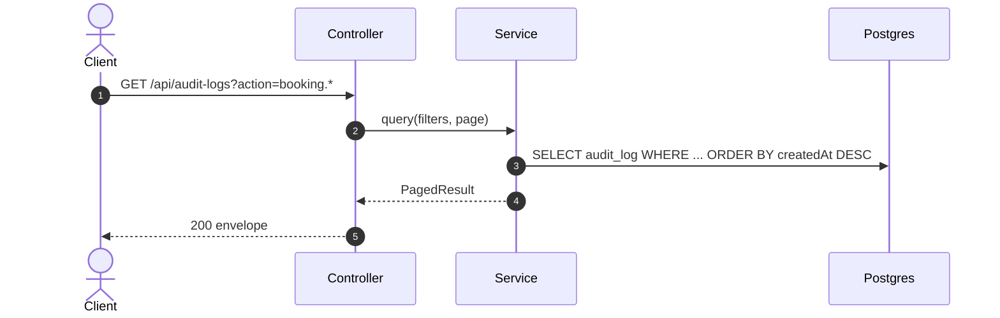

# GET /api/audit-logs: Query the audit log

> Module `platform`. Format: `02-templates/04-api-endpoint-template.md`, with Mermaid in place of PlantUML (D-017). Envelope: D-002.

[TOC]

---
## Overview

Paged query over the generic append-only audit log: authentication events, administrative changes and every state-changing business action that modules report through `audit.record`. Module-specific trails (incident, device status, sync audit) have their own endpoints; this is the system-wide view.

## API Specification

| API        | URL             |
| ---------- | --------------- |
| GET | /api/audit-logs |
| Permission | Admin |
| Traces | UC-20, FR-ADM-01, NFR-SEC-04, US-004, US-073 |

### Query parameters

| Field | Description | Data Type | Required | Examples |
| --- | --- | --- | --- | --- |
| actorId | Filter by acting user | uuid | no | `b3c1...` |
| action | Exact action or prefix with `*` | string | no | `booking.*` |
| subjectType | Entity type | string | no | `Booking` |
| subjectId | Entity id | string | no | `7f1e...` |
| from | Inclusive UTC lower bound | datetime | no | `2026-10-01T00:00:00Z` |
| to | Exclusive UTC upper bound | datetime | no | `2026-10-02T00:00:00Z` |
| pageNumber | 1-based page | int | no | `1` |
| pageSize | Default 20, max 100 | int | no | `50` |

## Request sample

No request body. Query string example:

```
GET /api/audit-logs?action=auth.login.*&from=2026-10-01T00:00:00Z&pageSize=50
```

## Response sample

```json
{
  "result": {
    "items": [
      {
        "id": "0c5b...",
        "actor": {
          "id": "b3c1...",
          "username": "op.lan",
          "roles": [
            "OPERATOR"
          ]
        },
        "action": "booking.confirm",
        "subjectType": "Booking",
        "subjectId": "7f1e...",
        "before": {
          "status": "PENDING"
        },
        "after": {
          "status": "CONFIRMED"
        },
        "requestId": "req-8a1f",
        "createdAt": "2026-10-01T04:12:09Z"
      }
    ],
    "pageNumber": 1,
    "pageSize": 50,
    "totalCount": 1,
    "totalPages": 1
  },
  "isSuccess": true,
  "statusCode": 200,
  "message": "Audit log retrieved"
}
```

### Rules

Secrets are redacted before insert (platform REQ-UBI-09), so `before` and `after` never contain hashes or keys.

## Validation

<table>
    <th>Status code</th>
    <th>Description</th>
    <th>Examples</th>
    <tbody>
        <tr>
            <td>400</td>
            <td>`from` is after `to`, or a filter is malformed (<code>VALIDATION_FAILED</code>)</td>
<td>

```json
{
  "result": {
    "errorCode": "VALIDATION_FAILED"
  },
  "isSuccess": false,
  "statusCode": 400,
  "message": "from must be earlier than to."
}
```
</td>
        </tr>
        <tr>
            <td>401</td>
            <td>Missing, malformed or expired access token (<code>UNAUTHENTICATED</code>)</td>
<td>

```json
{
  "result": {
    "errorCode": "UNAUTHENTICATED"
  },
  "isSuccess": false,
  "statusCode": 401,
  "message": "Authentication required."
}
```
</td>
        </tr>
        <tr>
            <td>403</td>
            <td>Authenticated, but the caller's role or policy does not allow this action (<code>FORBIDDEN</code>)</td>
<td>

```json
{
  "result": {
    "errorCode": "FORBIDDEN"
  },
  "isSuccess": false,
  "statusCode": 403,
  "message": "You do not have permission to perform this action."
}
```
</td>
        </tr>
    </tbody>
</table>

## Activity Diagram



## Sequence Diagram


