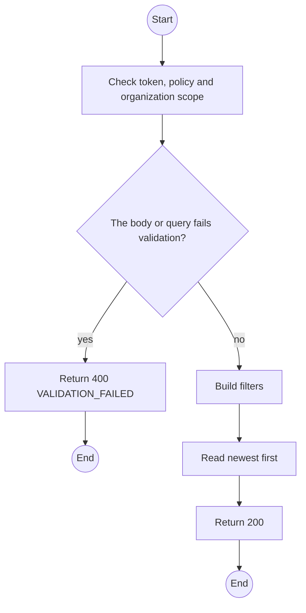
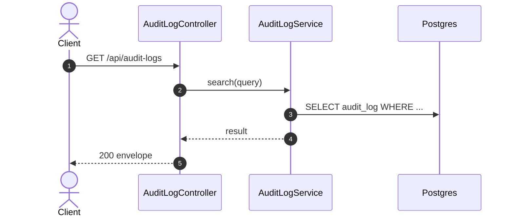

# GET /api/audit-logs: Search the audit log

> Module `platform`. Generated from `scripts/specs/endpoints/platform.py` by `scripts/specs/build_api_design.py`; edit the catalog, not this file. Format: `02-templates/04-api-endpoint-template.md` with Mermaid (D-017). Envelope: D-002.

[TOC]

---
## Overview

Searches the generic append-only audit log by actor, organization, subject, action and time range (UC-58). Module trails (incident, device, contract transitions) have their own endpoints.

## API Specification

| API | URL |
| --- | --- |
| GET | /api/audit-logs |
| Permission | TrekLink Admin |
| Traces | UC-58, REQ-EVT-02, NFR-SEC-05 |

### Query parameters

| Field | Description | Data Type | Required | Examples |
| --- | --- | --- | --- | --- |
| actorId | Filter by actor | uuid | no | `3f2e1d0c-9b8a-4c7d-8e6f-5a4b3c2d1e0f` |
| organizationId | Filter by tenant | uuid | no | `5b1d2c0e-7f3a-4e21-9c8d-1a2b3c4d5e6f` |
| subjectType | Entity type | string | no | `RentalContract` |
| subjectId | Entity id | string | no | `c0ffee00-...` |
| action | Action prefix | string | no | `contract.` |
| from | Inclusive start, ISO 8601 | datetime | no | `2026-10-01T00:00:00Z` |
| to | Exclusive end, ISO 8601 | datetime | no | `2026-10-21T00:00:00Z` |
| pageNumber | 1-based page | int | no | `1` |
| pageSize | Items per page, at most MAX_PAGE_SIZE | int | no | `20` |

## Request sample

No body.

## Response sample

```json
{
  "result": {
    "items": [
      {
        "id": "4d3c...",
        "actor": {
          "id": "3f2e1d0c-9b8a-4c7d-8e6f-5a4b3c2d1e0f",
          "fullName": "Staff A"
        },
        "actorRoles": [
          "STAFF"
        ],
        "organizationId": "5b1d2c0e-7f3a-4e21-9c8d-1a2b3c4d5e6f",
        "action": "contract.approve",
        "subjectType": "RentalContract",
        "subjectId": "c0ffee00-1234-4abc-9def-001122334455",
        "before": {
          "status": "REQUESTED"
        },
        "after": {
          "status": "APPROVED"
        },
        "requestId": "req-8f2a",
        "createdAt": "2026-10-20T03:15:00.000Z"
      }
    ],
    "pageNumber": 1,
    "pageSize": 20,
    "totalCount": 1,
    "totalPages": 1
  },
  "isSuccess": true,
  "statusCode": 200,
  "message": "OK"
}
```

## Validation

<table>
    <th>Status code</th>
    <th>Description</th>
    <th>Examples</th>
    <tbody>
        <tr>
            <td>400</td>
            <td>The body or query fails validation (<code>VALIDATION_FAILED</code>)</td>
<td>

```json
{
  "result": {
    "errorCode": "VALIDATION_FAILED"
  },
  "isSuccess": false,
  "statusCode": 400,
  "message": "{field} is required."
}
```
</td>
        </tr>
        <tr>
            <td>401</td>
            <td>Missing, malformed or expired access token or API key (<code>UNAUTHENTICATED</code>)</td>
<td>

```json
{
  "result": {
    "errorCode": "UNAUTHENTICATED"
  },
  "isSuccess": false,
  "statusCode": 401,
  "message": "Authentication required."
}
```
</td>
        </tr>
        <tr>
            <td>403</td>
            <td>The caller's role, policy or organization does not allow this action (<code>FORBIDDEN</code>)</td>
<td>

```json
{
  "result": {
    "errorCode": "FORBIDDEN"
  },
  "isSuccess": false,
  "statusCode": 403,
  "message": "You do not have access to this."
}
```
</td>
        </tr>
    </tbody>
</table>

## Activity Diagram



## Sequence Diagram


